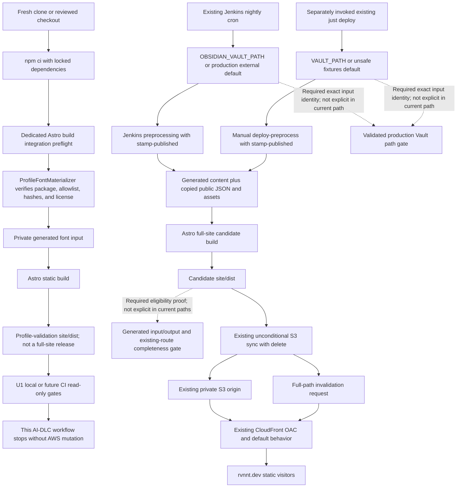

# U1 Deployment Architecture — Profile Domain and Native Experience

## 문서 상태

- **단계**: CONSTRUCTION — U1 Infrastructure Design
- **Unit**: U1 Profile Domain and Native Experience
- **결정 입력**: Infrastructure Design Q1~Q8 = A/A/A/A/A/A/A/A
- **Clarification 입력**: Public CSS Delivery Q1 = A
- **Architecture 결과**: Existing S3/CloudFront static delivery와 호환; Infrastructure no-change
- **작성일**: 2026-07-24

## 1. 목적과 권한 경계

이 문서는 fresh clone의 dependency 설치부터 verified font materialization과 profile-validation Astro build, external Vault preprocessing을 포함하는 full-site deployment build, deployable `site/dist/`와 기존 S3/CloudFront delivery까지의 물리적 배치를 정의한다. 현재 단계는 설계와 read-only compatibility verification만 수행한다.

다음 입력은 binding이다.

- [Infrastructure Design Plan](../../plans/profile-domain-and-native-experience-infrastructure-design-plan.md)
- [Public CSS Delivery Clarification](../../plans/profile-domain-and-native-experience-infrastructure-design-clarification-questions.md)
- [NFR Requirements](../nfr-requirements/nfr-requirements.md)
- [NFR Design Patterns](../nfr-design/nfr-design-patterns.md)
- [Logical Components](../nfr-design/logical-components.md)
- [Frontend Components](../functional-design/frontend-components.md)
- [Project Requirements](../../../inception/requirements/requirements.md)
- Authored implementation baseline: `site/astro.config.mjs`, `infra/main.tf`, `infra/variables.tf`, `Justfile`, `Jenkinsfile`

이 설계는 다음을 승인하거나 실행하지 않는다.

- Terraform, AWS, CloudFront, ACM 또는 Cloudflare DNS mutation
- S3 upload, object deletion 또는 CloudFront invalidation
- Production deployment나 rollback 실행
- Remote push
- 새 staging environment, origin, bucket, distribution 또는 cache behavior
- 새 runtime compute, database, queue, worker, telemetry, alarm 또는 synthetic monitor

Compatibility gap이 위 변경 중 하나를 요구하면 U1 Code Generation으로 흡수하지 않고 별도 scope와 명시적 권한을 요청한다.

## 2. Environment와 실행 주체 분리

| Environment / boundary | 실행 주체 | 허용된 책임 | 금지 |
|---|---|---|---|
| Local fresh clone | Developer 또는 operator | `npm ci`, direct Astro build, private font materialization, profile-slice `site/dist/` verification | Direct build를 full-site deployable set으로 취급, AWS mutation, generated input의 수동 authoring |
| Local verification | U1 owner-local commands | Unit/PBT/E2E/PDF verification, loopback preview, private evidence | Existing server reuse, non-loopback dependency, implicit deployment |
| Local PDF release | Human operator + S04 | Exact-SHA prepare/review/promote, tracked PDF/receipt pair의 local transaction | CI promotion, S3 atomicity 주장 |
| Future validation-only CI path | U3-owned aggregation; 현재 Jenkins에는 없음 | Pinned browser provisioning과 네 read-only U1 command, clean build와 evidence | `resume:pdf`, tracked PDF/receipt write, test logic 복제, Deploy stage 실행 |
| Current scheduled Jenkins pipeline | `cron('H 0 * * *')` | `OBSIDIAN_VAULT_PATH` 또는 hard-coded production external default를 `--stamp-published`, generated-contract copy와 build 성공 뒤 condition 없이 candidate sync/invalidation | Infrastructure Design validation에 호출하거나 current path가 explicit complete-set gate를 가진다고 주장 |
| Existing manual deployment | Separately invoked `just deploy` | `VAULT_PATH`가 선택한 input을 `--stamp-published`; unset default는 unsafe `./fixtures/vault`; generated copy/build 뒤 candidate sync/invalidation | Explicit validated production `VAULT_PATH` 없이 실행, 이 문서의 승인만으로 실행, direct Astro output 사용 |
| Production runtime | Existing CloudFront + private S3 | Static GET/HEAD delivery, clean-route rewrite, shared cache와 access logging | Application process, database, queue, server-side PDF generation |

Local loopback preview와 future validation-only CI path는 cloud deployment environment가 아니다. 현재 Jenkinsfile에는 validation-only entry가 없고 nightly cron build가 성공하면 Deploy stage로 바로 진행한다. 이는 inherited physical behavior이며 이 AI-DLC 단계의 no-deploy authority와 같지 않다. 별도 staging S3/CloudFront environment를 만들지 않는다. Public production identity는 existing `rvnnt.dev`, CloudFront distribution, private S3 origin, ACM certificate input과 Cloudflare DNS를 그대로 사용한다.

## 3. End-to-End Architecture

### Text alternative

1. Fresh clone 또는 reviewed checkout에서 locked npm dependencies를 설치한다.
2. 모든 canonical Astro production build entry가 dedicated build integration을 거친다.
3. Integration은 module graph resolution 전에 `ProfileFontMaterializer`를 실행해 package version, allowlist, file type, hash와 license를 검증하고 private generated font input을 준비한다.
4. Bare fresh clone의 direct Astro build는 profile route, tracked PDF, hashed profile CSS/WOFF2를 검증할 수 있지만 external Vault-derived `content/`, post routes와 current generated public JSON/assets를 보장하지 않는다. 따라서 그 `site/dist/`는 profile-validation output이며 full-site deployable set이 아니다.
5. Local 또는 later CI가 profile route, MIME, asset, PDF와 source-parity gate를 통과시킨다.
6. 이 AI-DLC workflow는 여기서 중단하며 AWS를 변경하지 않는다.
7. 별개의 inherited physical path에서 current Jenkins는 `OBSIDIAN_VAULT_PATH` 또는 hard-coded production external default를, `just deploy`는 `VAULT_PATH` 또는 unset 시 `./fixtures/vault`를 선택해 `--stamp-published` preprocessing을 실행한다. 따라서 manual default는 fixture를 변경하고 fixture-derived candidate를 만들 수 있다.
8. 두 path는 `content/`, generated public JSON/assets를 갱신하고 Astro full-site candidate를 만든다. Current Jenkins는 nightly build 성공 뒤 별도 authorization/complete-set condition 없이 Deploy stage로 진행하고, `just deploy`도 호출되면 candidate를 바로 S3 sync한다. 이 문서는 두 path를 호출하거나 변경할 권한을 부여하지 않는다.
9. `sync --delete` 전에 deployment readiness를 주장하려면 explicitly configured `VAULT_PATH`가 exact intended production `Areas/Notes` root로 resolve되는지, fixture/default가 아닌지, preprocessing input identity와 generated/copy outputs, expected post/route/asset inventory 및 private exclusion이 일치하는지 확인해야 한다. Current paths에는 이 explicit path/completeness gate가 없으므로 U1 direct build나 현재 automation inspection만으로 production-ready라고 주장하지 않는다.
10. CloudFront는 OAC로 S3를 읽고 existing default behavior와 clean-route function을 통해 `rvnnt.dev`에 static objects를 제공한다.

U3가 Jenkins evidence를 수집하려면 Deploy stage에 도달하지 않는 실제 validation-only 실행 경로를 먼저 증명해야 한다. 현재 pipeline을 그대로 실행해 validation evidence로 사용하는 것은 허용되지 않으며, 안전한 경로가 없으면 U3는 중단하고 별도 scope/authorization 결정을 요청한다.

## 4. Fresh-Clone Font Bootstrap

### 4.1 Canonical build entry

다음 entry는 모두 별도 수동 font preparation 없이 같은 build integration을 실행해야 한다.

- `cd site && npx astro build`
- `cd site && npm run build`
- `just site-build`
- `just build`
- Existing Jenkins의 Astro build invocation
- U1 `test:e2e`, `resume:pdf`와 `resume:pdf:verify`가 소유하는 clean production build

Direct `npx astro build`는 project의 canonical site-build command이므로 generated font input이 없다는 이유로 별도 wrapper를 요구할 수 없다.

### 4.2 Materialization contract

Dedicated Astro build integration은 module graph가 `site/src/styles/profile/font.css`를 resolve하기 전에 shared `ProfileFontMaterializer`를 호출한다.

1. Lockfile이 exact `pretendard@1.3.9`를 resolve하는지 확인한다.
2. Reviewed allowlist에 있는 official subset CSS, WOFF2와 SIL OFL 1.1 notice만 허용한다.
3. Source path containment, regular-file type, symlink absence와 expected SHA-256를 검증한다.
4. Exclusive staging에서 `site/.generated/profile-font/` input을 만들고 complete manifest와 license evidence 뒤 atomic publish한다.
5. 동일한 verified input에 대한 반복 build는 같은 logical materialization result를 제공한다. Partial 또는 identity-mismatched directory는 재사용하지 않는다.
6. Astro/Vite가 authored `font.css` import를 same-origin content-hashed WOFF2로 emit한다.

`site/.generated/profile-font/`는 gitignored private build input이다. 이 directory 자체는 `site/dist/`나 S3에 복사하지 않는다. Public으로 배포되는 것은 Astro/Vite module graph가 emit한 hashed WOFF2와 이를 참조하는 compiled CSS뿐이다.

Materializer 실패는 fallback system font로 복구하지 않고 build를 `site/dist/` publish 전에 non-zero로 종료한다.

## 5. Deployable Set와 Object Mapping

Clarification A에 따라 actual deployable namespace는 U1 file 목록의 부분집합이 아니라 complete `site/dist/`다. 그러나 directory 이름이나 successful direct Astro exit만으로 completeness가 성립하지 않는다.

### 5.1 Build-state distinction

| Build state | Inputs and production meaning | S3 eligibility |
|---|---|---|
| Profile-validation output | Fresh clone/reviewed checkout, tracked public inputs와 verified font materialization; external Vault-derived `content/`가 없거나 fixture/stale generated public files일 수 있음 | **금지**; U1 route/PDF/CSS/font verification only |
| Full-site candidate | Selected Vault input에 deploy preprocessing을 실행해 `content/posts/`, `content/meta/`, search/graph/preview/nav JSON와 assets를 생성·copy한 뒤 clean Astro build; manual unset default는 fixture candidate | 아직 미확정; input-path와 complete-set evidence 필요 |
| Deployment-eligible complete set | Explicit `VAULT_PATH`가 exact intended production `Areas/Notes` root이고 fixture가 아님을 확인하며 generated-input/output identity, all expected post/route/public-asset presence, reference closure와 private exclusion을 통과 | 별도 deployment authority가 있을 때만 sync input 가능 |

`site/src/lib/data.ts`는 `content/meta` 또는 개별 generated files가 없을 때 empty/default 값을 반환할 수 있으므로 successful direct Astro build는 full-site completeness oracle가 아니다. `site/public/search-index.json`, `previews.json`, `nav-tree.json`의 tracked copy가 존재해도 current external Vault projection임을 증명하지 않는다. `sync --delete`에 incomplete direct output을 전달하면 existing origin routes/assets를 삭제할 수 있다.

### 5.2 Route와 object mapping

| Public request | Viewer-request mapping | `site/dist/` source | S3 object key | Expected MIME | Cache identity |
|---|---|---|---|---|---|
| `/resume` | `/resume/index.html` | `site/dist/resume/index.html` | `resume/index.html` | `text/html` | Stable route object |
| `/resume/` | `/resume/index.html` | `site/dist/resume/index.html` | `resume/index.html` | `text/html` | Stable route object |
| `/portfolio` | `/portfolio/index.html` | `site/dist/portfolio/index.html` | `portfolio/index.html` | `text/html` | Stable route object |
| `/portfolio/` | `/portfolio/index.html` | `site/dist/portfolio/index.html` | `portfolio/index.html` | `text/html` | Stable route object |
| `/resume.pdf` | Unchanged because it has an extension | `site/dist/resume.pdf` | `resume.pdf` | `application/pdf` | Stable public path, content changes by reviewed release |
| `/_astro/<profile-css>.<hash>.css` | Unchanged because it has an extension | Matching emitted CSS | `_astro/<profile-css>.<hash>.css` | `text/css` | Content-hashed |
| `/_astro/<profile-font>.<hash>.woff2` | Unchanged because it has an extension | Matching emitted WOFF2 | `_astro/<profile-font>.<hash>.woff2` | `font/woff2` | Content-hashed |
| Existing site route/assets | Existing rewrite or unchanged dotted path | Remaining complete `site/dist/` | Same relative key | Existing type contract | Existing behavior |

The exact hashed filename is build output, not authored configuration. Verification discovers it from the actual route/build manifest rather than predicting a literal hash. “Existing site route/assets” row는 full-site preprocessing과 completeness gate가 통과한 경우에만 성립한다.

### 5.3 All-extensionless rewrite

The existing CloudFront viewer-request function is shared site infrastructure:

- URI가 `/`로 끝나면 `index.html`을 붙인다.
- 그 외 URI에 dot이 없으면 `/index.html`을 붙인다.
- Dot이 있는 URI는 그대로 둔다.

따라서 function은 profile route만 특별 취급하지 않는다. `/resume`와 `/portfolio`를 포함한 **모든** extensionless site URI가 같은 rule을 사용한다. `/resume.pdf`, hashed CSS와 WOFF2는 dotted path이므로 rewrite되지 않는다.

### 5.4 Public set에서 제외되는 evidence

| Path class | Tracking | Public deployment treatment |
|---|---|---|
| `site/.generated/profile-font/` | Gitignored generated input | Directory 자체 제외; verified emitted WOFF2/CSS만 포함 |
| `site/.artifacts/profile/resume/` | Gitignored private | Candidate, draft receipt, viewer, screenshot, lock와 journal 모두 제외 |
| `site/.artifacts/profile/verification/` | Gitignored private | Budget/request/test evidence 제외 |
| `site/verification/resume/current-release.json` | Tracked non-public | S3 sync set에서 제외 |
| `site/verification/profile/manual-web-accessibility.json` | Tracked non-public | S3 sync set에서 제외 |
| `aidlc-docs/` fact-review evidence | Tracked documentation | Runtime import와 public serving 금지 |

Exclusion은 file naming convention에만 의존하지 않는다. Full-site candidate가 이 경계를 어겨 private path를 `site/dist/`에 emit하거나 required generated contract/route/asset을 빠뜨리면 deployment-eligible artifact가 아니며 gate가 실패한다.

## 6. MIME, CSP와 `nosniff`

Existing CloudFront response-headers policy는 `X-Content-Type-Options: nosniff`를 강제하고 CSP의 `font-src`에 `'self'`를 허용한다. Profile font는 same-origin이므로 새 CSP source가 필요하지 않지만, 잘못된 origin metadata를 browser sniffing으로 보완할 수 없다.

### 6.1 Pre-deploy blocking checks

Local supervised production preview와 build inspection은 다음을 검증한다.

| Artifact | Blocking checks |
|---|---|
| `/resume`, `/portfolio` | 200, HTML content type, non-empty body, expected source/build identity |
| `/resume.pdf` | 200, exact `application/pdf`, non-empty body, tracked release receipt의 PDF SHA와 current source/manifest parity |
| Hashed profile CSS | 200, `text/css`, non-empty bytes, route reachability와 manifest provenance |
| Hashed WOFF2 | 200, `font/woff2`, non-empty bytes, same-origin URL, materializer/emitted hash evidence |

`nosniff`와 결합했을 때 wrong or missing MIME은 terminal compatibility failure다. PDF extension, font extension 또는 browser의 관대한 처리를 success evidence로 사용하지 않는다.

### 6.2 Future deployment evidence

Local preview MIME은 S3 object metadata나 actual CloudFront response를 증명하지 않는다. 별도로 deployment가 승인된 미래 operation은 sync 성공 뒤 다음 read-only evidence를 수집해야 한다.

- S3/CloudFront public response의 status와 exact content type
- `/resume.pdf`의 non-empty bytes와 expected SHA
- Hashed CSS/WOFF2 URL의 response identity
- Same-origin font load와 `document.fonts.check()` result
- `nosniff`/CSP 아래 실제 browser load result

이 future evidence requirement는 현재 deployment 또는 network/AWS action을 승인하지 않는다.

## 7. CloudFront와 Origin Contract

Existing topology는 다음과 같다.

- Origin: private `obsidian-custom-s3` bucket
- Origin access: CloudFront OAC와 distribution ARN-bound `s3:GetObject`
- Viewer protocol: HTTP to HTTPS redirect
- Methods: GET/HEAD only
- Cache: AWS managed CachingOptimized policy on one default behavior
- Route handling: shared viewer-request CloudFront Function
- Response headers: existing HSTS, `nosniff`, frame, referrer와 CSP policy
- TLS/domain: existing ACM certificate input and Cloudflare-managed DNS for `rvnnt.dev`
- Access logs: existing S3 log bucket with 90-day lifecycle

U1은 새 origin, ordered cache behavior, API Gateway, load balancer, VPC, Lambda, edge worker, certificate, DNS record 또는 log sink를 추가하지 않는다.

## 8. Cache, Invalidation과 Non-Atomic Rollout

### 8.1 Cache contract

- Stable HTML과 `/resume.pdf`는 existing managed CachingOptimized behavior를 공유한다.
- Hashed CSS와 WOFF2는 content가 바뀌면 URL hash가 바뀌는 immutable-style identity를 사용한다.
- U1은 PDF용 short TTL, `no-cache`, dedicated behavior 또는 versioned release prefix를 추가하지 않는다.
- Explicit deployment는 existing `/*` invalidation을 그대로 사용한다.

### 8.2 Inherited non-atomicity

Existing deployment는 두 separate remote operations다.

1. `aws s3 sync site/dist/ s3://... --delete`
2. `aws cloudfront create-invalidation ... --paths "/*"`

이 sequence는 atomic transaction이 아니다.

- Sync 진행 중에는 origin object set이 부분적으로 바뀔 수 있다.
- Sync가 실패하면 partial origin update가 가능하며 deployment success를 주장할 수 없다.
- Sync가 성공하고 invalidation이 실패하면 origin은 새 set이지만 edge cache에는 old/new response가 혼재할 수 있다.
- Invalidation request 성공도 모든 edge가 한 시점에 바뀌는 atomic cutover를 뜻하지 않는다.

U1 completion은 current profile source, tracked PDF/receipt, hashed profile assets와 profile route HTML이 일치하는 **coherent profile-validation output**까지만 보장한다. External Vault preprocessing과 site-wide generated-output completeness가 필요한 deployment-ready `site/dist/`를 U1 completion으로 주장하지 않는다. Production-wide instant parity나 edge-atomic rollout도 주장하지 않는다.

Future deployment failure는 operator-visible non-zero 결과와 failed operation evidence를 보존해야 한다. 이 설계는 existing pipeline에 자동 retry, automatic rollback 또는 state mutation을 추가하지 않는다.

## 9. Rollback Boundary

### 9.1 Local release rollback

S04의 `SingleWriterResumeReleaseStore`는 repository-local PDF release transaction만 소유한다.

- Public commit 전에는 previous `site/public/resume.pdf`와 tracked current receipt pair를 보존한다.
- Commit 뒤 second build/final gate failure는 같은 lock과 journal 아래 previous pair 또는 first-release absence를 복구한다.
- Local rollback은 S3 object, CloudFront cache 또는 deployed site를 변경하지 않는다.
- Local finalize가 성공한 reviewed pair만 deployment-eligible source가 될 수 있다.

### 9.2 Future production rollback

현재 infrastructure는 exact prior production release를 복구할 수 있다고 보장하지 않는다. `site/dist/`는 보존되는 release artifact가 아니고 S3 object versioning, versioned release prefix, origin pointer와 remote snapshot도 없다. 또한 complete site build는 Git 밖의 mutable external Vault와 그 generated posts/JSON/assets를 입력으로 사용하므로 Git history만으로 이전 complete `site/dist/`를 재현할 수 없다.

Exact production rollback에는 최소한 다음 중 하나가 사전에 보존되어 있어야 한다.

1. 검증된 이전 complete `site/dist/` release artifact와 identity/evidence
2. Repository revision뿐 아니라 exact external Vault 및 모든 generated input을 포함한 reproducible source snapshot

현재 contract에서 가능한 것은 **best-effort redeploy**뿐이다.

1. 이전 profile repository revision, `site/public/resume.pdf`와 matching tracked receipt를 선택한다.
2. Explicitly validated production `VAULT_PATH`의 현재 available Vault/generated input으로 fresh dependency/font bootstrap과 clean complete build를 수행한다.
3. 모든 pre-deploy route/MIME/source/PDF/private-exclusion gate를 다시 실행한다.
4. 별도 deployment 권한 아래 새 complete set을 기존 S3 sync로 반영하고 full invalidation을 요청한다.

이 절차는 이전 profile revision을 되돌릴 수는 있어도 이전 production site 전체의 byte-identical state를 복구한다는 보장은 아니다. Exact rollback이 요구되면 artifact retention/versioning architecture를 별도 승인해야 한다. Exact 또는 best-effort operation 모두 sync/invalidation의 inherited non-atomicity를 가진다.

## 10. Failure Gates와 Evidence

| Gate | Blocking failure | Mutation boundary | Required evidence |
|---|---|---|---|
| Dependency/bootstrap | Missing package, wrong version, unsafe path/type, hash/license mismatch | No `site/dist/`; no AWS | Package, allowlist, file/hash/license diagnostic |
| Font materialization | Partial/stale generated input, atomic publish failure | Private generated path only | Materialization identity and failure stage |
| Profile-validation Astro build | Source validation, profile route generation, CSS/font resolution or build failure | Gitignored build output only | Build identity, profile route set and stderr; no full-site claim |
| Deploy preprocessing | `VAULT_PATH` unset/fixture/default/wrong root, missing exact production `Areas/Notes` identity, failed `--stamp-published`, missing generated `content/` or failed public copy | Selected Vault/generated paths only under separate deployment authority | Explicit resolved Vault path, fixture exclusion, input revision, mutation result and generated contract inventory |
| Full-site completeness | Expected post route, generated JSON/public asset, referenced asset or prior required site output absent; direct/fixture/stale output supplied | No AWS; candidate is not deployment-eligible | Generated input/output counts and digests, route/object inventory, reference closure |
| Public/private boundary | Receipt, candidate, journal or review evidence appears in `site/dist/` | No deployment eligibility | Exact unexpected output path |
| Route/object mapping | Missing route/PDF/asset, wrong rewrite expectation or broken internal reference | No AWS | Dist path, public URL and expected origin key |
| MIME/`nosniff` | Wrong/missing MIME, empty body, cross-origin font, browser font rejection | No AWS | Status, header, bytes, URL and browser result |
| CSS/resource budget | Profile CSS union over 24KiB gzip, untraceable ownership, new U1 client JS/external request | No AWS | Manifest graph, ordered asset hashes/bytes and request ledger |
| PDF release | Active journal, stale source/review/receipt, hash or full-manifest mismatch | Local rollback only | Source/manifest/PDF identities and journal result |
| Pre-deploy eligibility | Any applicable profile or full-site gate missing, failed or skipped | No AWS | Aggregate profile verification plus separately authorized full-site completeness result |
| Future S3 sync | Non-zero sync or partial object update | Remote mutation only under separate authority | Command result and observed object-set status |
| Future invalidation | Request failure after sync | No success claim; no implicit retry | Distribution/path/request identity and failure |
| Future post-deploy read | Wrong status/MIME/hash, route or font load | Read-only observation | CloudFront headers/body identity and browser evidence |

No gate may convert a required tool, browser, MIME, source identity or receipt failure into skip-success.

## 11. Evidence Persistence와 Authority

| Evidence | Persistence | Authority |
|---|---|---|
| Font integrity/materialization report | Non-public local/CI artifact | Package, source and emitted-font identity only |
| Profile build identity and route/object manifest | Non-public local/CI artifact | Exact U1 profile-validation evidence; not full-site readiness |
| Full-site generated/input manifest | Only in a separately authorized deploy-validation context | Explicit production Vault path/identity, fixture exclusion, generated public copies and deployment-candidate completeness |
| CSS budget/request ledger | Non-public local/CI artifact | Compiled resource and actual request evidence |
| Current release receipt | `site/verification/resume/current-release.json`, tracked non-public | Released local PDF/source/review identity; not a fact source |
| Manual web accessibility record | Dedicated tracked non-public path | Current UI manual evidence; not runtime monitoring |
| Candidate/viewer/journal | Gitignored private path | Local release/recovery only |
| CloudFront access logs | Existing shared log bucket, 90-day lifecycle | Inherited delivery logs; no U1 SLO or alert |
| Future deployment/post-deploy record | Only after separate authorization | Operation evidence; not approval to redeploy |

Canonical public facts remain in C01-owned approved profile source. `site/dist/`, S3 objects, PDF, receipt, logs와 verification report를 fact source로 역수입하지 않는다.

## 12. Runtime N/A와 Re-Evaluation Triggers

Production runtime에는 application server, Lambda, container, database, queue, event bus, application cache, background PDF worker, autoscaler, health endpoint, feature telemetry, analytics와 secret/session store가 없다.

다음 변화는 현재 no-change 결론을 무효화하고 새 NFR/Infrastructure review를 요구한다.

- Static route나 stable public object path 변경
- Runtime API, user input, mutable/per-user state 또는 server-side PDF generation 도입
- Profile-owned CSS 24KiB budget 초과 승인
- U1 client JavaScript 또는 external runtime request 도입
- Dedicated PDF cache behavior, TTL 또는 versioned release prefix 요구
- Atomic 또는 exact production rollout/rollback, prior release retention 요구
- S3/CloudFront/DNS/certificate/logging topology 변경
- Local readiness가 production compatibility를 대표하지 못한다는 evidence
- Direct/fixture/stale Astro output과 deploy-preprocessed full-site candidate를 구분하거나 complete-set gate를 증명할 수 없음
- Manual deployment의 `VAULT_PATH`가 unset/default fixture이거나 exact production `Areas/Notes` root임을 증명할 수 없음

## 13. Traceability와 Completion Conditions

| Decision | Architecture realization |
|---|---|
| Q1 Deployment | Existing production topology; local/CI는 non-deploy; staging 추가 없음 |
| Q2 Compute/bootstrap | Dedicated Astro integration이 every canonical build 전에 shared materializer 실행 |
| Q3 Storage/MIME | Complete `site/dist/`만 deployable namespace; direct profile build와 gated full-site candidate 분리; fixed public/private boundary와 MIME gate |
| Clarification A | Hashed profile CSS/WOFF2와 existing assets 포함; profile CSS union 24KiB 유지 |
| Q4 Messaging | Local sequential process only; queue/worker N/A |
| Q5 Networking | Existing OAC/default behavior; all-extensionless rewrite; dotted asset passthrough |
| Q6 Cache/rollback | Managed cache/full invalidation 유지; non-atomicity와 exact rollback 부재 명시; authorized best-effort redeploy |
| Q7 Monitoring | Existing access logs only; U1 SLO/alarm/synthetic/telemetry N/A |
| Q8 Shared infrastructure | Existing single-tenant bucket/distribution/OAC/headers/logs/DNS 공유 |

Deployment Architecture는 다음 조건이 모두 참일 때 complete하다.

1. Fresh clone direct Astro build가 verified font bootstrap과 함께 성공할 수 있다.
2. Fresh-clone direct output은 profile-validation only이며 full-site deployable set으로 사용되지 않는다.
3. Deployment-eligible complete `site/dist/`는 explicit `VAULT_PATH`가 exact production `Areas/Notes` root이고 fixture가 아님을 증명하며, deploy preprocessing, generated `content/`/public JSON/assets와 expected existing route/asset completeness evidence를 요구한다.
4. Local/CI gate가 profile route, MIME, source/PDF parity, CSS budget와 zero-new-JS/external-request contract를 검증한다.
5. Existing clean-route, OAC, cache, CSP와 `nosniff` contract에 새 U1 object가 정확히 매핑된다.
6. Exact local PDF transaction, best-effort production redeploy와 deployment authority가 혼동되지 않는다.
7. Terraform, AWS, DNS, deployment, invalidation, remote push 또는 external Vault mutation이 수행되지 않는다.
