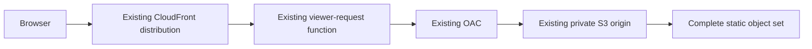
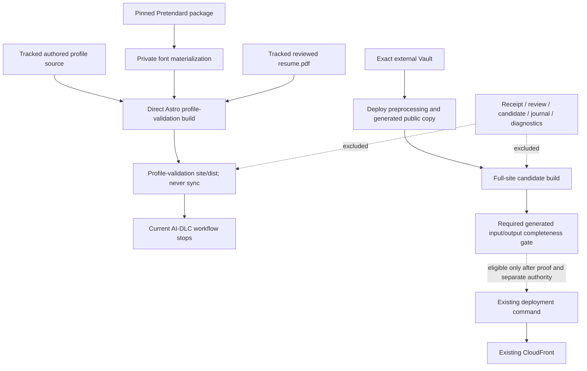

# U1 Infrastructure Design — Profile Domain and Native Experience

## 문서 상태

- **단계**: CONSTRUCTION — U1 Infrastructure Design
- **Unit**: U1 Profile Domain and Native Experience
- **Bounded Context**: Profile Experience
- **상태**: 완료 및 승인됨 — 2026-07-24T07:47:23Z
- **작성일**: 2026-07-24
- **Feature Branch Context**: `codex/feature/resume-profile-experience`
- **Decision Input**: Q1~Q8 = A/A/A/A/A/A/A/A
- **Q3 Clarification**: Q3의 path 목록은 representative mapping이다. 실제 deployable namespace는 hashed CSS/WOFF2와 existing assets를 포함한 complete `site/dist/`이며, deploy preprocessing과 completeness gate를 통과한 full-site output만 eligible하다.
- **Infrastructure Outcome**: Existing AWS S3/CloudFront topology **no-change**; inherited deployment automation의 readiness는 이 U1 stage가 보장하지 않음
- **PBT Enforcement**: 이 stage에 직접 적용되는 PBT rule은 없어 N/A; Functional Design, Code Generation과 Build and Test의 PBT 의무는 유지
- **Extensions**: Obsidian Press project extension 활성; Security와 Resiliency extension 비활성

## 1. 목적과 binding inputs

이 문서는 U1 logical component와 static artifact를 실제 deployment environment에 매핑하고 새 infrastructure의 필요성을 판정한다. Existing private S3 origin과 CloudFront delivery topology가 U1의 static HTML, compiled CSS, reviewed PDF, same-origin hashed font와 existing site assets를 수용하므로 Terraform 또는 AWS resource 변경은 필요하지 않다.

Binding inputs:

- [Infrastructure Design Plan and Answers](../../plans/profile-domain-and-native-experience-infrastructure-design-plan.md)
- [NFR Design Patterns](../nfr-design/nfr-design-patterns.md)
- [NFR Logical Components](../nfr-design/logical-components.md)
- [NFR Requirements](../nfr-requirements/nfr-requirements.md)
- [Tech Stack Decisions](../nfr-requirements/tech-stack-decisions.md)
- [Business Logic Model](../functional-design/business-logic-model.md)
- [Business Rules](../functional-design/business-rules.md)
- [Domain Entities](../functional-design/domain-entities.md)
- [Frontend Components](../functional-design/frontend-components.md)
- [Application Components](../../../inception/application-design/components.md)
- [Application Services](../../../inception/application-design/services.md)
- [Unit Definitions](../../../inception/application-design/unit-of-work.md)
- [Terraform Infrastructure](../../../../infra/main.tf)
- [Astro Configuration](../../../../site/astro.config.mjs)
- [Just Commands](../../../../Justfile)
- [Jenkins Pipeline](../../../../Jenkinsfile)
- [Project Instructions](../../../../AGENTS.md)

이 설계는 authored source inspection 결과다. Terraform plan/apply, AWS API, S3 upload, CloudFront invalidation, DNS query, live endpoint request, deployment, remote push 또는 Vault write를 실행하지 않았다.

## 2. 승인된 Infrastructure 결정

| Question | 선택 | 확정된 결정 | 별도 권한 없이는 채택하지 않는 대안 |
|---|---|---|---|
| Q1 | A | Existing production `rvnnt.dev`의 private S3, CloudFront, ACM input과 Cloudflare DNS를 유지하고 별도 staging cloud environment를 만들지 않음 | 새 bucket/distribution/domain |
| Q2 | A | Dedicated Astro build integration이 module graph resolution 전에 shared idempotent `ProfileFontMaterializer`를 실행 | 수동 pre-step에 의존하거나 deployed font service 도입 |
| Q3 | A + clarification | Complete `site/dist/`가 deployable namespace다. `/resume`/`portfolio` HTML, `/resume.pdf`, hashed CSS/WOFF2와 existing assets는 representative mapping이며, exact Vault deploy preprocessing과 generated-output completeness를 통과한 full-site output만 eligible | Profile 전용 origin/bucket, incomplete file allowlist 또는 bare direct-build output sync |
| Q4 | A | PDF prepare/review/promote는 local sequential process이며 messaging, remote worker와 event bus는 N/A | Queue 기반 remote generation |
| Q5 | A | Existing OAC, single default behavior, viewer-request rewrite, HTTPS와 response-header policy를 재사용 | PDF/font 전용 behavior 또는 function |
| Q6 | A | Existing managed cache와 explicit deployment의 `/*` invalidation을 유지하고 non-atomic rollout을 inherited limitation으로 기록 | Versioned release prefix, atomic pointer 또는 dedicated PDF cache policy |
| Q7 | A | Existing CloudFront access log만 shared context로 유지하고 U1-specific monitoring은 추가하지 않음 | Alarm, synthetic canary, dashboard 또는 analytics |
| Q8 | A | Existing single-tenant bucket, distribution/OAC, headers, log bucket, ACM input과 DNS를 공유 | 별도 account, tenant, bucket 또는 distribution |

Q3 clarification은 NFR-U1-004의 profile-owned CSS unique gzip `<= 24 KiB` gate를 그대로 유지한다. CSS를 deployable set에서 제외하거나 budget을 완화하지 않는다. Existing site JavaScript/assets는 deploy-preprocessed full-site build와 completeness evidence가 포함을 증명할 때 함께 배포되며, U1의 별도 의무는 profile-owned hydrated component와 new client JS가 0인 것이다.

## 3. No-change 판정

### 3.1 결론

U1 static objects를 수용하기 위해 새 AWS resource나 Terraform change는 필요하지 않다. 이 topology no-change 결론은 current Jenkins/Just deployment path에 complete-set safety gate가 이미 있다고 뜻하지 않는다.

- `/resume`와 `/portfolio`는 existing Astro static output과 CloudFront clean-route rewrite에 맞는다.
- `/resume.pdf`, hashed CSS/WOFF2와 other dotted assets는 일반 static object로서 rewrite되지 않는다.
- Existing S3 bucket policy의 CloudFront OAC `GetObject` 범위는 complete deployed object set을 포함한다.
- Existing default behavior의 HTTPS, `GET`/`HEAD`, cache와 response headers는 U1에 충분하다.
- Same-origin compiled CSS와 WOFF2는 existing CSP의 `style-src 'self'`와 `font-src 'self'`에 허용된다.
- Explicit deployment의 sync source는 representative allowlist가 아니라 deploy-preprocessed and completeness-gated full-site `site/dist/`다.
- Candidate, receipt, journal, screenshot와 private verification evidence는 `site/dist/` 밖에 있어 deployment sync set에 포함되지 않는다.
- Runtime compute, database, queue, application cache, load balancer, API gateway, browser farm, secret, authentication 또는 new monitoring은 필요하지 않다.

### 3.2 No-change가 의미하지 않는 것

- Production deployment, invalidation 또는 AWS mutation이 승인·실행됐다는 뜻이 아니다.
- S3 sync와 CloudFront invalidation이 atomic하다는 주장이 아니다.
- Actual S3 object metadata 또는 live CloudFront MIME가 이미 검증됐다는 주장이 아니다.
- Existing delivery에 uptime, throughput, RTO/RPO, canary 또는 synthetic SLO를 추가하는 것이 아니다.
- Local `site/public/resume.pdf` transaction이 production rollback을 소유한다는 뜻이 아니다.
- Terraform, DNS, cache policy, Jenkins deploy stage 또는 credentials를 수정할 권한이 아니다.
- Bare fresh-clone/direct Astro build가 external Vault-derived posts/JSON/assets를 포함한 production-complete set이라는 뜻이 아니다.
- Current `just deploy`/Jenkins가 `sync --delete` 전에 explicit generated-output completeness gate를 이미 수행한다는 뜻이 아니다.
- `just deploy`의 unset `VAULT_PATH` default인 `./fixtures/vault`가 production input으로 안전하다는 뜻이 아니다.

## 4. Existing service와 logical component mapping

| Existing service/boundary | Authored evidence | U1 artifact 또는 logical component | Mapping result |
|---|---|---|---|
| Astro static build | `site/astro.config.mjs`의 `output: "static"` | C02/C04, LC-U1-04, LC-U1-07~09 | HTML, CSS와 hashed assets를 request-time compute 없이 생성 |
| Local Node build/test process | package/Just/Jenkins build entry | LC-U1-01~03, LC-U1-05~06, LC-U1-09, LC-U1-11~19 | Build, browser, PDF와 verification만 수행; deployed compute 아님 |
| Profile-validation output | Direct Astro `site/dist/` | U1 route/PDF/CSS/font slice | Fresh clone에서도 성공해야 하지만 full-site sync source가 아님 |
| Generated full-site inputs | `deploy-preprocess`, `content/`, generated `site/public` JSON/assets | External Vault-derived posts, metadata, search/graph/preview/nav and assets | Correct Vault identity/copy completeness가 deployment candidate의 prerequisite |
| Full-site candidate | Deploy-preprocessed Astro `site/dist/` | Profile output plus all expected existing site output | Complete-set gate 통과 뒤에만 explicit deploy의 sync source |
| Private S3 origin | `aws_s3_bucket.site` | Complete `site/dist/` object set | Existing bucket namespace를 공유 |
| S3 public-access block | `aws_s3_bucket_public_access_block.site` | All deployed objects | Direct public bucket access 없이 CloudFront로 제공 |
| CloudFront OAC/bucket policy | OAC and SourceArn-constrained `GetObject` | HTML, CSS, JS, PDF, WOFF2와 existing assets | 새 IAM principal/policy 불필요 |
| Viewer-request function | `aws_cloudfront_function.index_rewrite` | Clean HTML routes and dotted assets | 모든 extensionless URI는 `/index.html`; dotted object는 unchanged |
| Default cache behavior | CloudFront default behavior | Complete public object set | Single origin, HTTPS redirect, `GET`/`HEAD`, shared managed cache |
| Response-header policy | Existing security policy | HTML/CSS/PDF/font response | `nosniff`; same-origin style/font 허용 |
| CloudFront logging | Distribution log + 90-day S3 lifecycle | Shared delivery log only | U1 acceptance oracle 또는 feature telemetry 아님 |
| Existing manual deploy command | Separately invoked `just deploy`: `VAULT_PATH` 또는 unsafe unset default `./fixtures/vault`를 stamp/preprocess, generated copy, build, `sync --delete`, invalidation | Candidate Just workspace `site/dist/` | Explicit validated production path와 complete-set gate가 현재 없음; 이 문서가 호출 승인 안 함 |
| Current scheduled Jenkins pipeline | `cron('H 0 * * *')`; `OBSIDIAN_VAULT_PATH` 또는 hard-coded production external default를 stamp/preprocess하고 successful Build Site 뒤 unconditional Deploy | Candidate Jenkins workspace `site/dist/` | Inherited auto-deploy behavior; validation-only path 또는 gated readiness로 주장 금지 |

Existing ACM certificate input과 Cloudflare DNS는 custom-domain context다. U1은 certificate, alias, TLS policy 또는 DNS record를 변경하지 않는다.

## 5. Deployment Environment

| Environment | Purpose | Infrastructure | Mutation authority |
|---|---|---|---|
| Local development | Authored route/style iteration | Astro dev process와 workspace | Workspace source/generated scope |
| Local profile verification | Direct clean build, loopback preview, browser/PDF checks | Ephemeral `127.0.0.1` process와 private artifacts | Public cloud mutation 없음; full-site deployability 주장 없음 |
| Future validation-only CI | U3가 연결할 four read-only U1 commands; 현재 pipeline에는 없음 | Jenkins agent/workspace 또는 별도 안전한 CI entry | U1 PDF promotion과 Deploy stage 실행 금지 |
| Production | Public `rvnnt.dev` static delivery | Existing S3 + CloudFront + ACM/Cloudflare context | 이 문서는 mutation을 승인하지 않음; current Jenkins auto-deploy는 inherited behavior |

별도 U1 staging bucket, distribution 또는 domain은 만들지 않는다. Local loopback preview는 production-like static artifact contract를 검증하지만 cloud staging environment가 아니다.

Environment invariants:

1. Application behavior와 public fact authority는 authored source에 있으며 S3/CloudFront state나 `site/dist/`를 canonical source로 읽지 않는다.
2. Profile route는 request-time computation 또는 environment-specific API 없이 완결된다.
3. Profile build/test command는 AWS credential이나 external Vault를 요구하지 않으며, 그 결과를 deployment candidate로 사용하지 않는다.
4. Local command contract에서는 deployment와 verification을 분리하며, current Jenkinsfile에 안전한 validation-only entry가 없다는 gap을 숨기지 않는다.
5. Live infrastructure gap을 발견하면 local gates나 product NFR을 임의로 약화하지 않는다.

## 6. Compute Infrastructure와 fresh-clone font bootstrap

### 6.1 Runtime compute

Deployed runtime compute는 없다. Lambda/Lambda@Edge의 새 code, container, ECS/EKS, EC2, serverless function, remote browser/PDF worker를 추가하지 않는다. Existing CloudFront Function은 URI rewrite만 수행하는 inherited networking component이며 U1-specific behavior로 바꾸지 않는다.

### 6.2 Build-time compute

`PbtRunCoordinator`, `StartupRetryController`, `StaticPreviewSupervisor`, asset/request analyzers, `ProfileFontMaterializer`, browser/PDF adapters, release coordinator와 U1 verification provider는 local 또는 Jenkins build/test process다. Production runtime component가 아니다.

Browser와 preview startup에만 clean-state retry를 최대 한 번 허용한다. Remote retry service나 queue를 추가하지 않는다.

### 6.3 Fresh-clone font bootstrap contract

`site/.generated/profile-font/`는 gitignored private generated input이다. Fresh clone의 canonical Astro build entry는 manual preparation이나 stale local font file에 의존할 수 없다. 이는 font/profile buildability 계약이지 external Vault-derived full-site release completeness 계약이 아니다.

1. Dedicated Astro build integration이 module graph resolution 전에 shared `ProfileFontMaterializer`를 호출한다.
2. Materializer가 lockfile-resolved `pretendard@1.3.9`, allowlisted official subset, digest와 SIL OFL 1.1 notice를 검증한다.
3. Verified repository-local private path에 exclusive-create/atomic 방식으로 generated input을 만든다.
4. Authored profile font entry가 distinct family alias로 generated input을 참조한다.
5. Astro/Vite가 same-origin content-hashed WOFF2를 build graph에 emit한다.
6. Local gate가 emitted URL, non-empty file, `font/woff2`, digest provenance와 route reachability를 검증한다.

같은 integration은 다음 entry에서 같은 결과를 보장해야 한다.

- `cd site && npx astro build`
- `cd site && npm run build`
- `just site-build`
- Jenkins `Build Site`

S04 PDF flow도 같은 idempotent materializer를 재사용한다. 검증 실패는 build failure이며 CDN fallback이나 stale local file로 성공 처리하지 않는다.

### 6.4 CI handoff

Current Jenkins pipeline은 `cron('H 0 * * *')`로 시작하며 Build Site 성공 뒤 condition 없는 Deploy stage를 실행한다. Exact Node version, pinned Playwright browser/system dependency, U1 read-only gates와 validation-only entry도 아직 증명하지 않는다. 따라서 U3는 current pipeline을 그대로 validation에 실행할 수 없다. Deploy stage에 도달하지 않는 실제 안전한 path를 먼저 증명한 뒤 다음을 연결하며, 그런 path가 없으면 중단하고 별도 scope/authorization 결정을 요청한다.

- Node `^22.12.0 || >=24.0.0`
- Pinned Playwright browsers/system dependencies
- `test:unit`, `test:pbt`, `test:e2e`, `resume:pdf:verify`
- CI PBT 1,000 runs, printed suite seed와 replay evidence

CI는 mutating `resume:pdf`를 실행하거나 current receipt/PDF를 생성·교체하지 않는다.

## 7. Storage Infrastructure

### 7.1 Complete deployable set

`aws s3 sync`의 허용된 source namespace는 complete `site/dist/`다. 그러나 bare direct Astro build가 만든 directory는 full-site complete set이 아니다. `site/src/lib/data.ts`는 missing `content/meta`와 generated files를 empty/default data로 처리할 수 있으므로, fresh clone build success는 profile slice buildability만 증명한다.

| Build state | Required input/evidence | Deployment treatment |
|---|---|---|
| Profile-validation output | Tracked profile/public inputs, verified font, direct Astro build와 U1 gates | Never sync; external Vault posts/generated public contract가 없거나 stale/fixture일 수 있음 |
| Full-site candidate | Selected Vault에 `--stamp-published` deploy preprocessing, generated `content/posts/`, `content/meta/`, search/graph/preview/nav JSON와 assets, copied `site/public` outputs, clean Astro build; manual unset default는 fixture candidate | Input-path와 complete-set evidence 전에는 sync 금지 |
| Deployment-eligible complete set | Explicit `VAULT_PATH`가 exact production `Areas/Notes` root이고 fixture가 아님을 확인하며 generated input/output identity, expected post/route/object inventory, reference closure, existing-output preservation와 private exclusion 통과 | 별도 deployment authority 아래서만 sync 가능 |

Current `just deploy`는 `VAULT_PATH`가 unset이면 `./fixtures/vault`를 사용해 그 fixture의 `published` metadata를 쓸 수 있고, Jenkins는 `OBSIDIAN_VAULT_PATH` 또는 hard-coded production external default를 쓴다. Production deployment eligibility는 manual command에 explicit `VAULT_PATH`를 요구하고 그것이 `/Users/revenantonthemission/Library/Mobile Documents/iCloud~md~obsidian/Documents/Obsidian Vault/Areas/Notes`의 intended root로 resolve되며 fixture가 아님을 차단식으로 검증해야 한다. 이 U1 workflow는 어느 command도 실행하지 않는다. 다음 table은 deployment-eligible full-site set 내부의 representative object mapping이며 exhaustive allowlist가 아니다.

| Representative input | Representative build output | S3 object key | Public URL |
|---|---|---|---|
| `site/src/pages/resume.astro` | `site/dist/resume/index.html` | `resume/index.html` | `/resume`, `/resume/` |
| `site/src/pages/portfolio.astro` | `site/dist/portfolio/index.html` | `portfolio/index.html` | `/portfolio`, `/portfolio/` |
| Reviewed `site/public/resume.pdf` | `site/dist/resume.pdf` | `resume.pdf` | `/resume.pdf` |
| Profile CSS sources | `site/dist/_astro/<hashed-css>.css` | `_astro/<hashed-css>.css` | Manifest-selected same-origin URL |
| Verified font input + font entry | `site/dist/_astro/<hashed-font>.woff2` | `_astro/<hashed-font>.woff2` | Manifest-selected same-origin URL |
| `content/posts/`, `content/meta/` | Existing post/index/tag route HTML | Matching route keys | Existing clean routes |
| Generated search/graph/preview/nav JSON and assets copied to `site/public/` | Root JSON/object paths and `assets/**` | Same relative keys | Existing search/graph/navigation/asset URLs |
| Existing site source/public assets | Other files under `site/dist/` | Same relative keys | Existing public URLs |

Exact hashed filenames and complete inventory are owned by the gated full-site build manifest/output, not hard-coded placeholders. The gate must prove generated-input/output correspondence and all expected existing routes/assets; a directory named `site/dist/` or a successful direct build is insufficient. U1 introduces no profile-owned hydrated component or new client JS.

### 7.2 Public/private mapping

| Path class | Tracking | Purpose | Public/S3 status |
|---|---|---|---|
| `site/src/lib/profile/`, components, styles and pages | Tracked authored source | Domain/presentation/style | Build input; source itself는 sync하지 않음 |
| Explicit production `VAULT_PATH` → `Areas/Notes` | External mutable input | Whole-site post/content projection; `--stamp-published` may mutate frontmatter | Path/identity must be gated; this workflow does not read/write it |
| Default `./fixtures/vault` | Tracked test fixture | Just default and test/integration input | Never a production deployment input |
| `site/verification/resume/current-release.json` | Tracked non-public | Current release receipt | `site/dist/` 밖; sync 제외 |
| `site/verification/profile/manual-web-accessibility.json` | Tracked non-public | Manual web evidence | `site/dist/` 밖; sync 제외 |
| `site/.generated/profile-font/` | Gitignored generated | Verified build input | Raw input은 sync 제외; hashed derivative만 public |
| `site/.artifacts/profile/resume/` | Gitignored private | Candidate, draft, viewer, screenshot, lock, journal, recovery | Sync 제외 |
| `site/.artifacts/profile/verification/` | Gitignored private | Budget/request/test evidence | Sync 제외 |
| `site/public/resume.pdf` | Tracked public derivative | Reviewed PDF | Clean build가 root PDF로 copy |
| `content/` | Gitignored generated | Vault-derived posts, metadata, search/graph/preview/nav and assets | Full-site build input; direct build absence를 success로 해석 금지 |
| `site/public/search-index.json`, `graph.json`, `previews.json`, `nav-tree.json` | Tracked/ignored generated mix | Preprocessor-derived public contract | Intended Vault run의 current copy인지 evidence 필요 |
| `site/public/assets/` | Existing generated boundary | Preprocessor-derived public assets | Complete build output에 포함; profile source 아님 |
| `site/dist/` | Gitignored generated | Profile-validation output 또는 full-site candidate | Gated full-site candidate만 explicit deploy의 sync source |

Receipt, review record, candidate, journal와 diagnostics는 route, sitemap 또는 public asset으로 노출하지 않는다. Raw private font input만 authored font entry를 통해 compiled derivative가 될 수 있다.

### 7.3 MIME and identity

| Local URL/path | Expected response | Required identity |
|---|---|---|
| `/resume` | `200`, HTML, non-empty | Current canonical route/source |
| `/portfolio` | `200`, HTML, non-empty | Current canonical route/source |
| `/resume.pdf` | `200`, `application/pdf`, non-empty | Public PDF, current receipt, exact SHA/manifest parity |
| Profile CSS URL | `200`, `text/css`, non-empty | Build manifest reachability and 24KiB accounting |
| Profile font URL | `200`, `font/woff2`, non-empty | Allowlisted package and emitted digest provenance |

Astro preview MIME는 S3 metadata proof가 아니다. Existing deploy command는 explicit PDF/font Content-Type override를 쓰지 않으므로 actual CloudFront/S3 response MIME는 별도로 승인된 deployment 뒤 read-only check에서 확인한다. `nosniff` 상태에서 PDF, CSS 또는 font MIME가 다르면 compatibility failure다. 이를 고치는 sync metadata option, policy 또는 CDN change는 자동 승인되지 않는다.

### 7.4 Storage lifecycle

- Public build output은 existing site bucket과 deploy contract를 공유한다.
- Access log는 existing log bucket의 90-day expiration을 유지한다.
- Profile-specific S3 lifecycle, versioning, archive bucket 또는 artifact store를 추가하지 않는다.
- Receipt retention은 Git history가 담당하며 S3 metadata가 approval source가 아니다.
- Local candidate/recovery lifecycle은 release transaction이 담당하며 cloud storage로 승격하지 않는다.

## 8. Messaging Infrastructure

Messaging은 명시적 N/A다.

- `resume:pdf --prepare`와 `--promote`는 operator-local sequential command다.
- Repository-local lock와 promotion journal이 concurrency/recovery를 소유한다.
- Human exact-SHA pause는 queue message나 remote workflow state가 아니다.
- 종료 뒤 worker, scheduled job, queue, topic, event bus 또는 callback을 남기지 않는다.
- SQS, SNS, EventBridge와 remote PDF generation은 추가하지 않는다.

Runtime async processing이 필요해지면 NFR, security, IAM, retry, DLQ, monitoring, storage와 cost design을 새로 열어야 한다.

## 9. Networking Infrastructure

Text alternative: browser request가 existing CloudFront와 viewer-request rewrite를 지나 OAC-signed S3 `GetObject`로 전달되고, complete `site/dist/`에서 동기화된 static object가 same default behavior와 response-header policy로 반환된다.

### 9.1 URI rewrite

Current CloudFront Function은 route-specific allowlist가 아니라 모든 extensionless URI를 처리한다.

| Viewer URI | Rewrite result | Reason |
|---|---|---|
| `/resume` | `/resume/index.html` | Extensionless URI |
| `/resume/` | `/resume/index.html` | Trailing slash |
| `/portfolio` | `/portfolio/index.html` | Extensionless URI |
| `/portfolio/` | `/portfolio/index.html` | Trailing slash |
| `/resume.pdf` | unchanged | Dotted object |
| `/_astro/<hashed-css>.css` | unchanged | Dotted object |
| `/_astro/<hashed-font>.woff2` | unchanged | Dotted object |

U1은 function code/association을 변경하지 않는다.

### 9.2 Origin, methods and headers

- S3 public access는 차단되고 CloudFront OAC만 `GetObject`한다.
- Default behavior의 `GET`/`HEAD`와 HTTPS redirect는 static profile에 충분하다.
- API Gateway, ALB, new origin/VPC/security group은 필요 없다.
- Profile route는 runtime external request를 추가하지 않는다.
- Existing `style-src 'self'`와 `font-src 'self'`가 same-origin compiled CSS/font를 허용한다.
- Existing HSTS, frame denial, referrer policy와 `nosniff`를 유지한다.
- Other routes 때문에 존재하는 current CDN/style/connect allowlist를 U1에서 넓히거나 줄이지 않는다.

## 10. Cache, rollout and rollback

| Artifact | URL strategy | Existing cache treatment | U1 contract |
|---|---|---|---|
| Route HTML | Stable clean route | Managed CachingOptimized behavior | Deploy-preprocessed complete build + explicit deploy invalidation |
| Résumé PDF | Stable `/resume.pdf` | Same managed behavior | Current reviewed PDF + full invalidation |
| Compiled CSS/font | Content-hashed `_astro` URLs | Same managed behavior | 24KiB CSS gate; content identity changes URL |
| Existing assets | Existing generated/static URLs | Same default behavior | Generated-output completeness gate가 preservation을 증명해야 함 |

Required safe eligibility/deployment order (not the current physical implementation):

1. Explicit `VAULT_PATH`가 exact intended production `Areas/Notes` root이고 fixture/default가 아님을 검증
2. Selected production Vault에 `--stamp-published` deploy preprocessing을 실행하고 `content/`와 generated `site/public` JSON/assets를 갱신
3. Astro build로 candidate `site/dist/` 생성
4. Generated input/output, expected post/route/asset inventory, reference closure와 private exclusion completeness gate
5. `aws s3 sync site/dist/ s3://... --delete`
6. CloudFront `/*` invalidation request

Current `just deploy`는 step 1 없이 unset `VAULT_PATH`를 fixture로 default하고, current Just/Jenkins 모두 step 4 없이 candidate build에서 sync로 진행한다. Infrastructure Design은 이 path를 실행하지 않으며 current candidate를 deployment-ready라고 승인하지 않는다. `sync --delete`에 default fixture, direct, stale 또는 incomplete output을 전달하면 기존 origin posts/assets를 삭제할 수 있다. Sync와 invalidation은 atomic switch가 아니며, sync 중 또는 invalidation 전파 중 구·신 object가 함께 보일 수 있다.

U1이 보장하는 범위:

- Current approved profile source에서 만든 coherent local profile HTML/CSS/PDF/font set
- Public PDF와 tracked receipt의 exact identity
- Direct clean second build의 profile route/link/MIME/parity
- Profile-owned CSS unique gzip `<= 24 KiB`
- Full-site deployment candidate가 complete `site/dist/`여야 한다는 namespace/input/output gate contract

U1이 보장하지 않는 범위:

- Direct fresh-clone output의 external Vault posts/generated JSON/assets completeness 또는 deployment eligibility
- Current Jenkins/Just path의 missing complete-set gate 보완
- Multi-object S3 upload atomicity
- CloudFront invalidation completion time
- Zero-downtime cutover 또는 production cache rollback RTO/RPO
- Live origin과 local revision의 automatic reconciliation

Local `resume:pdf` rollback은 previous tracked PDF/receipt pair 또는 first-release absence를 정확히 복구하며 AWS state를 수정하지 않는다. 반면 현재 infrastructure는 previous complete `site/dist/` artifact, exact external Vault/generated-input snapshot, S3 versioning 또는 versioned origin pointer를 보존하지 않는다. 따라서 Git history의 previous profile revision과 current available Vault로 clean build, re-sync, invalidate하는 것은 best-effort production redeploy일 뿐 이전 production site 전체의 exact rollback이 아니다. Exact rollback이 필요하면 release artifact/source snapshot retention, versioning 또는 atomic pointer를 포함한 새 deployment architecture와 별도 권한을 연다.

## 11. Monitoring Infrastructure

U1-specific monitoring은 N/A다.

- Existing CloudFront access logs와 90-day lifecycle만 shared context로 유지한다.
- Access logs는 fact approval, PDF parity, accessibility 또는 U1 acceptance oracle가 아니다.
- Local preview가 route/PDF/CSS/font status, MIME, body와 source identity를 검증한다.
- U1 evidence와 later C12/S05 aggregation은 build/CI artifact이지 production telemetry가 아니다.
- Uptime SLO, CloudWatch alarm/dashboard, synthetic canary, RUM, analytics와 feature metric을 추가하지 않는다.

Runtime service, production SLO 또는 operational owner가 생기면 monitoring design을 다시 연다.

## 12. Shared Infrastructure

| Shared resource | Sharing rule | Isolation boundary |
|---|---|---|
| Site S3 bucket | Complete `site/dist/` static set | Object key namespace |
| CloudFront distribution/default behavior | All public routes/assets | URI and object identity |
| OAC and bucket policy | Read-only origin access | CloudFront SourceArn |
| Response-header policy | Shared security headers | Route resource policy는 application layer |
| CloudFront Function | All extensionless routes | Dotted assets unchanged |
| Access log bucket | Distribution-wide logs | Existing prefix/lifecycle |
| ACM input and Cloudflare DNS | Existing custom domain | No U1 subdomain/certificate |
| Jenkins/Just deployment | Complete site | Manual invocation authority와 inherited nightly Jenkins auto-deploy behavior를 구분 |

New account, bucket, distribution, origin 또는 tenant boundary를 만들지 않는다. Route/object namespace, repository containment와 public/private/generated boundaries가 필요한 isolation을 제공한다.

## 13. Public, private and generated boundary

Text alternative: tracked profile source, verified private font input과 reviewed PDF는 direct Astro profile-validation build의 input이고 현재 AI-DLC workflow는 그 결과를 sync하지 않고 중단한다. Full-site deployment candidate는 explicit validated production `VAULT_PATH`, generated `content/`와 copied public JSON/assets를 추가로 요구하며, generated input/output completeness gate와 별도 authority가 있어야 sync-eligible하다. Current `just deploy`는 unset path를 `./fixtures/vault`로 default하고 current Just/Jenkins 모두 explicit completeness gate 없이 candidate를 sync하므로 diagram의 path/gate가 현재 automation에 구현됐다고 주장하지 않는다. Private evidence는 두 output 모두에서 제외된다.

Boundary invariants:

1. `site/public/resume.pdf`만 PDF public target이다.
2. `site/verification/` records는 `site/public/` 또는 `site/dist/`로 copy하지 않는다.
3. `site/.generated/`와 `site/.artifacts/`는 gitignored private/generated paths다.
4. `site/public/assets/`는 existing generated boundary이며 profile authored font/fact source가 아니다.
5. `site/dist/`는 output namespace일 뿐이며 deploy-preprocessed completeness evidence가 있는 full-site candidate만 deployable하다; 어느 dist도 behavior source는 아니다.
6. S3/CloudFront object는 C01 fact source나 approval record가 아니다.
7. Existing preprocessor asset copy는 `site/public/assets/`를 갱신하지만 `site/public/resume.pdf`를 생성·수정하지 않는다.

## 14. Verification and evidence

### 14.1 Local gates

| Gate | Required evidence | Mutation |
|---|---|---|
| Profile clean build | U1 profile routes/PDF/CSS/font; direct build가 full-site output이 아님을 명시 | Gitignored build/generated font only |
| Route mapping | `/resume/index.html`, `/portfolio/index.html`; local 200 HTML | Cloud mutation 없음 |
| PDF mapping | Public PDF equals final dist copy; `application/pdf` | Verification read-only |
| CSS mapping | Manifest-reachable profile CSS, `text/css`, unique gzip `<= 24 KiB` | Read-only analyzer evidence |
| Font bootstrap | Empty generated path에서 direct build success; package/license/digest | Private generated input |
| Font serving | Manifest URL, `font/woff2`, non-empty, `document.fonts` | Browser observation |
| Full-site completeness | Explicit production `VAULT_PATH`/fixture exclusion, preprocessing identity, `content/` and copied JSON/assets, expected post/route/asset inventory와 reference closure | Current U1에서 실행하지 않음; separately authorized deploy-validation evidence |
| Private exclusion | No receipt/candidate/journal/screenshot/diagnostics in dist | Read-only inventory |
| Rewrite compatibility | Source-level extensionless/dotted truth table | Terraform/AWS mutation 없음 |
| Deploy boundary | Source inspection proves sync then invalidation; no atomicity claim | Deploy 실행 안 함 |

### 14.2 Deferred live evidence

Actual S3 metadata와 CloudFront response는 local build로 증명할 수 없다. Separately authorized deployment 뒤 read-only check만 다음을 확인한다.

- `/resume`, `/portfolio`, `/resume.pdf` status/type/body
- Reviewed PDF revision/SHA attribution
- Hashed CSS `text/css` and WOFF2 `font/woff2`
- Required response headers
- Invalidation completion and selected artifact availability

이 deferred check는 current stage network gate가 아니며 deployment authority를 만들지 않는다.

Failure handling:

- Missing artifact, wrong local MIME, CSS budget failure, existing-output regression, private leakage 또는 font bootstrap failure는 Code Generation completion을 차단한다.
- Direct/fixture/stale output을 full-site candidate로 취급하거나 generated completeness evidence가 없으면 deployment eligibility를 차단한다.
- `VAULT_PATH`가 unset/default fixture/wrong root이거나 exact production `Areas/Notes` identity를 증명하지 못하면 deployment eligibility를 차단한다.
- Terraform source가 mapping과 다르면 no-change conclusion을 재평가한다.
- Later live mismatch는 success로 숨기지 않고 authorization trigger로 전환한다.

## 15. Traceability

### 15.1 NFR

| NFR | Infrastructure mapping/evidence |
|---|---|
| NFR-U1-001 | Static HTML/CSS delivered through existing origin; browser content-preservation matrix remains U1-owned |
| NFR-U1-002 | Browser is local/Jenkins build compute; U3 owns pinned provisioning, no browser service |
| NFR-U1-003 | Static delivery/header reuse; Axe/manual record is authority, new monitoring N/A |
| NFR-U1-004 | Profile compiled CSS is present in validation output and required full-site release, unique gzip `<=24 KiB`, no profile JS/external request; new cache N/A |
| NFR-U1-005 | Print/PDF is build-time; runtime infrastructure N/A |
| NFR-U1-006 | Fresh-clone materializer, same-origin WOFF2, PDF/font MIME; no remote renderer |
| NFR-U1-007 | Fixed `resume.pdf`; receipt stays non-public; exact SHA/manifest gate |
| NFR-U1-008 | Vitest/fast-check is local/Jenkins tooling; infrastructure enforcement N/A |
| NFR-U1-009 | U3 process preserves runs/seed/path; deployed infrastructure N/A |
| NFR-U1-010 | U1 stable commands, later U3 aggregation; `resume:pdf` excluded from CI |
| NFR-U1-011 | Authored/generated/public/private mapping; direct profile output and deploy-preprocessed complete set are distinct |
| NFR-U1-012 | Local lock/journal/rollback; production atomicity explicitly not claimed |
| NFR-U1-013 | Static internal routes and same-origin assets; no tracking/runtime external request |
| NFR-U1-014 | Existing static route/PDF/font compatibility; local 200/MIME/body; scaling N/A |
| NFR-U1-015 | Metadata/JSON-LD remain profile route HTML and are required in any full-site static set |

### 15.2 Logical components

| Logical components | Placement and boundary |
|---|---|
| LC-U1-01~03 | Local/Jenkins Node and loopback process; no deployed compute |
| LC-U1-04, LC-U1-07~08 | Authored Astro CSS/head/serializer; compiled static output |
| LC-U1-05~06 | Read-only build/browser analyzers; private evidence |
| LC-U1-09 | Astro build integration/private input; hashed WOFF2 public derivative |
| LC-U1-10, LC-U1-13~15 | C11 pure contracts; no infrastructure state |
| LC-U1-11~12, LC-U1-16~17 | Local S04 PDF/filesystem transaction; no AWS side effect |
| LC-U1-18~19 | U1 commands/evidence; later C12/S05 consumes four read-only commands |
| LC-U1-20 | Policy-only static boundary; no resource/process |

### 15.3 Functional requirements

| Functional requirement | Infrastructure relevance |
|---|---|
| FR-001~FR-002 | Authored canonical/approved facts; S3/PDF/receipt never becomes fact authority |
| FR-003~FR-005 | Resume/portfolio static routes map to existing clean routes/object keys |
| FR-006~FR-007 | CTA/content hierarchy delivered as static HTML/CSS |
| FR-010 | Reviewed `/resume.pdf`, print source and exact parity map to fixed public object |
| FR-011~FR-012 | Metadata, JSON-LD, navigation and cross-links remain static route content |
| FR-013 | No profile client/runtime compute or new infrastructure |
| FR-014~FR-015 | U1 examples/PBT remain owner-local; U3 aggregates commands |
| FR-016 | Current scheduled Jenkins auto-deploy를 validation-only CI로 오인하지 않으며 U3는 safe non-deploy execution path를 증명하거나 중단 |
| FR-017 | Authored source, external Vault/generated contracts, profile-validation output, gated full-site `site/dist/`와 private evidence의 ownership/publication boundary |
| FR-018 handoff | Local route/PDF/CSS/font readiness; production deploy/monitoring not inferred |

BR-DOC-001~007 remain application/document gates. Infrastructure mapping does not weaken expected=web=print=PDF parity, source identity, missing/stale failure 또는 stable `/resume.pdf`.

## 16. Applicability and N/A

| Category | Decision | Re-evaluation trigger |
|---|---|---|
| Deployment environment | Existing production + local/CI non-deploy | Separate staging requested |
| Runtime compute | N/A | SSR/API/remote PDF generation |
| Build/test compute | Applicable | CI platform/tool contract changes |
| Storage | Existing S3; gated full-site dist only | Artifact/publicity/completeness/retention change |
| Database | N/A | Mutable/queryable runtime data |
| Messaging | N/A | Remote async generation |
| Networking | Existing CloudFront/OAC | New origin/domain/path behavior |
| Application cache | N/A; existing CDN cache only | New TTL/atomic rollout requirement |
| Monitoring | No new U1 monitoring | Operational SLO/synthetic owner |
| Shared infrastructure | Existing single-tenant resources | Tenant/account isolation |
| Secrets/IAM | No new resource | New cloud operation |

## 17. Authorization triggers

다음은 no-change 결론을 중단하고 별도 scope와 명시적 권한을 요구한다.

1. Terraform resource/provider/state/topology/policy change
2. S3 bucket/prefix isolation, lifecycle, versioning, public access 또는 metadata policy
3. CloudFront distribution/origin/behavior/function/cache/header/invalidation change
4. ACM, alias, Cloudflare DNS 또는 domain change
5. Staging, separate account 또는 tenant boundary
6. Runtime API/server/Lambda/container, remote browser/PDF worker, DB, queue 또는 app cache
7. Atomic/exact production cutover·rollback, prior complete artifact/source snapshot retention, immutable release prefix 또는 origin pointer
8. Alarm, canary, dashboard, analytics 또는 new log retention
9. Jenkins deploy semantics, AWS credential flow 또는 production rollback automation
10. Wrong live MIME를 고치는 sync metadata/CDN mutation
11. `just deploy`, S3 sync, invalidation, Terraform apply, remote push 또는 Vault write
12. `sync --delete` 전에 explicit production `VAULT_PATH`/fixture exclusion 또는 deploy-preprocess generated-output completeness를 증명하려면 current deployment automation을 변경해야 하는 경우

## 18. Extension compliance

### PBT

- Infrastructure Design에 직접 적용되는 PBT rule은 N/A다.
- NFR Requirements의 PBT-09 toolchain과 Functional Design PBT-01 properties는 Code Generation/Build and Test로 유지한다.
- Infrastructure mapping은 tests를 remote service로 옮기거나 U3가 재구현하게 하지 않는다.
- Font bootstrap, object mapping, MIME, CSS budget와 private exclusion은 deterministic build/browser gates다.

### Security and Resiliency

두 extension은 비활성이지만 approved product contracts는 유지한다: private S3/OAC, public/private containment, same-origin font, offline PDF, local single-writer journal/rollback, safe JSON-LD, no tracking, startup-only retry와 all semantic/layout/parity/PBT failures fail-closed.

### Obsidian Press

| Rule | Compliance |
|---|---|
| OBSIDIAN-01 | `AGENTS.md`, Astro/npm/npx, generated boundary, Git Flow와 no-deploy instructions를 binding input으로 사용 |
| OBSIDIAN-02 | Authored source, external/generated inputs, direct profile output, gated full-site `site/dist/`와 private evidence를 구분; dist를 behavior source로 사용하지 않음 |
| OBSIDIAN-03 | Infrastructure source change가 없어 Terraform gate N/A; Code Generation은 direct Astro build와 affected U1 gates를 실행하고 deploy를 test로 사용하지 않음 |
| OBSIDIAN-04 | Focused U1 branch context를 유지하고 dirty primary worktree/unrelated changes를 흡수하지 않음; Git mutation 없음 |
| OBSIDIAN-05 | Existing active AI-DLC state/audit를 계속 사용하며 새 run/archive를 만들지 않음 |

## 19. Handoff

### U1 Code Generation

1. Direct `npx astro build` 전에 동작하는 font build integration과 shared materializer
2. Static routes, resource policy, profile CSS와 hashed font
3. `site/public/resume.pdf` local release transaction과 tracked non-public receipt
4. `.generated`/`.artifacts` private ignore/exclusion
5. Profile-validation route/PDF/CSS/font MIME, CSS budget와 final-copy gates; direct output은 full-site deployable이라고 주장하지 않음
6. Exactly five stable commands; only `resume:pdf` may mutate PDF/receipt

No `infra/`, AWS, DNS 또는 deployment change를 구현하지 않는다. Gap은 authorization trigger로 보고한다.

### U3 and Jenkins

U3는 Node/browser provisioning, four read-only U1 commands, CI PBT 1,000 runs/seed와 deploy 이전 blocking gate를 소유한다. 현재 Jenkins는 nightly build 뒤 unconditional Deploy를 실행하므로 그 pipeline 자체는 validation-only evidence가 아니다. U3는 Deploy stage에 도달하지 않는 실제 안전한 실행 path를 먼저 증명하고 fixture/non-mutating integration output과 production deploy-preprocessed candidate를 구분해야 하며, 없으면 중단하고 별도 결정을 요청한다. CI에서 `resume:pdf` 또는 mutating `deploy-preprocess`를 호출하지 않는다. Jenkins deploy stage의 변경/실행/credentials use는 이 document가 승인하지 않는다.

### Companion artifacts

`deployment-architecture.md`는 direct profile build와 deploy-preprocessed/gated full-site dist, S3/CloudFront request, cache/invalidation와 non-atomic rollout을 topology/sequence 관점에서 구체화한다. `shared-infrastructure.md`는 existing resources를 U1/U2/U3 shared context로 기록한다. 둘 다 new resource나 stronger production guarantee를 도입할 수 없다.

## 20. Completion invariants

1. `/resume`와 `/portfolio`가 static route output에 있고 all-extensionless rewrite와 양립한다.
2. `/resume.pdf`, compiled CSS와 WOFF2는 dotted object로 rewrite되지 않는다.
3. Deployable namespace는 representative allowlist가 아닌 complete `site/dist/`이며, explicit production `VAULT_PATH`/fixture exclusion, deploy preprocessing과 generated-output completeness를 통과한 full-site candidate만 eligible하다.
4. PDF는 `application/pdf`, CSS는 `text/css`, WOFF2는 `font/woff2`이고 모두 non-empty다.
5. Profile-owned CSS unique gzip은 `<=24 KiB`; profile-owned new client JS는 0이다.
6. Fresh clone direct Astro build가 manual font pre-step 없이 성공하되 그 reduced/profile output을 full-site deployable set으로 취급하지 않는다.
7. Receipt, review, candidate, journal와 diagnostics가 `site/dist/`에 없다.
8. Public PDF는 current receipt/source/manifest와 일치한다.
9. Exact local two-pass release rollback과 best-effort production redeploy를 혼동하거나 exact production rollback을 주장하지 않는다.
10. Runtime compute, DB, queue, app cache, monitoring 또는 new shared resource가 없다.
11. Terraform, AWS, DNS, deploy, invalidation, remote push와 Vault write를 실행·승인하지 않는다.
12. Current `just deploy`의 unsafe fixture default와 deployment paths의 missing complete-set gate를 포함한 infrastructure/automation gap은 workaround로 숨기지 않고 authorization trigger로 전환한다.
