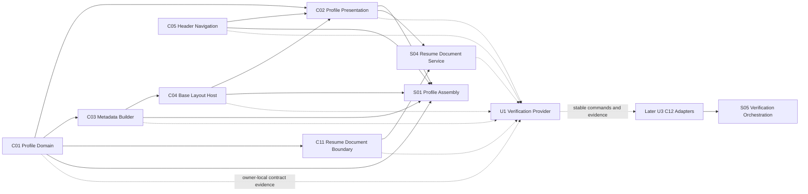
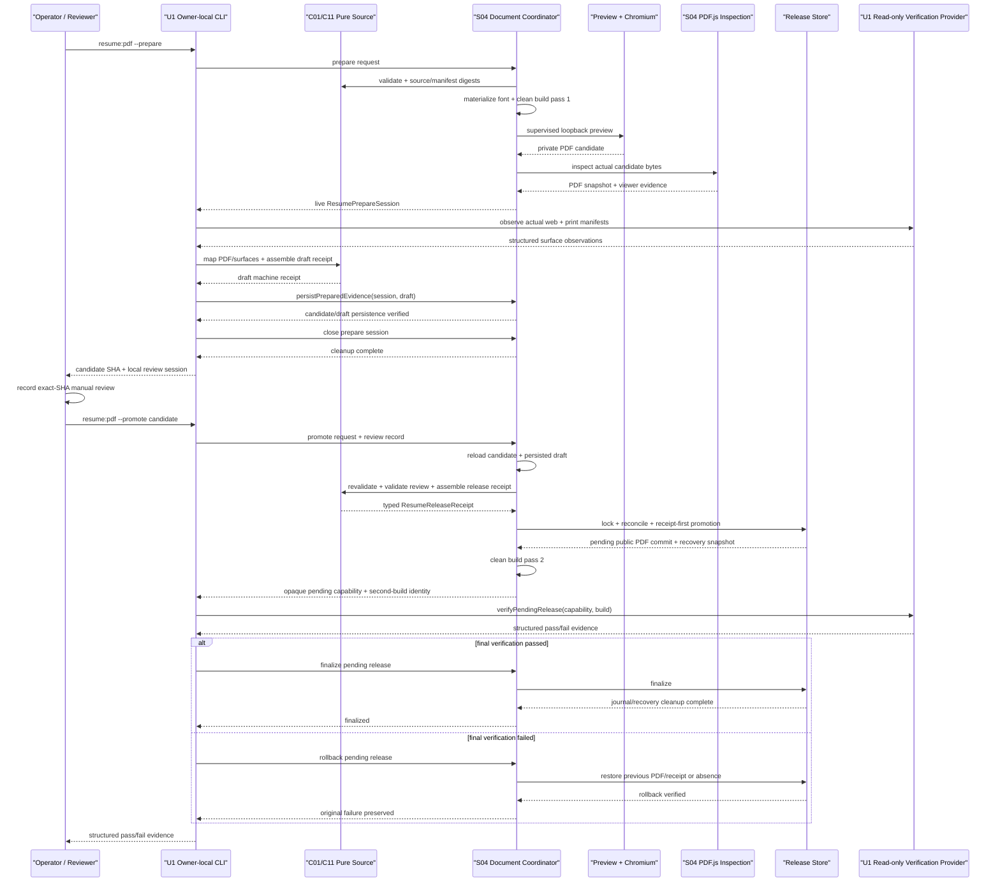

# U1 NFR Design — Logical Components

## 문서 상태

- **단계**: CONSTRUCTION — U1 NFR Design
- **Unit**: U1 Profile Domain and Native Experience
- **상태**: 완료 및 승인됨 — 2026-07-24T06:52:11Z, 사용자 입력: "다음 단계로 진행해줘"
- **작성일**: 2026-07-24
- **결정 입력**: NFR Design Q1~Q16 = 모두 A
- **Feature Branch**: `codex/feature/resume-profile-experience`
- **Extensions**: Obsidian Press project extension 활성; Security와 Resiliency extension 비활성

## 1. 목적과 binding inputs

이 문서는 승인된 Functional/Application Design의 소유권을 바꾸지 않으면서 U1 NFR을 구현 가능한 logical component, dependency, side-effect와 command boundary로 구체화한다.

Binding inputs:

- `nfr-requirements/nfr-requirements.md`의 NFR-U1-001~015
- `nfr-requirements/tech-stack-decisions.md`의 TS-U1-001~009
- Functional Design의 canonical profile, ordered fact manifest, exact parity와 PBT property
- Application Design의 C01~C05/C11, C12와 S01/S04/S05 dependency direction
- NFR Design Plan의 Q1~Q16에서 선택된 A pattern

이 설계는 실제 공개 fact, Terraform/AWS, deployment, remote push 또는 외부 Vault 변경을 승인하지 않는다.

## 2. 고정 ownership과 dependency 원칙

1. **C01 Profile Domain**은 canonical production fact, validation, selector와 ordered résumé manifest의 source 의미를 소유한다.
2. **C02 Profile Presentation**은 정적 semantic HTML과 profile/print style의 authored ownership을 소유한다.
3. **C03 Profile Metadata Builder**는 typed metadata와 JSON-LD document를 pure projection으로 만든다.
4. **C04 Base Layout Metadata Host**는 typed route resource policy와 script-safe JSON-LD embedding을 소유한다.
5. **C05 Header Navigation**은 desktop/mobile이 공유하는 server-rendered navigation model만 소유한다.
6. **C11 Resume Document Boundary**는 source/manifest identity, pure evidence mapping, receipt assembly와 public `/resume.pdf` contract를 소유한다.
7. **S01 Profile Assembly**은 C01~C05를 같은 validated source identity로 조합한다. NFR automation을 호출하지 않는다.
8. **S04 Resume Document Service**는 preview, browser, font materialization, PDF/file I/O와 release promotion side effect를 소유하며 C11의 pure contract를 소비한다.
9. **U1 owner-local verification providers**는 U1 assertion, PBT generator, browser/document probe와 다섯 stable command를 feature branch에 구현한다. 이 tooling은 application runtime component가 아니다.
10. **C12 Verification and Automation Adapters**와 **S05 Verification Orchestration**의 implementation ownership은 U3에 남는다. U3는 U1 stable command/evidence contract를 read-only로 실행·집계하며 U1 logic을 이동·복제하지 않는다. Application component와 S01/S04는 C12에 의존하지 않는다.

Provider가 typed value/result를 consumer에게 제공하는 contract/data flow는 다음과 같다. 이 그림은 TypeScript import arrow가 아니다.

실선은 production contract의 provider → consumer flow이고 점선은 owner-local evidence → later verification consumer flow다. Code dependency는 consumer가 provider의 public interface에만 의존하는 approved Application Design을 따른다. Provider가 downstream consumer나 verification component를 import하는 ownership inversion, 그리고 application production code가 U1 provider/C12를 import하는 방향은 금지한다.

## 3. 공통 logical contracts

| Contract | 필수 내용 | Authority / 소비자 |
|---|---|---|
| `PbtRunConfig` | positive `numRuns`, signed-int32 `seed`, optional exact file/test focus와 optional replay path | LC-U1-01이 생성; PBT-only setup이 소비 |
| `BuildIdentity` | clean production build root, build/source identity, created-at와 route set | Build owner가 생성; LC-U1-03이 검증·소비 |
| `PreviewLease` | loopback base URL, process identity, build identity, exact ready routes와 cleanup handle | LC-U1-03이 생성; browser/PDF adapters가 소비 |
| `CanonicalDigest` | domain tag, schema version, algorithm `sha256`과 lowercase hex digest | LC-U1-10이 생성 |
| `ResumeCandidate` | private candidate ID/path, PDF SHA-256, source fingerprint와 manifest digest | LC-U1-11이 생성 |
| `ResumePrepareSession` | expected manifest/digests, live `PreviewLease`, candidate, `PdfInspectionSnapshot`, viewer evidence, identity-checked S04 persistence handle와 mandatory cleanup handle | S04가 생성; neutral LC-U1-19가 U1 provider/C11 pure contracts와 조정 |
| `PdfInspectionSnapshot` | page text fragments, URL annotations, structure tree, outline, rendered-page evidence와 tool versions | LC-U1-12가 생성 |
| `MappedResumeEvidence` | every expected fact/entity/section/order entry와 exact observed occurrence의 deterministic mapping | LC-U1-13이 생성 |
| `RenderedResumeManifestObservation` | `web` 또는 `print` surface, source identity, present-section/entity/order vectors와 structured DOM에서 관찰한 every fact ID/path/kind/value | U1 browser provider가 생성; LC-U1-13이 expected manifest와 비교 |
| `SurfaceManifestComparison` | expected/web/print/PDF surface identity와 every ordered field의 exact equality/mismatch | LC-U1-13이 pure하게 생성 |
| `ResumeInspectionReceipt` | candidate hash, source/manifest digests, full mapping, machine checks와 diagnostics | LC-U1-14가 생성; canonical source가 아님 |
| `ManualReviewRecord` | exact candidate SHA, source/manifest digests, reviewer, timestamp, checklist outcome와 result | Human reviewer가 작성; LC-U1-15가 검증 |
| `ManualWebAccessibilityRecord` | versioned review-subject digest, route, engine/viewport/theme/details state, reviewer/time, reading order, color-independent meaning, focus appearance/obscuration와 result | Human reviewer가 작성; tracked non-public record를 LC-U1-18이 completeness/currentness 검증 |
| `ResumeReleaseReceipt` | promoted public PDF SHA, source/manifest digests, full mapping, machine receipt identity, exact manual review와 tool versions | LC-U1-14가 pure assembly; LC-U1-16이 tracking; U1 provider가 read-only 검증하고 later C12/S05가 stable result 집계 |
| `PromotionJournal` | old/new receipt/PDF hashes, durable previous bytes/absence sentinels, private recovery paths, candidate path, state와 commit point | LC-U1-16의 crash recovery/rollback evidence |
| `PendingResumeRelease` | held release lock, journal identity, new pair와 verified previous recovery snapshot을 묶은 opaque non-serializable in-process capability | LC-U1-16만 생성; neutral LC-U1-19가 scoped final verification 뒤 finalize/rollback을 지시 |
| `VerificationEvidence` | command, stage, result, rules, artifacts, optional PBT seed/path와 no-skip reason | U1 provider가 생성; local operator와 later C12/S05가 소비 |

Digest, receipt와 evidence는 fact source가 아니다. Production projection은 언제나 C01에서 다시 계산한다.

## 4. Logical component catalog

| ID | Logical component | Primary owner | 종류 | 핵심 책임 | Side effect |
|---|---|---|---|---|---|
| LC-U1-01 | `PbtRunCoordinator` | U1 owner-local verification tooling | Node ESM process adapter | suite seed/run/focus를 worker 전에 검증하고 local Vitest를 시작 | Child process와 console evidence만 |
| LC-U1-02 | `StartupRetryController` | S04 | Automation policy/controller | eligible startup failure만 clean state에서 최대 한 번 재시도 | Child-process cleanup/recreate |
| LC-U1-03 | `StaticPreviewSupervisor` | S04 | Local process adapter | clean build를 ephemeral loopback preview로 lease | Loopback server process |
| LC-U1-04 | `ProfileStyleOwnership` | C02 | Authored style boundary | foundation, route와 print layer의 소유권/entry를 정의 | 없음 |
| LC-U1-05 | `ProfileAssetBudgetAnalyzer` | U1 provider of C12-facing contract | Read-only build analyzer | manifest provenance, unique gzip CSS와 new JS를 판정 | Non-public evidence만 |
| LC-U1-06 | `BrowserRequestLedger` | U1 provider of C12-facing contract | Browser observation adapter | actual request를 기록하고 non-loopback/external request를 차단 | Browser observation, private evidence |
| LC-U1-07 | `ProfileRouteResourcePolicy` | C04 | Pure typed policy | profile route의 local-only head resource set을 결정 | 없음 |
| LC-U1-08 | `JsonLdScriptSerializer` | C04 | Pure serializer | JSON-LD를 script-safe하게 embed하고 round-trip contract 제공 | 없음 |
| LC-U1-09 | `ProfileFontMaterializer` | S04 | Build-time filesystem adapter | pinned Pretendard subset/license를 private generated input으로 materialize | Private generated files |
| LC-U1-10 | `CanonicalDigestEncoder` | C11 | Pure digest service | source fingerprint와 ordered manifest digest를 domain-separated encoding으로 계산 | 없음 |
| LC-U1-11 | `ResumePdfRenderer` | S04 | Browser/filesystem adapter | `/resume` print representation에서 offline private PDF candidate 생성 | Browser와 private candidate file |
| LC-U1-12 | `PdfInspectionAdapter` | S04 | PDF.js/viewer adapter | actual PDF text/link/structure/outline/page evidence 추출 | Private viewer/screenshots |
| LC-U1-13 | `ResumeEvidenceMapper` | C11 | Pure mapper | extracted occurrence를 expected fact/entity/section/order에 연결 | 없음 |
| LC-U1-14 | `ResumeInspectionReceiptAssembler` | C11 | Pure assembler | exact mapping과 machine result를 draft inspection receipt로 조합 | 없음 |
| LC-U1-15 | `ResumeHumanReviewGate` | C11 | Pure review validator | exact-SHA manual review의 completeness/currentness 판정 | 없음 |
| LC-U1-16 | `SingleWriterResumeReleaseStore` | S04 | Filesystem transaction boundary | lock, journal, receipt-first/public-PDF commit과 recovery | Tracked receipt/PDF promotion |
| LC-U1-17 | `ResumeDocumentCoordinator` | S04 | Side-effect session coordinator | prepare session, promote/rollback와 two-pass build side effect 조정 | Delegated side effects |
| LC-U1-18 | `U1VerificationProvider` | U1 owner-local verification tooling | Read-only feature verification provider | unit/PBT/browser/document/link/metadata/obligation evidence 생성 | Generated build/private evidence만 |
| LC-U1-19 | `U1CommandRouter` | U1 owner-local tooling | Stable CLI boundary | 정확히 다섯 stable command를 read-only U1 provider 또는 mutating S04 flow에 연결 | Command별로 제한 |
| LC-U1-20 | `StaticCapacityBoundary` | NFR policy | Policy-only logical boundary | bounded static architecture와 재평가 trigger 기록 | **구현/프로세스 없음** |

## 5. Component design

### 5.1 LC-U1-01 — `PbtRunCoordinator`

**Inputs**

- `PBT_RUNS`
- optional `PBT_SEED`
- optional `PBT_PATH`
- wrapper가 받는 exact test file과 exact full test name focus
- CI/local execution context

**Behavior**

1. `PBT_RUNS`를 positive safe integer로 검증한다. 값이 없으면 local 100, CI 1,000을 선택한다.
2. `PBT_SEED`가 없으면 worker 시작 전에 signed 32-bit seed 하나를 생성한다. 있으면 signed 32-bit decimal만 허용한다.
3. `PBT_PATH`는 explicit seed와 exact file/test focus가 모두 있을 때만 허용한다.
4. canonical run config와 seed를 Vitest spawn 전에 항상 출력한다.
5. repository-local Vitest binary만 immutable child environment로 실행한다. Package download 또는 `npx` resolution에 의존하지 않는다.
6. PBT-only setup은 validated environment를 한 번 읽고 `fc.configureGlobal()`에 같은 seed/run policy를 적용한다. Test body는 environment를 다시 parse하거나 property별 seed를 만들지 않는다.
7. Default shrinking, seed/path/counterexample와 shrink count output을 그대로 보존한다. Retry, normal-run `endOnFailure`와 incomplete-success를 금지한다.

**Outputs**

- `PbtRunConfig`
- Vitest exit code와 unmodified fast-check failure evidence

Invalid run/focus configuration은 worker를 한 개도 시작하지 않고 terminal failure다. 이 component에는 startup retry를 적용하지 않는다.

### 5.2 LC-U1-02 — `StartupRetryController`

`StartupRetryController`만 retry count와 eligibility를 소유한다.

| Error class | 예 | Retry |
|---|---|---|
| `startup.preview.launch` | preview child process를 시작하지 못함 | clean teardown 뒤 1회 |
| `startup.preview.readiness` | deadline 전 loopback connect/readiness가 transient하게 성립하지 않음 | clean teardown 뒤 1회 |
| `startup.browser.launch` | pinned browser launch가 transient하게 실패 | browser/process cleanup 뒤 1회 |
| Semantic/static response | ready server의 404, wrong MIME, empty body, wrong route | 없음 |
| Source/parity/layout/font/network/assertion | digest mismatch, overflow, font mismatch, non-loopback request, axe/PDF/PBT failure | 없음 |

Attempt 1 실패 후 process tree, port lease, browser context와 partial startup-only state를 제거하고 새 process/port/context로 attempt 2를 시작한다. 같은 process에 method call만 반복하지 않는다. Attempt 2가 실패하면 terminal이다. Diagnostic에는 `stage`, 1-based `attempt`, stable error code, route/process/path와 rule을 포함한다.

### 5.3 LC-U1-03 — `StaticPreviewSupervisor`

**Precondition**

- current source에서 만든 clean `site/dist/`
- reuse되지 않은 ephemeral `127.0.0.1` port
- required exact route set

**Responsibilities**

- 기존 dev/preview server를 탐색하거나 재사용하지 않는다.
- production output만 serve하고 외부 interface에 bind하지 않는다.
- `/resume`, `/portfolio`와 호출 use case가 요구한 exact path를 probe한다.
- 연결 대기와 server startup을 LC-U1-02에 위임한다.
- ready server의 wrong status/MIME/body는 startup transient가 아닌 terminal static-contract failure로 분류한다.
- success, failure, signal과 exception에서 process tree와 lease를 정리한다.

**Output**

`PreviewLease`만 browser E2E와 PDF adapter에 전달한다. Consumer는 server process를 직접 소유하거나 retry하지 않는다.

### 5.4 LC-U1-04 — `ProfileStyleOwnership`

Authored profile CSS는 다음 logical layer로 분리한다.

| Layer | Intended path | Owner | 내용 |
|---|---|---|---|
| Foundation | `site/src/styles/profile/foundation.css` | C02 | typography, spacing, shared profile shell와 existing `--c-` tokens |
| Résumé | `site/src/styles/profile/resume.css` | C02 | résumé section/details/layout |
| Portfolio | `site/src/styles/profile/portfolio.css` | C02 | case-study six-dimension layout |
| Print | `site/src/styles/profile/print.css` | C02/C11 contract | named `@media print`, `@page`, details expansion, page break와 screen-only omission |
| Font entry | `site/src/styles/profile/font.css` | C02; material supplied by S04 | distinct local profile family와 generated subset imports |

Astro component-local style을 사용할 수 있지만 위 layer 중 하나에 귀속해야 한다. Global selector가 필요한 print 또는 `set:html` exception은 owning file과 이유를 주석/obligation map에 기록한다. Color/surface variable은 기존 `--c-` prefix만 사용한다.

Named print obligations은 다음과 같다.

- Canonical `@page { size: A4; margin: 12mm; }`; Letter는 ephemeral test-only override다.
- Body text는 10pt 이상, line-height는 1.35 이상이다.
- Page count는 evidence로 report하지만 hard limit이나 content-cutting oracle로 쓰지 않는다.
- Printable content box에 들어가는 entry는 page를 가로질러 split하지 않는다. 긴 detail만 clipping/truncation 없이 page split을 허용한다.
- Heading은 최소한 첫 following content block과 같은 page에 남는다.
- CSS 자체가 모든 native `
`의 승인 detail을 표시하고 navigation, toggle affordance, progress와 screen-only decoration을 숨긴다.

Compiled budget attribution:

1. Build manifest의 module-to-asset provenance에서 profile style root가 들어간 emitted CSS를 profile-owned로 판정한다.
2. `/resume`와 `/portfolio`가 reach하는 profile-owned emitted CSS의 union을 만든다.
3. 같은 emitted byte asset은 union에서 한 번만 gzip 합산한다.
4. Profile과 baseline이 하나의 asset으로 합쳐졌다면 byte-level 추정을 하지 않고 그 emitted asset 전체를 보수적으로 계산한다.
5. Profile source root가 없는 기존 shell asset만 incremental baseline에서 제외한다.

### 5.5 LC-U1-05 — `ProfileAssetBudgetAnalyzer`

이 U1-owned read-only provider는 production build manifest와 emitted files를 분석해 Q5가 선택한 C12-facing evidence contract를 제공한다. U3의 C12 adapter는 later unit에서 이 stable result를 소비하며 analyzer logic을 재구현하지 않는다.

**Checks**

- LC-U1-04 provenance/reachability rule에 따른 unique gzip CSS 합계 `<= 24 KiB`
- U1-owned hydrated component 0
- Profile source에서 파생된 새 client JS chunk 0
- Missing manifest, untraceable ownership, duplicate/ambiguous asset identity는 fail closed

**Output**

Route graph, emitted asset path/hash, provenance, raw/gzip byte와 total을 포함한 non-public JSON evidence. Analyzer는 source나 output bundle을 rewrite하지 않는다.

### 5.6 LC-U1-06 — `BrowserRequestLedger`

U1-owned `BrowserRequestLedger`는 Playwright context 생성 직후 request handler를 설치하고 C12-facing evidence contract를 만든다.

- `127.0.0.1`/`localhost`의 supervised preview origin만 허용한다.
- Non-loopback request는 응답 전에 abort하고 terminal diagnostic을 남긴다.
- URL, initiator/resource type, route, response status, same-origin 여부와 emitted asset identity를 기록한다.
- `/resume`와 `/portfolio`에서 external successful request와 U1 new external request가 모두 0인지 검증한다.
- LC-U1-05의 static graph evidence와 ledger의 actual request를 한 non-public verification result로 연결한다.

Ledger는 analytics나 production telemetry가 아니며 public output에 포함되지 않는다.

### 5.7 LC-U1-07 — `ProfileRouteResourcePolicy`

C04는 route category를 입력으로 immutable head resource set을 만든다.

- `/resume`와 `/portfolio`: CDN Pretendard, its preconnect와 사용하지 않는 KaTeX stylesheet를 제외하고 LC-U1-09가 공급한 same-origin profile font만 허용한다.
- 기존 route: 현재 BaseLayout default resource behavior를 그대로 유지한다.
- Unknown/mixed policy와 profile route의 external font/style resource는 build failure다.

Policy는 C01 개인 fact를 소비하지 않으며 C04의 backward-compatible props 안에서 동작한다.

### 5.8 LC-U1-08 — `JsonLdScriptSerializer`

`JsonLdScriptSerializer`는 C03의 typed `JsonLdDocument`만 받는 C04 pure component다.

1. JSON으로 serialize한다.
2. serialized payload의 `<`, `>`, `&`, U+2028과 U+2029를 각각 script-safe Unicode escape로 치환한다.
3. `<script type="application/ld+json">` 하나의 text payload로 반환한다.
4. serialize → embed → extract → parse 결과가 입력과 structural equality인지 contract test로 검증한다.

Route-local raw serializer, pre-serialized user string와 string concatenation은 금지한다. Typed document가 없으면 script도 출력하지 않는다.

### 5.9 LC-U1-09 — `ProfileFontMaterializer`

**Source**

- lockfile이 resolve한 exact `pretendard@1.3.9`
- reviewed allowlist manifest의 official Unicode-range subset CSS/WOFF2 paths, expected SHA-256와 SIL OFL 1.1 license path/hash

**Behavior**

1. resolved package version, regular-file type, symlink absence, allowlist와 every file hash를 검증한다.
2. exclusive-create staging에서 private generated font input을 만든다.
3. complete manifest와 license evidence 뒤 directory를 atomic publish한다.
4. C02의 authored `font.css`가 distinct family alias로 generated input을 import하고 Astro/Vite가 same-origin hashed asset으로 emit한다.
5. Build 후 emitted font response, hash, family selection과 license evidence를 U1 verification provider에 제공하고 later C12가 stable result만 집계할 수 있게 한다.

Generated font input이나 `site/public/assets/`를 authored behavior source로 취급하지 않는다. Missing package/license/hash mismatch는 fallback font로 진행하지 않고 실패한다.

### 5.10 LC-U1-10 — `CanonicalDigestEncoder`

두 digest는 서로 다른 domain tag와 schema version을 사용한다.

- **Source fingerprint**: validated résumé projection의 stable entity/fact identity, normalized values, relation과 explicit order vector
- **Manifest digest**: present-section order, entity kind/ID/order와 모든 ordered manifest entry의 fact ID, semantic path, value kind와 normalized value

Canonical bytes는 field-ordered UTF-8 length-prefixed tuple이다. 각 text는 먼저 `normalized = NFC(value)`를 계산하고 `UTF8(normalized)`의 byte length와 bytes를 함께 기록한다. Collection/order vector는 unsigned 32-bit big-endian item count 뒤 각 item의 type tag, normalized byte length와 bytes를 순서대로 기록한다. Number/order는 documented base-10 representation으로 encode하고 optional/empty/collection boundary는 distinct typed tag로 구분한다. 각 digest에 domain tag와 schema version을 prefix한 뒤 SHA-256을 적용한다.

Locale sort, object insertion order, platform newline 또는 raw `JSON.stringify`는 canonical encoding authority가 아니다. Schema 변경은 version을 올리고 old receipt를 current로 인정하지 않는다.

### 5.11 LC-U1-11 — `ResumePdfRenderer`

**Inputs**

- current C11-validated document request
- exact `/resume` `PreviewLease`
- source fingerprint와 manifest digest
- fixed private candidate path

**Render flow**

1. Pinned Playwright 1.61.1 bundled Chromium을 LC-U1-02 아래에서 launch한다.
2. S04가 소유하는 loopback-only request guard를 browser context에 먼저 설치하고 request evidence를 반환한다. C12의 LC-U1-06을 호출하거나 import하지 않는다.
3. `/resume`의 successful HTML과 selected same-origin font response를 확인한다.
4. `document.fonts.ready` 뒤 distinct profile family의 `document.fonts.check()`를 통과한다.
5. DOM의 `open` attribute를 script로 바꾸지 않고 print CSS 자체가 모든 승인 detail을 표시하는지 확인한다.
6. Print computed style에서 body text 10pt 이상/line-height 1.35 이상, screen-only omission과 named entry/heading break policy가 적용됐는지 확인한다.
7. `preferCSSPageSize: true`, `tagged: true`, `outline: true`, `printBackground: false`로 private candidate를 생성한다.
8. Page count를 report-only evidence로 기록하고 hard limit 또는 content removal을 적용하지 않는다.
9. Candidate가 regular file이고 non-empty인지 확인하고 SHA-256을 계산한다.
10. Generation 후 current source fingerprint와 manifest digest를 다시 계산해 input과 같음을 확인한다.

Canonical A4는 authored `@page { size: A4; margin: 12mm; }`다. Letter는 private test-only artifact이며 public promotion 후보가 될 수 없다.

### 5.12 LC-U1-12 — `PdfInspectionAdapter`

S04의 side-effect adapter는 exact `pdfjs-dist@5.4.624`로 actual candidate 또는 public PDF를 연다.

**Extracted evidence**

- page별 text item, transform/position과 normalized reading stream inputs
- URL link annotations와 destinations
- tagged structure tree
- outline entries와 destinations
- page count와 rendered-page images
- PDF SHA-256, PDF.js/Chromium/font versions

Local PDF.js viewer는 actual bytes를 render하고 Playwright structural/screenshot observation과 manual review session을 제공한다. Pixel delta threshold와 byte equality를 quality/content oracle로 사용하지 않는다. Adapter는 `factId`나 semantic path를 flat text에서 추론하지 않는다.

### 5.13 LC-U1-13 — `ResumeEvidenceMapper`

이 C11 pure component는 surface별 두 operation을 제공한다.

**`mapPdfEvidence(expected, snapshot)`**

Expected `ResumeFactManifest`와 `PdfInspectionSnapshot`을 입력으로 받는다.

- 허용 normalization은 Unicode NFC, line-wrap whitespace와 soft hyphen 처리뿐이다.
- Expected entry order, section/entity order, value kind와 URL annotation을 함께 사용한다.
- 각 expected entry는 exact observed occurrence 하나에만 연결되어야 한다.
- Duplicate value, split/merge 또는 repeated label 때문에 mapping이 둘 이상 가능하면 ambiguity로 실패한다.
- Missing/extra/changed/reordered fact, wrong URL, structure 또는 outline mismatch를 복구·추정하지 않는다.

Output은 full `MappedResumeEvidence` 또는 stable mismatch list다.

**`compareRenderedManifest(expected, observation)`**

C02는 expected manifest에서 파생된 stable fact ID, semantic path, value kind, section/entity/order annotation을 actual résumé DOM에 구조적으로 노출하되 별도 fact copy를 만들지 않는다. U1 browser provider는 screen media와 print media 각각에서 actual DOM text/period/URL과 ordered annotations를 추출해 `RenderedResumeManifestObservation`을 만든다.

Comparator는 source identity, present-section vector, entity kind/ID/order vector, entry count와 every entry의 section/order, entity tuple, fact ID, semantic path, value kind와 normalized value가 expected와 완전히 같은지 비교한다. Missing/duplicate annotation, hidden print detail, changed href, extra/reordered entry와 source mismatch는 terminal이다. Set equality, core subset와 raw flat-text 추론은 허용하지 않는다.

Final `SurfaceManifestComparison`은 `expected = web = print = PDF` ordered equality를 요구한다. PDF side는 `MappedResumeEvidence`, web/print side는 structured observations에서 만들며 어느 surface도 다른 surface를 대신하지 않는다.

### 5.14 LC-U1-14 — `ResumeInspectionReceiptAssembler`

Assembler는 다음이 모두 성공했을 때 private draft machine receipt를 만든다.

- PDF SHA-256와 candidate identity
- current source fingerprint와 manifest digest
- full fact/entity/section/order mapping
- expected/web/print/PDF full ordered manifest equality
- annotations, structure와 outline result
- font/network/print checks
- tool/schema versions

Receipt에는 ambiguous/missing mapping을 `pass`로 변환하는 optional field가 없다. Draft receipt는 private candidate에 묶이며 manual review와 public promotion 자체를 증명하지 않는다.

LC-U1-15가 exact-SHA review를 validated value로 반환한 뒤 같은 C11 assembler의 `assembleRelease`가 draft의 full mapping, candidate/source/manifest identity, validated review, tool/schema versions와 fixed target `/resume.pdf`를 final `ResumeReleaseReceipt`로 결합한다. 이 함수는 file을 읽거나 쓰지 않으며 S04는 receipt 내용을 재조립하지 않는다.

### 5.15 LC-U1-15 — `ResumeHumanReviewGate`

Human reviewer는 local viewer의 actual candidate pages를 대상으로 다음을 기록한다.

- exact candidate SHA-256, source fingerprint와 manifest digest
- reviewer와 reviewed-at
- reading order, tagged structure, clipping, grayscale hierarchy, page break, Korean font/readability와 link appearance
- body 10pt/line-height 1.35, entry/long-detail split와 heading-first-block keep 결과
- pass/fail 및 필요한 note

Gate는 review record의 digest가 candidate/draft receipt/current source와 byte-for-byte 같고 모든 mandatory checklist item이 명시적으로 pass인지 pure하게 판정한다. 다른 SHA의 과거 review, schema-invalid free-form note 또는 machine screenshot만으로 대체하지 않는다.

### 5.16 LC-U1-16 — `SingleWriterResumeReleaseStore`

**Path safety**

- Repository root에서 resolve한 fixed allowlist만 사용한다.
- `lstat`, `realpath`, regular-file type와 containment를 create/read/rename 직전에 다시 확인한다.
- Symlink, directory/non-regular target와 allowlist 밖 path는 거부한다.
- Candidate staging과 `site/public/resume.pdf`의 filesystem device가 같지 않으면 promotion을 시작하지 않는다.

**Single-writer protocol**

1. Repository-local exclusive release lock을 획득한다.
2. Existing journal, tracked release receipt, public PDF hash와 current source를 reconcile한다.
3. Unique private candidate, machine receipt, exact-SHA validated review와 C11이 pure하게 조립한 final `ResumeReleaseReceipt`를 다시 검증한다.
4. Existing public PDF와 tracked receipt의 exact bytes를 same-filesystem private recovery area에 fsync하고 hashes를 재검증한다. 이전 file이 없으면 explicit absence sentinel을 기록한다.
5. Old/new receipt/PDF hashes, recovery paths/absence와 candidate path가 있는 promotion journal을 atomic publish한다.
6. New tracked release receipt를 먼저 atomic replace한다.
7. Candidate를 `site/public/resume.pdf`로 atomic rename한다. 이 rename이 public-file commit point다.
8. New receipt와 public PDF를 다시 읽어 exact pair를 확인하고 lock, journal와 previous recovery snapshot을 보존한 `PendingResumeRelease`를 반환한다.
9. Clean second build와 final read-only gate가 모두 pass한 뒤에만 `finalize`가 journal/recovery bytes를 지우고 lock을 해제한다.
10. Second build 또는 final gate가 fail하면 `rollback`이 previous PDF/receipt를 private temporary target에서 atomic restore한다. First release의 absence sentinel이면 new public PDF와 receipt를 private recovery/quarantine path로 atomic rename한다. Old hashes/absence 재검증 뒤 failed second-pass build identity를 invalid로 표시하고 original failure를 non-zero로 반환한다.

Forward promotion과 rollback 모두 file content를 fsync하고 containing directory durability를 확인한 뒤에만 journal state를 전진시킨다. Receipt atomic replace, public PDF rename, recovery restore/quarantine와 journal publish 각각의 직후 actual hash/absence와 directory durability가 확인되지 않으면 다음 mutation을 수행하지 않는다.

**Durable rollback states**

| Journal state | Verified state | Next mutation |
|---|---|---|
| `ROLLBACK_REQUIRED` | Original failure, previous snapshot/absence와 new pair identity | Previous PDF restore 또는 new PDF quarantine |
| `ROLLBACK_PDF_RESTORED` | Public PDF old hash/absence와 quarantined new PDF identity | Previous receipt restore 또는 new receipt quarantine |
| `ROLLBACK_RECEIPT_RESTORED` | Receipt old hash/absence와 quarantined new receipt identity | Old pair/absence 전체 read-back |
| `ROLLED_BACK` | Old pair/absence, invalid second-build identity와 original failure | Recovery cleanup과 lock release |

각 file mutation 전에 intended transition을 journal에 fsync하고, mutation/directory fsync 뒤 actual hashes/absence가 정확히 expected state일 때만 다음 state를 fsync한다. Crash가 mutation과 state update 사이에 발생하면 다음 mutating invocation은 old/new/quarantine identity가 한 transition과 정확히 일치할 때만 그 transition을 완료된 것으로 채택한다.

**Interrupted state**

- Standalone `resume:pdf:verify`, test command와 later C12/S05는 journal/lock 또는 receipt/PDF mismatch를 발견하면 항상 fail closed하고 아무것도 수정하지 않는다.
- 같은 promote process의 LC-U1-19가 LC-U1-16에서 직접 받은 opaque `PendingResumeRelease`를 LC-U1-18의 transaction-scoped operation에 전달할 때만 exact `PDF_COMMITTED` pair를 read-only로 관찰할 수 있다. Capability의 journal ID/lock lease/pair identity가 하나라도 다르면 terminal failure다.
- Mutating promote는 lock 아래에서 journal이 설명하는 exact state만 복구한다.
- Receipt가 교체됐지만 public PDF가 old hash이면 current reviewed candidate가 그대로 존재하고 source가 unchanged인 경우에만 pending public rename을 완료할 수 있다. 그렇지 않으면 journal이 보존한 old receipt를 복원하고 abort한다.
- Public PDF가 new hash이고 receipt도 new hash이지만 `FINAL_VERIFIED` 전이면 previous recovery snapshot을 유지하고 second build/final gate를 재개하거나 rollback한다.
- Rollback 중단 시 journal과 recovery bytes를 보존하고 다음 explicit mutating invocation만 exact rollback을 재개한다.
- Journal로 설명되지 않는 hash/path/source 조합은 추정하지 않고 operator-visible failure로 남긴다.

모든 release failure는 이전 public PDF/receipt pair 또는 first-release absence를 보존·복구한다. Current source와 old receipt/PDF가 다르면 보존된 asset은 stale로 판정되며 success로 주장하지 않는다.

### 5.17 LC-U1-17 — `ResumeDocumentCoordinator`

`resume:pdf` 하나의 stable command는 explicit mode를 가진 two-phase human workflow다.

**Prepare mode**

1. Source/manifest validate와 digest
2. LC-U1-09 font materialization
3. Clean first production build
4. LC-U1-03 preview
5. LC-U1-11 private candidate render
6. LC-U1-12 inspection과 local viewer evidence
7. Expected manifest/digests, live preview lease, candidate/snapshot와 cleanup handle를 가진 `ResumePrepareSession` 반환

S04는 U1 verification provider를 호출하거나 import하지 않는다. Neutral LC-U1-19가 live session을 받은 뒤 LC-U1-18에 actual web/print observations를 요청하고, C11 LC-U1-13의 PDF mapping/cross-surface comparison과 LC-U1-14 draft receipt assembly를 호출한다. CLI는 draft를 직접 쓰지 않고 S04 `persistPreparedEvidence(session, draftReceipt)`에 전달한다. S04는 session/candidate/source/manifest identity, private path containment와 receipt schema를 다시 확인하고 candidate directory에 exclusive temporary write + fsync + atomic rename으로 보존한다. Success/failure 모두에서 LC-U1-19가 S04 cleanup handle을 실행하고 persistence가 성공한 candidate SHA/viewer/manual-review instructions만 operator에게 반환한다.

Public PDF와 tracked release receipt는 prepare에서 변경하지 않는다.

**Promote mode**

1. Candidate ID로 S04가 private candidate와 persisted draft receipt를 path/type/identity-checked read로 다시 연다.
2. Current source/manifest와 exact manual review를 LC-U1-15로 다시 검증한다.
3. Source/build identity가 prepare 이후 바뀌었으면 실패하고 새 prepare를 요구한다.
4. LC-U1-14 `assembleRelease`로 final `ResumeReleaseReceipt`를 pure하게 생성한다.
5. LC-U1-16 single-writer promotion으로 `PendingResumeRelease`를 획득한다.
6. Clean second production build로 promoted `site/public/resume.pdf`를 `site/dist/resume.pdf`에 materialize한다.
7. Pending release와 second-build identity를 neutral LC-U1-19에 반환한다.

Second build 자체가 실패하면 S04 coordinator가 C12를 호출하지 않고 LC-U1-16 `rollback`을 즉시 실행한 뒤 original build failure를 반환한다. Rollback 뒤의 `site/dist/`는 invalid generated output이며 이후 command가 clean build로 대체하기 전에는 소비하지 않는다.

Prepare와 promote 사이의 human pause를 포함한 이 release transaction이 “first build → candidate/inspection/review/promotion → second build”의 두-pass topology다. `site/dist/resume.pdf`를 직접 patch하거나 first-pass dist를 final output으로 재사용하지 않는다.

S04는 C12를 호출하지 않는다. Neutral owner-local CLI인 LC-U1-19가 S04의 opaque pending capability를 받은 뒤 read-only LC-U1-18의 transaction-scoped final route/link/MIME/current-source/parity verification을 실행한다. Pass면 S04 release store의 `finalize`, fail이면 `rollback`을 호출한다. C12는 capability를 받지 않으며 어떤 경우에도 promotion, finalize 또는 rollback mutation을 수행하지 않는다.

### 5.18 LC-U1-18 — `U1VerificationProvider`

이 U1 owner-local provider는 application production code에 import되지 않는 read-only verification boundary다. U3의 C12/S05는 later unit에서 이 provider의 stable commands와 `VerificationEvidence`를 실행·집계할 뿐 내부 assertion을 재구현하지 않는다.

- `verifyCurrentRelease()`는 standalone `resume:pdf:verify`가 사용하며 any active lock/journal을 incomplete release로 거부한다.
- `verifyPendingRelease(capability, secondBuildIdentity)`는 같은 promote process의 neutral LC-U1-19만 호출한다. LC-U1-16이 직접 발급한 non-serializable capability의 journal ID, live lock lease와 exact pending pair가 current state와 모두 일치할 때만 second-build route/link/MIME/current-source/parity를 read-only로 관찰한다.
- 두 operation 모두 mutation 권한이 없다. Pending result는 current release 선언이 아니며 LC-U1-19가 S04 `finalize` 또는 `rollback`을 선택하기 위한 scoped result일 뿐이다.

| Verification group | Owner contracts observed | Evidence |
|---|---|---|
| Pure examples | C01~C05, C11, S01 | validation, projection, metadata, serializer, navigation, manifest와 negative paths |
| PBT | Functional Design U1 properties | seed/run/path, shrunk counterexample와 obligation aliases |
| Browser | C02/C04/C05, S04 preview, C11 manifest | responsive matrix, JS on/off, keyboard, native details, axe, focus, print, no-overflow와 actual web/print ordered-manifest observations |
| Manual web accessibility | C02/C04/C05 actual routes | complete `ManualWebAccessibilityRecord`: reading order, 색상 외 의미 전달, focus appearance/obscuration와 approved exception |
| Performance/network | LC-U1-04~06 | manifest graph, gzip total, JS count와 request ledger |
| Link/metadata | C01/C03/C04/C11 | offline internal route/link, approved URL mapping, metadata/visible summary와 JSON-LD parity |
| Document | C11/S04 | current public PDF, receipt, actual PDF.js extraction, expected=web=print=PDF full mapping와 prior exact-SHA manual review |
| Traceability | All U1 owners | every named Functional property, NFR, Story/AC, EDGE와 negative path to test |

Browser provider는 C02의 source-derived structured annotations와 actual screen/print DOM value를 독립 추출하고 LC-U1-13의 `compareRenderedManifest`에 전달한다. PDF mapping과 결합한 `SurfaceManifestComparison`이 source identity, section/entity/order vectors, entry count와 every fact ID/path/kind/value의 exact equality를 증명해야 한다.

Manual web accessibility evidence는 required route/state matrix, reviewer, reviewed-at, reading order, color-independent meaning, visible focus와 authored sticky-content obscuration result를 모두 포함해야 한다. Applicable target-size exception이 있으면 exact element, WCAG exception과 근거를 기록한다.

Currentness authority는 commit SHA가 아닌 versioned `AccessibilityReviewSubject` digest다. 이 digest는 evidence path 자체를 제외하고 C02/C04/C05의 relevant authored component/layout/style, profile route/resource policy, browser/a11y config, package lock/tool versions와 clean build의 route HTML/CSS/JS asset identities를 field-ordered hash한다. U1 provider가 fresh clean build에서 digest를 재계산하고 current/stale result와 evidence를 출력한다. Later C12/S05는 그 stable result를 집계하며 digest logic을 복제하지 않는다. 관련 source, dependency/config 또는 emitted UI asset이 바뀌면 record는 stale다. Missing/stale/manual-fail record는 Axe pass로 대체할 수 없다.

External URL truth/reachability는 runtime/CI network call로 검사하지 않는다. Approved fact-review inventory의 expected destination, verifier와 checked-at human evidence만 read-only로 대조한다.

No required engine/tool 또는 obligation이 missing일 때 skip-success를 허용하지 않는다. U1 provider와 later C12는 public PDF, tracked receipt, source, infrastructure 또는 Vault를 수정하지 않는다.

### 5.19 LC-U1-19 — `U1CommandRouter`

이 owner-local CLI boundary는 application component가 아니며 later C12와 S04 중 어느 쪽에도 역방향 production dependency를 만들지 않는다. Read-only command는 LC-U1-18 U1 provider에 dispatch하고, 유일한 mutating command `resume:pdf`의 side effect는 S04 coordinator에 dispatch한다.

Prepare에서는 S04 `ResumePrepareSession`과 live preview를 받아 U1 provider의 web/print observations 및 C11 pure mapping/draft assembly를 조정한다. Draft는 S04 persistence handle로 넘기고 성공을 확인한 뒤 session cleanup을 보장하며 CLI 자체는 candidate/draft filesystem을 쓰지 않는다. Promote에서는 candidate ID와 review record를 S04에 전달해 persisted draft를 reload/revalidate하고 final receipt를 조립하게 한다. Returned opaque `PendingResumeRelease`를 같은 process에서 U1 provider `verifyPendingRelease`에 직접 전달하고 result에 따라 S04 `finalize` 또는 `rollback`을 지시한다. Capability를 serialize, log, environment/CLI argument로 재입력하거나 later C12에 넘기지 않는다. S04와 production component는 U1 provider를 import하지 않는다.

Stable public command는 정확히 다음 다섯 개다.

| Stable command | Primary flow | Mutation contract | Direct execution contract |
|---|---|---|---|
| `npm run test:unit` | Vitest pure examples and traceability checks | Tracked source/output mutation 없음 | Self-contained local dependency resolution |
| `npm run test:pbt` | LC-U1-01 → owner-local PBT suites | Tracked mutation 없음 | Suite seed/run/focus를 worker 전에 검증 |
| `npm run test:e2e` | clean build → LC-U1-03 → Playwright/Axe/analyzers | `site/dist`와 private evidence만 생성 | Existing server reuse 없음 |
| `npm run resume:pdf` | LC-U1-17 prepare 또는 explicit promote | Promote만 tracked receipt와 `site/public/resume.pdf`를 변경 | Human exact-SHA gate와 two-pass flow |
| `npm run resume:pdf:verify` | no active lock/journal → clean build → preview → actual current public PDF/receipt reinspection | **항상 read-only**; private evidence만 생성 가능 | Pending capability를 받지 않으며 current source/manifest/full parity를 독립 검증 |

NFR Requirements의 framework smoke command는 tool-selection capability evidence이며 이 feature의 stable topology에 추가되지 않는다.

U3/Jenkins는 앞의 다섯 중 read-only 네 command(`test:unit`, `test:pbt`, `test:e2e`, `resume:pdf:verify`)만 집계한다. CI는 `resume:pdf`를 호출하지 않고 tracked receipt/PDF를 생성·교체하지 않는다. U3는 별도 assertion 또는 여섯 번째 U1 stable command를 만들지 않는다.

### 5.20 LC-U1-20 — `StaticCapacityBoundary`

`StaticCapacityBoundary`는 구현 파일, runtime process 또는 verification service가 없는 logical policy다.

- Current bound: approved portfolio project 3~6개, static Astro routes/assets와 inherited S3/CloudFront delivery
- Runtime API, database, queue, cache, load balancer, autoscaling, health check, telemetry와 circuit breaker: N/A
- Re-evaluation triggers:
  - project upper bound 변경
  - runtime API 또는 mutable/per-user state 도입
  - profile CSS 24KiB budget 초과 요구
  - static delivery architecture 변경

Local 200/MIME/body/current-source readiness는 U1 provider가 검증하고 later C12가 stable result를 집계하지만 production uptime/throughput SLO를 주장하지 않는다.

## 6. Physical source, generated and public boundaries

다음 path는 Code Generation의 물리적 target이다. Exact filename은 책임을 합치지 않는 범위에서 세분할 수 있지만 path class와 visibility는 binding이다.

| Path class | Visibility / tracking | Owner와 허용 내용 | 금지 |
|---|---|---|---|
| `site/src/lib/profile/` | Authored, tracked, non-public module | C01/C03/C11 pure domain, digest, manifest, mapper와 receipt schema | Draft fact, browser/filesystem I/O |
| `site/src/components/profile/`, `site/src/pages/resume.astro`, `site/src/pages/portfolio.astro` | Authored, tracked, public output source | C02 static semantic presentation | Client island, copied fact source |
| `site/src/styles/profile/` | Authored, tracked | LC-U1-04 style/font entries | Generated WOFF2, unprefixed color variables |
| `site/src/layouts/`와 existing header owner | Authored, tracked | C04 resource/serializer host와 C05 nav extension | Route-local duplicate serializer |
| `site/scripts/profile/` | Authored, tracked, non-runtime | S04 process/font/PDF/release와 U1 owner-local verification/command providers; later C12는 stable command만 소비 | Production fact source |
| `site/tests/` | Authored, tracked | Unit/PBT/browser/document tests와 obligation map | Assertion duplication in Jenkins |
| `site/verification/resume/current-release.json` | **Non-public, tracked** | Current `ResumeReleaseReceipt` only | Canonical fact source, browser-served asset |
| `site/verification/profile/manual-web-accessibility.json` | **Non-public, tracked** | Current `ManualWebAccessibilityRecord`와 versioned review-subject digest | Runtime import, public serving, Axe 대체 |
| `site/.generated/profile-font/` | Non-public, gitignored, generated | LC-U1-09 verified subset/license input | Manual authoring, public URL authority |
| `site/.artifacts/profile/resume/` | Non-public, gitignored, generated | Candidate, draft receipt, viewer, screenshot, diagnostics, lock/journal | Public serving, canonical source |
| `site/.artifacts/profile/verification/` | Non-public, gitignored, generated | Budget/request/test reports | Required tracked release evidence |
| `site/public/resume.pdf` | **Public, tracked, derived release asset** | LC-U1-16 after all pre-promotion gates, inside a pending transaction held through second build/final gate; failure restores the previous asset/absence | Manual fact editing, direct CI write |
| `site/dist/` | Public build output, gitignored/generated | Clean Astro build including hashed font and copied PDF | Authored behavior/source edit |
| `site/public/assets/`와 generated public JSON | Public generated boundary | Existing generators only | Profile authored font/fact source |
| `aidlc-docs/` fact-review artifacts | Non-public review documentation, tracked | Draft/evidence/user approval before C01 materialization | Runtime import or automatic truth inference |

Every fixed-path operation resolves from repository root; process working directory, unresolved environment variables와 user-supplied absolute path를 authority로 사용하지 않는다.

## 7. Two-pass release sequence

Any source change between prepare and promote invalidates the candidate. Final verification failure never declares success: the held transaction explicitly restores and verifies the previous PDF/receipt pair or first-release absence, then reports the original failure. If rollback itself is interrupted, journal/recovery evidence remains and a subsequent explicit mutating recovery resumes only the recorded rollback; read-only verification stays blocked.

## 8. Failure and evidence contract

All command failures return non-zero and a structured diagnostic containing:

- stable `stage` and `errorCode`
- 1-based `attempt`
- source fingerprint and manifest digest when available
- candidate/public/receipt path expressed repository-relative
- violated rule and expected/observed identity without silently repairing it
- tool version and evidence path when relevant

| Stage | Representative terminal conditions | Retry | Required evidence |
|---|---|---|---|
| PBT configuration | invalid runs/seed/path/focus, incomplete run | 없음 | Printed `PbtRunConfig` or pre-worker diagnostic |
| Build/font | source invalid, package/version/hash/license mismatch, build error | 없음 | Source phase, file/hash/license rule |
| Preview/browser startup | eligible launch/readiness error | LC-U1-02가 1회만 | Both attempts와 cleanup result |
| Static/browser assertions | wrong response, overflow, axe, keyboard, CSS/JS/request budget | 없음 | Route/viewport/state, analyzer/ledger |
| PDF render | external request, wrong font, print/detail/page contract, source changed | 없음 | Network/font/print/source evidence |
| PDF inspection/mapping | unreadable, missing/extra/changed/reordered/ambiguous fact, link/structure/outline mismatch | 없음 | PDF hash and exact mismatch rule |
| Manual review | missing, failed or different SHA/source/manifest | 없음 | Review record identity/checklist |
| Promotion | lock contention, unsafe path, stale source, invalid pending capability, unexplained journal/hash state | 없음 | Lock/journal/capability/old-new identity |
| Standalone read-only verify | stale receipt/PDF/source, any active lock/journal, public MIME/parity mismatch | 없음, mutation 없음 | Current observed state |
| Transaction-scoped final verify | capability/journal/lock/pending pair mismatch 또는 final route/parity failure | 없음, mutation 없음 | Opaque capability identity와 exact pending state |

PBT failure, semantic/parity/layout failure와 required tool absence에는 retry나 skip-success를 적용하지 않는다.

## 9. NFR traceability

| NFR | Primary logical components | Design evidence |
|---|---|---|
| NFR-U1-001 Responsive/content preservation | LC-U1-04, LC-U1-18 | Profile style ownership, exact browser matrix/no-overflow checks |
| NFR-U1-002 Browser compatibility/provisioning | LC-U1-02, LC-U1-03, LC-U1-18 | Clean preview, pinned Playwright engines, no skip |
| NFR-U1-003 WCAG 2.2 AA | LC-U1-18 + `ManualWebAccessibilityRecord` | Axe/keyboard/focus matrix와 reviewer/time-bound manual web checklist |
| NFR-U1-004 Deterministic static performance | LC-U1-04~07 | Manifest provenance, 24KiB union, zero new JS/external request |
| NFR-U1-005 Print pagination/readability | LC-U1-04, LC-U1-11, LC-U1-12, LC-U1-15 | A4/12mm print contract, actual PDF and manual review |
| NFR-U1-006 Offline PDF/Korean font | LC-U1-06, LC-U1-07, LC-U1-09, LC-U1-11 | Local resource policy, materialized subset, font/network gate |
| NFR-U1-007 PDF identity/parity/visual review | LC-U1-10~16 | Digests, PDF.js, pure mapping, receipts and exact-SHA review |
| NFR-U1-008 Vitest/PBT framework | LC-U1-01, LC-U1-19 | Local Vitest/fast-check coordinator and stable command |
| NFR-U1-009 PBT reproducibility | LC-U1-01 | Pre-worker suite seed, runs, focus/path and shrinking evidence |
| NFR-U1-010 Test-layer ownership | LC-U1-18, LC-U1-19 | Pure/browser/document split and exactly five commands |
| NFR-U1-011 Maintainability/traceability | All owner mappings; LC-U1-18 | No responsibility inversion, obligation map, source/generated audit |
| NFR-U1-012 Fail-closed document reliability | LC-U1-02, LC-U1-10~17 | One startup retry, re-digest, lock/journal/atomic commit |
| NFR-U1-013 Link integrity/privacy/network independence | LC-U1-06~08, LC-U1-18 | Offline link/allowlist validation and no runtime/CI reachability |
| NFR-U1-014 Static readiness/scalability boundary | LC-U1-03, LC-U1-18, LC-U1-20 | Local route/PDF readiness and explicit runtime N/A policy |
| NFR-U1-015 Search/share consistency | LC-U1-07, LC-U1-08, LC-U1-18 | Route-unique metadata, safe JSON-LD and visible-fact parity |

## 10. Explicitly absent runtime infrastructure

U1은 다음 logical/runtime component를 만들지 않는다.

- API/service endpoint
- database or durable application state
- queue/background worker
- application cache
- circuit breaker or runtime retry
- load balancer/autoscaler/shard
- health/telemetry/analytics service
- authentication/session/secret manager
- remote PDF renderer or browser farm

Preview server, browser와 PDF.js viewer는 local build/test child process이며 deployed runtime가 아니다. Existing S3/CloudFront는 inherited delivery context일 뿐 이 문서가 새 resource, cache policy, invalidation 또는 deployment를 승인하지 않는다.

## 11. Code Generation handoff

Code Generation은 다음 순서와 경계를 구현해야 한다.

1. C01~C05/C11 pure contracts와 Functional Design properties를 owner-local source에 구현한다.
2. LC-U1-01의 coordinator와 PBT-only setup을 existing Vitest/fast-check stack에 연결한다.
3. Exact selected Playwright/Axe/Pretendard/PDF.js versions의 engine/peer/lockfile compatibility를 재확인한 뒤 dependencies를 반영한다.
4. LC-U1-04~09 style/resource/font boundaries와 manifest evidence를 구현한다.
5. LC-U1-02/03과 LC-U1-11~17의 private path, browser/PDF, inspection, review와 transaction protocol을 구현한다.
6. LC-U1-18/19의 tests, obligation map과 정확히 다섯 stable commands를 연결한다.
7. Symlink/non-regular/cross-filesystem, startup retry, duplicate mapping, crash journal과 stale receipt/PDF negative tests를 명명해 유지한다.
8. `site/public/resume.pdf`와 current release receipt는 실제 승인 fact materialization과 exact-SHA manual review가 완료되기 전 임의 placeholder로 promote하지 않는다.

Implementation은 application에서 C12를 import하게 만들거나 S04 side effect를 C11 pure contract로 이동시킬 수 없다.

## 12. Infrastructure Design과 U3 handoff

다음 U1 Infrastructure Design은 no-change 결론이 예상되더라도 별도 gate로 다음 compatibility를 확인해야 한다.

- `/resume`, `/portfolio`와 `/resume.pdf` static origin path
- PDF `application/pdf`, non-empty asset와 final build copy
- same-origin hashed font asset path와 public accessibility
- existing cache/invalidation/rollback이 tracked PDF와 hashed font를 어떻게 다루는지
- no Terraform/AWS/CloudFront mutation and no deployment authority

U3는 LC-U1-19의 네 read-only command를 Jenkins에 연결하고 pinned browser provisioning, CI PBT 1,000 runs와 printed seed를 보존한다. U3는 PDF를 promote하거나 U1 test logic, manual review와 receipt assembly를 재구현하지 않는다.

## 13. Completion invariants

이 logical design의 구현은 다음이 모두 참일 때만 완료 가능하다.

1. C01~C05/C11/S01/S04와 C12/S05 ownership direction이 유지된다.
2. Stable command는 정확히 다섯 개이고 CI가 mutating command를 호출하지 않는다.
3. Profile routes의 U1-owned client JS와 successful non-loopback request가 0이다.
4. Profile CSS union은 unique gzip 24KiB 이하이며 ownership을 manifest에서 설명할 수 있다.
5. PDF candidate, receipt, journal와 diagnostics는 public 밖에 있고 public PDF만 reviewed derived asset이다.
6. Current source, manifest, actual PDF, tracked receipt와 exact-SHA manual review가 모두 일치한다.
7. Startup failure 외에는 retry하지 않고 unexplained state를 fail closed한다.
8. No runtime infrastructure, Infrastructure mutation, deployment, Vault write 또는 unapproved public fact가 추가되지 않는다.
