# U1 NFR Design Patterns — Profile Domain and Native Experience

## 문서 상태

- **단계**: CONSTRUCTION — U1 NFR Design
- **Unit**: U1 Profile Domain and Native Experience
- **상태**: 완료 및 승인됨 — 2026-07-24T06:52:11Z, 사용자 입력: "다음 단계로 진행해줘"
- **작성일**: 2026-07-24
- **Feature Branch**: `codex/feature/resume-profile-experience`
- **Decision Input**: NFR Design Q1~Q16 = A/A/A/A/A/A/A/A/A/A/A/A/A/A/A/A
- **PBT Enforcement**: Full; 승인된 PBT-09 toolchain과 Functional Design의 PBT-01 properties가 binding
- **Extensions**: Obsidian Press project extension 활성; Security와 Resiliency extension 비활성

## 1. 목적과 입력

이 문서는 U1의 승인된 measurable NFR을 구현 가능한 resilience, static scalability, performance, integrity와 verification pattern으로 구체화한다. 다음 artifact가 binding input이다.

- [NFR Requirements](../nfr-requirements/nfr-requirements.md)
- [Tech Stack Decisions](../nfr-requirements/tech-stack-decisions.md)
- [Business Logic Model](../functional-design/business-logic-model.md)
- [Business Rules](../functional-design/business-rules.md)
- [Domain Entities](../functional-design/domain-entities.md)
- [Frontend Components](../functional-design/frontend-components.md)
- [Application Components](../../../inception/application-design/components.md)
- [Component Methods](../../../inception/application-design/component-methods.md)
- [Services](../../../inception/application-design/services.md)
- [NFR Design Plan and Answers](../../plans/profile-domain-and-native-experience-nfr-design-plan.md)

이 설계는 NFR target, 실제 공개 사실 또는 application architecture를 다시 승인하지 않는다. Q1~Q16의 선택은 pattern의 구조를 고정할 뿐이며, 아직 작성되지 않은 production profile fact는 별도 inventory와 명시적 사용자 승인을 거쳐야 한다.

## 2. 고정 설계 경계

1. `/resume`와 `/portfolio`는 Astro가 생성하는 한국어 static route다. Profile용 client JavaScript, hydrated island, runtime API, database, queue, cache, circuit breaker, load balancer 또는 background worker를 추가하지 않는다.
2. C01의 한 canonical typed profile이 web, print, PDF, metadata와 JSON-LD의 공개 사실을 소유한다. Generated HTML, `site/dist/`, font materialization output, PDF와 receipt는 canonical fact source가 아니다.
3. C11은 source/manifest guard, evidence mapping과 receipt assembly 같은 pure document contract를 소유한다. S04만 browser, process, filesystem, font와 PDF.js I/O를 조정한다.
4. U1은 feature-local assertion, PBT/browser/document probe와 stable command를 owner-local verification provider로 구현한다. C12/S05의 implementation ownership은 U3에 남고, later C12는 U1 stable command와 evidence contract를 read-only로 실행·집계한다. Application component는 C12에 의존하지 않는다.
5. `site/public/resume.pdf`는 reviewed, tracked derived release asset이다. Candidate, screenshots, journal과 diagnostics는 public 밖의 gitignored private artifact이고, current release receipt만 dedicated non-public repository path에 tracking한다.
6. Existing S3/CloudFront delivery는 inherited context일 뿐이다. 이 문서는 Terraform, AWS, cache policy, invalidation, deployment, remote push 또는 Vault write를 승인하지 않는다.
7. 모든 verification은 network reachability에 의존하지 않는다. External URL의 실제 reachability는 승인된 fact inventory의 별도 human-reviewed evidence다.

## 3. 승인된 pattern 결정

| Question | 선택 | 확정된 pattern | 채택하지 않은 대안 |
|---|---|---|---|
| Q1 | A | 중앙 `StartupRetryController`가 clean-state startup retry를 한 번만 소유 | Adapter별 same-state retry와 whole-pipeline retry는 stale process와 중복 side effect 위험 때문에 제외 |
| Q2 | A | Repository-local single writer, same-filesystem private staging, promotion journal과 public PDF rename commit point | Lock 없는 compare-and-swap과 operator-only concurrency contract는 interrupted two-artifact state를 충분히 조정하지 못함 |
| Q3 | A | 구현 코드 없는 `StaticCapacityBoundary` policy와 explicit reevaluation trigger | N/A note만 두거나 runtime-like capacity reporter를 추가하지 않음 |
| Q4 | A | Foundation, route, print authored layer와 emitted manifest 기반 unique gzip union | 단일 bundle 강제와 shared-output byte 추정은 actual build graph를 왜곡할 수 있음 |
| Q5 | A | C12-facing read-only asset analyzer와 browser request ledger를 U1 owner-local provider가 분리·합성하고 later C12가 stable evidence를 소비 | Build plugin의 mutation/coupling과 baseline diff 의존을 피함 |
| Q6 | A | C04 typed route resource policy로 profile route의 CDN font/preconnect/unused KaTeX 제거 | Abort에 의존하거나 generic head API로 scope를 확장하지 않음 |
| Q7 | A | Fixed path allowlist, realpath/lstat, regular-file와 same-filesystem containment | OS temp cross-filesystem copy와 unchecked working-directory path를 제외 |
| Q8 | A | Versioned, domain-separated, field-ordered UTF-8 length-prefixed tuple + NFC + SHA-256 | General JSON canonicalization보다 domain schema/order를 직접 명시 |
| Q9 | A | C04 전용 pure `JsonLdScriptSerializer`와 structural round-trip oracle | Route-local serializer, generic raw script serializer와 framework escape 추정을 제외 |
| Q10 | A | Pre-worker Node ESM `PbtRunCoordinator`와 한 번의 PBT global configuration | Worker/config별 parsing과 temporary run-config lifecycle을 제외 |
| Q11 | A | E2E/PDF가 공유하는 ephemeral loopback `StaticPreviewSupervisor` | Playwright/S04의 별도 server lifecycle과 command별 중복 lifecycle을 제외 |
| Q12 | A | Allowlisted package input을 private materialization하고 Vite가 same-origin hashed font를 emit | Direct package import만으로 integrity evidence를 추론하거나 vendor snapshot을 canonicalize하지 않음 |
| Q13 | A | S04 PDF.js side effect, C11 pure mapper/receipt assembler, U1 read-only provider와 later C12 aggregation | Extraction과 semantic oracle을 하나의 side-effect service에 결합하지 않음 |
| Q14 | A | Prepare와 explicit promote mode 사이 exact-SHA manual approval, promote 전 full recheck | Long-lived interactive process와 CI promotion을 금지 |
| Q15 | A | Ephemeral diagnostic set과 tracked non-public current release receipt를 분리 | Fresh clone에서 manual evidence를 잃거나 external artifact store에 의존하지 않음 |
| Q16 | A | Clean first build와 clean second build를 포함한 self-contained two-pass release | `dist/` direct mutation과 opaque shared build session을 제외 |

## 4. Resilience patterns

### RES-01 — Clean Startup Retry

**적용 범위**: `StaticPreviewSupervisor`의 child process launch/readiness와 Playwright browser launch만 해당한다.

**참여자**:

- `StartupRetryController`: error classification, attempt budget와 clean-state 전환 소유
- `StaticPreviewSupervisor`: loopback server process tree, ephemeral port와 exact-route readiness 소유
- Browser adapter: pinned engine launch와 clean browser context 소유
- U1 verification provider: attempt/result evidence 생성; later C12는 stable result만 read-only로 집계

**정상 및 retry 흐름**:

1. Attempt 1은 새 ephemeral `127.0.0.1` port, 새 preview process와 새 browser process/context만 사용한다. Existing dev server를 reuse하지 않는다.
2. Exact route readiness가 성공하면 retry budget을 폐기하고 후속 assertion으로 진행한다.
3. Browser launch 또는 preview launch/readiness가 transient startup error로 분류되면 supervisor가 child process tree와 browser context를 완전히 종료하고 port/resource ownership이 해제됐음을 확인한다.
4. Attempt 2는 새 process, 새 port와 새 context에서 readiness부터 한 번만 다시 실행한다.
5. Attempt 2가 실패하거나 cleanup을 증명할 수 없으면 즉시 non-zero로 종료한다.

**금지**:

- Semantic, source, fact parity, layout, accessibility, link, font, PDF inspection, receipt, promotion, budget 또는 PBT failure의 retry
- 같은 process/context에서의 blind retry
- Whole build/PDF pipeline retry
- Flaky-test retry와 silent browser skip

**Evidence**: stage, stable error code, attempt 1/2, process cleanup result, engine/version, bound host/port, exact readiness route, source fingerprint와 final status를 기록한다.

**Trace**: NFR-U1-002, NFR-U1-010, NFR-U1-012, NFR-U1-014.

### RES-02 — Single-Writer Crash-Safe PDF Promotion

`resume:pdf`의 promote mode만 tracked current receipt와 public PDF를 변경할 수 있다. `resume:pdf:verify`, test commands와 CI는 이 transaction에 진입하지 않는다.

**저장 경계**:

- Repository root에서 resolve한 fixed private root에 exclusive-create candidate directory를 만든다.
- Candidate PDF, draft receipt와 journal은 `site/public/`과 같은 filesystem에 있어야 한다.
- Current release receipt는 public 밖의 fixed tracked path에 둔다.
- Public commit target은 정확히 `site/public/resume.pdf` 하나다.
- Promotion 전 current public PDF와 release receipt의 exact bytes를 같은 filesystem의 private recovery area에 fsync하고 hash로 재검증한다. 이전 file이 없던 first release는 explicit absence sentinel로 기록한다.

**Single writer**:

1. Promote는 repository-local exclusive lock을 획득해야 시작한다.
2. Lock owner와 lifecycle은 OS-level exclusivity로 판정한다. PID 존재만으로 stale lock을 임의 파기하지 않는다.
3. 두 번째 writer는 public 또는 receipt를 건드리지 않고 stable lock-conflict error로 실패한다.
4. Standalone `resume:pdf:verify`, test command와 later C12/S05는 lock이나 journal이 보이면 mutation으로 복구하지 않고 incomplete release로 실패한다.
5. 유일한 예외는 같은 `resume:pdf --promote` process에서 release store가 lock 아래 만든 opaque, non-serializable `PendingResumeRelease` capability를 neutral CLI가 transaction-scoped final verifier에 직접 전달하는 경우다. Capability의 journal ID, lock lease와 exact `PDF_COMMITTED` pair가 current state와 같을 때만 read-only 관찰할 수 있고 finalize/rollback 권한은 갖지 않는다.

**Journal과 commit protocol**:

| Journal state | 보존해야 할 evidence | 허용된 다음 동작 |
|---|---|---|
| `PREPARED` | Candidate ID/SHA, source fingerprint, manifest digest, draft receipt hash | Exact candidate의 machine/manual evidence 재검증 |
| `PROMOTION_VALIDATED` | Current source 재검증, approved review SHA, target containment | Previous public PDF/receipt recovery snapshot 작성·검증 |
| `RECOVERY_SNAPSHOTTED` | Old PDF/receipt bytes와 hashes 또는 explicit absence sentinels, private recovery paths | Current receipt용 temporary file 작성·fsync |
| `RECEIPT_PROMOTED` | New receipt hash, old/new PDF hash, candidate path | Candidate를 public target에 atomic rename |
| `PDF_COMMITTED` | Public PDF hash = candidate hash, receipt hash와 source/manifest match | Lock을 유지한 채 second build와 final verification |
| `FINAL_VERIFIED` | Second-build route/link/MIME/parity 결과 | Lock release와 success |
| `ROLLBACK_REQUIRED` | Original second-build/final-gate failure, verified previous snapshot/absence와 new pair identity | Previous PDF 또는 first-release absence 복원 |
| `ROLLBACK_PDF_RESTORED` | Public PDF가 old hash 또는 absent이고 new PDF quarantine identity가 확인됨 | Previous receipt 또는 first-release absence 복원 |
| `ROLLBACK_RECEIPT_RESTORED` | Receipt가 old hash 또는 absent이고 new receipt quarantine identity가 확인됨 | Old pair/absence 전체 재검증 |
| `ROLLED_BACK` | Previous PDF/receipt hashes 또는 absence, invalidated second-build identity와 original failure | Recovery cleanup, lock release와 original non-zero result |

Receipt를 먼저 atomic replace한 뒤 candidate PDF를 `site/public/resume.pdf`로 atomic rename하는 순간이 public-file commit point다. Release lock과 recovery snapshot은 clean second build와 final verification이 끝날 때까지 유지한다. Receipt만 바뀐 중간 상태에서는 existing public PDF를 current라고 주장하지 않으며 verify는 fail closed한다. Candidate가 그대로 있고 모든 digest와 review evidence가 유효한 경우에만 explicit promote 재실행이 pending rename을 완료할 수 있다. 증거가 없거나 source가 바뀌면 new release를 추정해 완료하지 않고 verified recovery snapshot으로 이전 pair를 복원한 뒤 새 prepare/review를 요구한다.

Transaction-scoped final verifier는 pending pair를 “current released asset”으로 선언하지 않는다. It returns only a pass/fail observation bound to the opaque capability; neutral CLI가 pass를 release store `finalize`에 전달한 뒤에야 `FINAL_VERIFIED` current release가 된다. Capability는 file, environment, CLI argument 또는 CI artifact에서 복원할 수 없다.

Candidate render, inspection, manual approval 또는 promotion recheck가 실패하면 이전 public PDF bytes는 보존한다. Public-file commit 뒤 second build 또는 final route/link/MIME/parity gate가 실패하면 같은 lock 아래 `ROLLBACK_REQUIRED`로 전환하고 original failure를 journal에 보존한다. PDF restore/quarantine 뒤 directory durability와 expected hash/absence를 확인하고 `ROLLBACK_PDF_RESTORED`, receipt restore/quarantine 뒤 같은 검증을 거쳐 `ROLLBACK_RECEIPT_RESTORED`, 전체 old pair/absence 재검증 뒤 `ROLLED_BACK`으로 전진한다. 각 state를 fsync한 뒤에만 다음 file mutation을 수행한다. Crash가 file mutation과 state update 사이에 발생하면 다음 mutating invocation은 actual old/new/quarantine hashes가 정확히 한 expected transition과 일치할 때만 state를 전진시키며, 그 외 조합은 추정하지 않는다. Restore 뒤 old hashes/absence를 다시 검증하기 전에는 lock, journal 또는 recovery bytes를 지우지 않는다. Rollback 자체가 중단되면 read-only verify는 계속 fail closed하고 다음 explicit mutating invocation만 journal이 설명하는 exact rollback을 재개할 수 있다. 실패한 second-pass `site/dist/` identity는 invalid로 표시하며 이후 command는 clean build만 사용한다. 이전 PDF가 current source와 일치하지 않더라도 보존·복구하되 그 존재만으로 success를 주장하지 않고 original release failure를 non-zero로 반환한다.

**Durability rule**: File content와 containing directory durability를 확인한 뒤 state를 전진시킨다. Cross-filesystem rename, symlink target, non-regular file와 unapproved target은 commit 전에 차단한다.

**Trace**: NFR-U1-006, NFR-U1-007, NFR-U1-012, NFR-U1-014.

### RES-03 — Fail-Closed Source Reconciliation

모든 prepare, promote와 verify 시작 시 current source fingerprint, ordered manifest digest, release receipt PDF hash와 actual public PDF hash를 독립 계산한다. Candidate 생성 후와 promote 직전에도 source와 manifest를 다시 계산한다.

- Source 또는 manifest가 바뀌면 candidate와 manual approval을 stale로 판정한다.
- Receipt가 가리키는 SHA와 actual PDF SHA가 다르면 public asset을 신뢰하지 않는다.
- Journal state가 actual filesystem state와 양립하지 않으면 ambiguity error로 종료한다.
- Missing/extra/reordered/ambiguous fact, structure, outline 또는 annotation mismatch는 retry하지 않는다.
- 진단은 failed stage, attempt, source fingerprint, manifest digest, candidate/public path, exact rule과 expected/actual identity를 포함한다.

이 pattern은 old PDF를 보존할 수는 있지만 stale PDF를 current release로 간주하지 않는다.

## 5. Static scalability pattern

### SCL-01 — Static Capacity Boundary

`StaticCapacityBoundary`는 구현 class나 runtime component가 아닌 architecture policy다.

**현재 유효 조건**:

- Portfolio가 승인된 3~6 projects의 bounded ordered collection이다.
- `/resume`, `/portfolio`와 `/resume.pdf`가 static artifact로 완결된다.
- Per-user state, runtime API, database, queue, cache, background processing과 dynamic document generation이 없다.
- Existing S3/CloudFront static delivery가 runtime availability/scalability를 계속 소유한다.
- Profile CSS는 24KiB incremental unique gzip budget 안에 있다.

**명시적 N/A**: Autoscaling, sharding, worker pool, queue backpressure, runtime cache, per-request throughput, load test, health check, U1 uptime SLO와 runtime telemetry는 설계할 새 runtime이 없으므로 N/A다. 이를 위한 placeholder infrastructure도 추가하지 않는다.

**NFR 재평가 trigger**:

1. Approved project 상한 6개가 바뀐다.
2. Runtime API, mutable state, user input, personalization 또는 server-side PDF generation이 도입된다.
3. Profile-owned CSS가 24KiB budget을 초과하거나 client JavaScript/external runtime request가 필요해진다.
4. Static delivery architecture, public path, cache/invalidation 또는 asset ownership이 바뀐다.
5. Local static readiness gate가 production delivery compatibility를 더 이상 대표하지 못한다.

Trigger는 자동 infrastructure mutation이 아니라 새 NFR/Infrastructure Design review를 시작한다.

**Trace**: NFR-U1-004, NFR-U1-014.

## 6. Performance and resource patterns

### PERF-01 — Deterministic Profile CSS Budget

**Authored ownership**:

- Profile foundation layer: shared typography, spacing, semantic layout와 existing `--c-` tokens
- Résumé route layer: résumé-specific screen structure
- Portfolio route layer: project collection/detail structure
- Named print layer: A4/Letter print-only behavior와 global-selector 예외

Profile-local style을 우선한다. `set:html` output 또는 print tree처럼 global selector가 필요한 rule은 owning file과 이유를 명시한다. Unprefixed color/surface CSS variable은 추가하지 않는다.

**측정**:

1. U1 owner-local read-only `ProfileAssetBudgetAnalyzer`가 clean production build의 manifest와 emitted files를 읽고 Q5의 C12-facing evidence contract를 만든다.
2. `/resume`와 `/portfolio` entry에서 실제로 reachable한 CSS dependency graph를 계산한다.
3. Authored profile layers에서 유래한 emitted CSS를 ownership mapping으로 식별한다.
4. 두 route의 reachable profile-owned asset을 normalized output path/content identity로 union하고 각 asset을 한 번만 센다.
5. Actual emitted bytes를 고정된 gzip algorithm/options로 압축한다. Tool/runtime version과 ordered asset list를 receipt에 남겨 같은 input의 byte count를 재현한다.
6. 합계가 24KiB를 넘으면 content를 자르지 않고 실패한다.

Existing BaseLayout/global shell asset은 recorded baseline이지 profile-owned 합계가 아니다. Build output split/merge가 바뀌어 ownership을 결정할 수 없으면 추정하지 않고 analyzer가 실패한다.

**Additional assertions**: U1-owned hydrated component 0, 새 client JavaScript chunk 0. Analyzer는 manifest evidence를 만들지만 build output을 고치지 않는다.

**Trace**: NFR-U1-001, NFR-U1-004, NFR-U1-011.

### PERF-02 — Profile Route Resource Isolation

C04는 typed route resource policy를 사용한다.

- `/resume`와 `/portfolio`: jsDelivr Pretendard, its preconnect와 사용하지 않는 KaTeX stylesheet를 head에서 생략하고 local profile font resource만 제공한다.
- 기존 다른 route: 현재 resource behavior를 유지한다.
- Route-local raw `<link>` injection으로 policy를 우회하지 않는다.

별도 U1 owner-local `RequestLedger`는 production preview의 actual browser request를 관찰하고 C12-facing evidence를 만든다. Profile route의 새 external runtime request와 U1 client chunk는 0이어야 한다. PDF generation에서는 S04가 독립적으로 loopback 외 request를 abort하고 successful non-loopback request 0을 단언한다. Attempted/blocked/successful request를 구분해 기록하며, abort가 “request가 없었다”는 증거가 되지 않게 한다. Later C12는 stable command/result를 소비하고 ledger logic을 복제하지 않는다.

Manifest analyzer와 browser ledger는 서로를 대체하지 않는다. 전자는 compiled reachability/bytes, 후자는 actual runtime fetch를 증명하며 non-public JSON evidence에서 합쳐진다.

**Trace**: NFR-U1-004, NFR-U1-006, NFR-U1-013.

### PERF-03 — Package-Pinned Font Materialization

`ProfileFontMaterializer`는 authored adapter이지만 output은 private generated input이다.

1. Lockfile이 정확히 `pretendard@1.3.9`를 resolve하는지 확인한다.
2. Official Unicode-range subset CSS/WOFF2와 SIL OFL 1.1 notice의 allowlist를 적용한다.
3. Package source file type, path containment와 digest를 검증한다.
4. Gitignored private generated input에 exclusive-create 방식으로 materialize한다.
5. Profile font entry는 legacy global font와 구별되는 family alias로 generated input을 참조한다.
6. Astro/Vite가 same-origin hashed assets를 production graph에 emit한다.
7. Preview에서 response success, `document.fonts.ready`와 `document.fonts.check()`가 selected family를 확인한 뒤에만 PDF를 render한다.

Materialized file, emitted font와 PDF는 fact source가 아니다. Package/version, allowlist, source/emitted digest, license path, family alias와 browser check를 evidence에 남긴다.

**Trace**: NFR-U1-005, NFR-U1-006, NFR-U1-011.

## 7. Security and integrity patterns

Security extension은 비활성이지만 public fact integrity, private artifact containment와 script boundary는 승인된 product NFR이므로 다음 pattern은 binding이다.

### INT-01 — Filesystem Containment and Type Safety

1. Repository root를 한 번 canonicalize하고 purpose별 fixed allowlist root/target을 그 아래에서 resolve한다.
2. Candidate, receipt temporary, journal, diagnostics, current receipt와 public target을 사용할 때마다 lexical containment뿐 아니라 `lstat`/realpath containment를 검사한다.
3. Existing symlink와 non-regular source/target을 거부한다. Missing leaf는 verified real parent 아래에서만 exclusive create한다.
4. Rename 직전 source와 target parent를 다시 검사하고 source/target device가 같은지 확인한다.
5. Public allowlist는 정확히 `site/public/resume.pdf`만 포함한다. Candidate, receipt, journal과 screenshots는 public root에 들어갈 수 없다.
6. Path/type/containment ambiguity는 cleanup이나 overwrite를 시도하지 않고 non-zero로 실패한다.

**Trace**: NFR-U1-006, NFR-U1-007, NFR-U1-012, NFR-U1-013.

### INT-02 — Canonical Source and Manifest Digests

Source fingerprint와 ordered fact-manifest digest는 각각 ASCII domain tag `obsidian-press:profile-source`와 `obsidian-press:resume-fact-manifest`, 그리고 unsigned 32-bit big-endian schema version을 갖는다. Hash input은 다음 field-ordered tuple encoding이다.

```text
domain-tag || schema-version ||
length(field-id) || field-id ||
length(UTF8(normalized-value)) || UTF8(normalized-value) ||
... ||
item-count(order-vector) ||
length(UTF8(stable-id-1)) || UTF8(stable-id-1) || ...
```

- 각 text value에 대해 `normalized-value = NFC(value)`를 먼저 계산한 뒤 그 normalized value의 UTF-8 bytes와 byte length를 함께 encoding한다.
- 모든 tuple/list item count와 normalized byte length는 unsigned 32-bit big-endian으로 encoding한다. Order vector는 item count 뒤 각 stable ID의 normalized UTF-8 byte length와 bytes를 순서대로 기록한다. Scalar 앞에는 string, boolean, integer, present와 absent를 구분하는 1-byte type tag를 둔다.
- 의미 있는 공백, URL, case와 punctuation은 NFC 외에 임의 변경하지 않는다.
- Source tuple은 stable entity/field IDs와 typed presence를 포함한다.
- Manifest tuple은 fact ID, entity ID, semantic section/path와 explicit order vector를 포함한다.
- Optional absence와 empty string은 서로 다른 typed token이다.
- 최종 algorithm은 SHA-256이며 lowercase hex 같은 한 canonical textual representation만 허용한다.
- Schema 또는 field order 변경은 schema version을 올린다. 서로 다른 domain digest를 교환해도 validation에 성공할 수 없다.

Digest는 truth나 approval을 추론하지 않는다. Exact source/manifest identity와 stale evidence를 검출할 뿐이다.

**Trace**: NFR-U1-007, NFR-U1-011, NFR-U1-012, NFR-U1-015.

### INT-03 — Script-Safe Typed JSON-LD

C03은 approved typed `JsonLdDocument`만 만든다. C04의 pure `JsonLdScriptSerializer`만 이를 `<script type="application/ld+json">` body로 바꾼다.

1. Typed document를 JSON으로 serialize한다.
2. `<`, `>`, `&`, U+2028과 U+2029를 script-safe Unicode escape로 치환한다.
3. Raw authored string, route-local serializer와 already-serialized input을 거부한다.
4. Serialized body를 script element에 embed한 뒤 test harness가 body를 extract/parse한다.
5. Parsed result가 input typed document와 structural deep equality여야 한다.
6. Adversarial `</script>`, Korean/Unicode, ampersand와 separator corpus를 example/PBT로 검증한다.

Metadata description은 visible approved summary와 exact equality여야 하고, 모든 non-constant JSON-LD claim은 approved fact allowlist에 있어야 한다. Serializer safety는 content approval을 대신하지 않는다.

**Trace**: NFR-U1-011, NFR-U1-015.

### INT-04 — Public Profile Privacy Boundary

Profile route에는 auth, authorization, session, secret, form submission, analytics와 contact tracking을 추가하지 않는다. Automated link gate는 scheme/host/path, internal route와 approved fact mapping을 offline으로 검증한다. External URL truth/reachability는 syntax나 network check로 추론하지 않고 fact inventory의 verifier, checked-at와 사용자 승인에 위임한다.

**Trace**: NFR-U1-013.

## 8. Reproducible verification patterns

### VER-01 — Pre-Worker PBT Coordination

Cross-platform Node ESM `PbtRunCoordinator`가 local Vitest binary를 시작하기 전에 다음을 수행한다.

1. `PBT_RUNS`를 positive integer로 검증한다. Default는 local 100, CI 1,000 actual runs/property다.
2. `PBT_SEED`가 없으면 signed 32-bit suite seed 하나를 생성하고, 있으면 signed 32-bit인지 검증한다.
3. Seed, run count, focus file/test와 replay path를 worker 시작 전에 항상 출력한다.
4. `PBT_PATH`는 explicit seed와 exact file/test focus가 모두 있을 때만 허용한다.
5. Validated value를 immutable child environment로 local Vitest binary에 전달한다.
6. PBT-only setup이 `fc.configureGlobal()`을 한 번 적용한다. Test file은 environment를 다시 parse하거나 자체 seed를 만들지 않는다.

Default shrinking, seed/path/counterexample와 shrink count를 보존한다. `fc.gen()`, primitive-only loop, flaky retry와 normal-run `endOnFailure`을 금지한다. Time limit을 쓰면 interrupted run은 failure다. 각 labelled invalid generator는 한 invariant만 깨뜨리고 unrelated invariant는 shrink 중 유지한다.

Framework capability smoke와 U1 domain property는 구분한다. One semantic property가 여러 refinement alias를 만족할 수 있지만 동일 property를 alias마다 중복 실행하지 않는다.

**Trace**: NFR-U1-008, NFR-U1-009, NFR-U1-010, NFR-U1-011.

### VER-02 — Shared Production Preview

`StaticPreviewSupervisor`는 clean production build만 입력받아 새 ephemeral `127.0.0.1` port에서 server를 시작한다.

- Existing dev server, fixed shared port와 non-loopback bind를 reuse하지 않는다.
- Exact `/resume`, `/portfolio`와 필요한 `/resume.pdf` readiness를 content/MIME expectation과 함께 probe한다.
- E2E와 PDF adapter는 받은 immutable base URL에서 assertions/render만 수행한다.
- Supervisor가 process tree, stdout/stderr capture, readiness timeout와 cleanup을 소유한다.
- Launch/readiness failure만 RES-01에 넘긴다.
- External network 성공은 readiness가 아니다.

`test:e2e`, `resume:pdf`와 `resume:pdf:verify`가 독립 실행될 때 각각 supervisor를 통해 self-contained clean build/preview를 소유한다.

**Trace**: NFR-U1-002, NFR-U1-010, NFR-U1-012, NFR-U1-014.

### VER-03 — Actual Browser and Static Evidence

U1 owner-local browser provider는 approved browser/state matrix를 actual production route에 적용한다. Later C12/S05는 U3에서 이 stable command와 evidence를 read-only로 집계한다.

- Chromium: 320×800, 479×900, 480×900, 767×1024, 768×1024, 1440×900와 390×844 journey
- Firefox/WebKit: 320×800와 1280×800, JavaScript enabled/disabled
- Axe: light/dark, narrow/wide, closed/all-details-open의 WCAG 2/2.1 A/AA와 2.2 AA tags
- Manual web complement: versioned review-subject digest, route/engine/viewport/theme/details state, reviewer와 timestamp를 가진 tracked non-public `ManualWebAccessibilityRecord`가 logical reading order, color-independent meaning, focus appearance/obscuration와 applicable target-size exception을 기록
- Contrast/target obligations: normal text 4.5:1 이상, large text와 non-text UI 3:1 이상, custom target 24×24 CSS px 이상 또는 exact WCAG 2.2 exception evidence
- Manual document complement: grayscale print hierarchy, tagged PDF structure와 exact-SHA reading-order review
- Print: canonical A4 12mm와 ephemeral Letter compatibility; body text 10pt 이상/line-height 1.35 이상; page count report-only/no hard limit; print box 안에 들어가는 entry는 page split 금지, 긴 detail은 clipping 없이 split 허용; heading과 첫 following block keep; CSS 자체의 details 전체 표시; screen-only navigation/decoration omission; no clipping/truncation과 exact link annotation

Required browser가 없으면 skip하지 않고 실패한다. Time score, pixel-delta threshold와 numeric code coverage는 oracle이 아니다.

Axe success는 manual record를 대신하지 않는다. `AccessibilityReviewSubject`는 record file 자체를 제외한 relevant C02/C04/C05 authored UI/layout/style, route/resource policy, browser/a11y config, lock/tool versions와 clean build route HTML/CSS/JS asset identities를 versioned field-ordered digest로 묶는다. Fresh clean build에서 digest가 다르면 record는 stale다. Missing, stale 또는 failed manual web record는 blocking이며 aggregate evidence는 automated result와 manual result를 별도 필드로 보존한다.

**Trace**: NFR-U1-001, NFR-U1-002, NFR-U1-003, NFR-U1-005, NFR-U1-010, NFR-U1-011.

## 9. PDF evidence and release patterns

### DOC-01 — Side-Effect Extraction, Pure Mapping

S04의 `PdfInspectionAdapter`가 pinned `pdfjs-dist`로 actual candidate/public PDF의 page text, URL annotations, structure tree, outline destinations와 rendered pages를 추출한다. Local viewer도 S04가 소유한다.

C11의 pure `ResumeEvidenceMapper`는 extracted evidence를 source의 stable fact/entity/section/order manifest와 연결한다.

- 허용 normalization은 Unicode NFC, line-wrap whitespace와 soft hyphen뿐이다.
- Duplicate value, split/merge 또는 occurrence mapping이 ambiguous하면 추론하지 않고 실패한다.
- Missing, extra, changed, reordered fact, wrong annotation, structure 또는 outline mismatch는 zero tolerance다.
- Raw flat text로 semantic identity를 복원했다고 주장하지 않는다.

C11의 pure `ResumeEvidenceMapper`는 PDF mapping과 별도로 actual web/print DOM의 source-derived structured fact ID/path/kind/order annotations를 expected manifest와 비교한다. U1 browser provider는 screen과 print media 각각에서 actual text/period/URL과 order vectors를 추출한다. Final machine parity는 source identity, present-section/entity/order vectors, entry count와 every fact ID/path/kind/value에 대해 `expected = web = print = PDF` ordered equality를 요구한다. Set equality, core subset 또는 raw flat-text inference는 금지한다.

C11의 pure `ResumeInspectionReceiptAssembler`는 두 출력을 소유한다. `assembleDraft`는 cross-surface comparison, PDF SHA-256, source fingerprint, manifest digest와 tool/version을 private machine receipt로 조립한다. Exact-SHA manual review가 C11 gate를 통과하면 `assembleRelease`가 같은 full mapping, validated review record와 fixed public target `/resume.pdf`를 결합한 final `ResumeReleaseReceipt`를 만든다. S04는 draft/final receipt를 해석하거나 재조립하지 않고 file I/O와 atomic persistence/promotion만 수행한다. U1 provider가 read-only로 검증하고 later C12는 stable result만 집계한다.

PDF byte equality는 content oracle이 아니며 pixel delta에는 blocking threshold를 두지 않는다. SHA-256은 inspected exact bytes의 identity만 증명한다.

**Trace**: NFR-U1-005, NFR-U1-006, NFR-U1-007, NFR-U1-011, NFR-U1-012.

### DOC-02 — Exact-SHA Manual Review and Receipt

`resume:pdf`는 하나의 stable command 안에 명시적 mode를 둔다.

**Prepare mode**:

1. Clean first build와 supervised preview를 만든다.
2. Font/network gate 뒤 private candidate PDF를 생성한다.
3. DOC-01 machine inspection과 receipt assembly를 수행한다.
4. Candidate ID, exact PDF SHA, source fingerprint, manifest digest, rendered pages/viewer session과 draft receipt를 private artifact로 보존한다.
5. Public PDF와 current release receipt는 변경하지 않는다.

Neutral U1 CLI가 S04의 live prepare session, U1 browser provider의 actual web/print observations와 C11 pure mapping/draft assembly를 조정한다. CLI는 draft/candidate filesystem을 직접 쓰지 않고 C11 draft를 S04 `persistPreparedEvidence`에 넘긴다. S04가 session/candidate/source identity와 private containment를 확인해 fsync + atomic persist한 뒤에만 prepare가 candidate ID를 반환한다. S04는 U1 provider나 later C12를 호출하지 않으며 success/failure 모두에서 CLI가 session cleanup을 보장한다.

**Manual action**:

- Reviewer가 exact candidate SHA의 page visual quality, Korean glyph, reading order, hierarchy, grayscale와 tagged structure를 검토한다.
- Reviewer identity, timestamp, exact SHA와 pass/fail outcome을 기록한다.
- Review 이후 candidate bytes, source 또는 manifest가 바뀌면 outcome은 stale다.

**Promote mode**:

1. Candidate ID와 exact-SHA approved outcome을 요구하고 S04가 private candidate와 persisted draft receipt를 identity-checked read로 다시 연다.
2. C11 review gate가 current source/manifest, candidate, machine receipt와 manual outcome을 pure하게 다시 검증한다.
3. C11 receipt assembler가 validated inputs와 fixed public target으로 final `ResumeReleaseReceipt`를 pure하게 조립한다.
4. Lock 아래 final receipt, candidate와 path containment를 다시 검증하고 RES-02 transaction으로 current release receipt와 public PDF를 pending promotion한다.
5. Release store가 같은 process에 발급한 opaque `PendingResumeRelease`와 second-build identity를 neutral CLI가 U1 provider의 transaction-scoped final verifier에 전달한다.
6. Final pass 뒤 release store `finalize`가 실행돼야 success이며 failure는 previous pair/absence rollback을 요구한다. Standalone `resume:pdf:verify`와 later C12는 pending capability를 받지 않는다.

Candidate, screenshots, viewer files, journal과 diagnostics는 gitignored private artifact다. Current release receipt만 dedicated non-public repository path에 tracking하며 public PDF exact SHA, source/manifest digest, reviewer outcome과 tool identity를 보존한다. Fresh clone과 CI는 tracked receipt와 PDF로 `resume:pdf:verify`를 실행할 수 있다. Receipt는 fact source나 public asset이 아니다.

### DOC-03 — Two-Pass Self-Contained Release

Mutating release flow는 다음 state를 따른다.

```mermaid
flowchart LR
    A["Clean first build"] --> B["Loopback preview ready"]
    B --> C["Candidate rendered"]
    C --> D["Machine inspection passed"]
    D --> E["Exact-SHA manual review"]
    E --> F["Promote revalidation"]
    F --> G["Receipt promoted"]
    G --> H["Public PDF commit"]
    H --> I["Clean second build"]
    I --> J["Final route/link/MIME/parity verified"]
```



각 arrow는 이전 state의 evidence가 완전할 때만 전진한다. Previous public PDF/receipt recovery snapshot과 release lock은 `FINAL_VERIFIED`까지 유지한다. Commit point 뒤 second build/final gate가 실패하면 journal에 기록된 exact previous pair 또는 first-release absence를 atomic restore하고 rollback을 재검증한 뒤 non-zero로 종료한다. Rollback이 완결되지 않으면 journal/recovery evidence를 보존하고 이후 read-only gate를 차단한다. 직접 `site/dist/resume.pdf`를 수정하거나 first build session을 stale reuse하지 않는다. Second build가 tracked public PDF를 normal static input으로 다시 소비한 뒤 `/resume`, `/portfolio`, `/resume.pdf`, link, MIME, source/manifest parity를 검사한다.

**Five stable commands**:

| Command | Mutation policy | Self-contained contract |
|---|---|---|
| `test:unit` | Read-only | Pure example, metadata/JSON-LD, manifest와 renderer-neutral contract |
| `test:pbt` | Read-only | VER-01 seed/run/replay policy와 U1 owner-local properties |
| `test:e2e` | Read-only | Clean build, VER-02 preview와 actual route/browser/print evidence |
| `resume:pdf` | **Operator-only mutating** | Prepare/manual/promote, two builds와 final verification |
| `resume:pdf:verify` | Read-only | Active lock/journal이 없는 clean validated build/preview에서 tracked receipt와 actual current public PDF 재검증 |

여기서 read-only는 source, tracked public PDF와 tracked current receipt를 변경하지 않는다는 뜻이다. Clean build가 gitignored generated `site/dist/`를 만드는 것은 허용되지만 그 output을 behavior source로 사용하거나 tracking하지 않는다. CI/U3는 네 read-only command만 집계하며 `resume:pdf`를 호출하거나 promotion하지 않는다.

**Trace**: NFR-U1-005, NFR-U1-006, NFR-U1-007, NFR-U1-010, NFR-U1-012, NFR-U1-014.

## 10. Error taxonomy and diagnostic contract

| Error family | 예 | Retry | Public mutation | Required evidence |
|---|---|---:|---:|---|
| `STARTUP_TRANSIENT` | Preview launch/readiness, browser launch | RES-01에서 최대 1회 | 금지 | Stage, attempt, process/port cleanup |
| `SOURCE_IDENTITY` | Source/manifest changed, stale review | 0 | 금지 | Source/manifest expected/actual digest |
| `FILESYSTEM_BOUNDARY` | Symlink, non-regular file, wrong root/device | 0 | 금지 | Resolved path, type, allowlist rule |
| `WRITER_CONFLICT` | Lock held, journal conflict | 0 | 금지 | Lock/journal state와 owner evidence |
| `RESOURCE_INTEGRITY` | Wrong font package/hash/license, external request | 0 | 금지 | Package/asset/request ledger |
| `BUDGET` | CSS >24KiB, new JS/request | 0 | 금지 | Asset graph, byte/request detail |
| `SEMANTIC_PARITY` | Missing/extra/reordered/ambiguous fact or link | 0 | 금지 | Fact/entity/section/order mismatch |
| `ACCESSIBILITY_LAYOUT` | Overflow, clipping, Axe/manual/print failure | 0 | 금지 | Engine, viewport/state와 rule |
| `PDF_INSPECTION` | Text/annotation/structure/outline mismatch | 0 | 금지 | PDF SHA, page/object evidence |
| `MANUAL_REVIEW` | Missing, failed or wrong-SHA approval | 0 | 금지 | Reviewer/outcome/SHA reference |
| `PROMOTION` | Receipt/PDF hash mismatch, interrupted journal, invalid pending capability, second-build/final-gate rollback | 0 | Journal 기반 explicit reconciliation/rollback만 | Journal/capability identity, recovery snapshot과 old/new hashes |
| `PBT` | Property counterexample or invalid replay config | 0 | 금지 | Seed, path, shrunk counterexample/count |

모든 non-zero result는 stable error code, failed stage, attempt, source fingerprint, relevant path/route와 violated rule을 포함한다. Secret이나 private fact inventory 내용을 diagnostics에 복제하지 않는다.

## 11. Evidence model

| Evidence | Producer | Persistence | Authority |
|---|---|---|---|
| PBT run report | VER-01/U1 provider | Local/CI report | Test execution evidence; later C12 aggregation input, fact source 아님 |
| Asset budget + request ledger | PERF-01/02, U1 provider | Non-public JSON evidence | Build/runtime resource evidence; later C12 consumes stable result |
| Manual web accessibility record | Human reviewer + VER-03 | Dedicated non-public tracked path, exact review-subject digest | Fresh-clone currentness, reading order/color/focus evidence; Axe substitute 아님 |
| Font integrity record | PERF-03/S04/U1 provider | Non-public build evidence | Package/asset identity evidence |
| Candidate PDF + screenshots/viewer | S04 | Gitignored private | Review input only |
| Machine inspection result | S04 extraction + C11 mapper | Draft/current receipt input | Actual PDF semantic evidence |
| Manual review outcome | Human reviewer | Exact candidate SHA에 결합 | Visual/reading-order evidence |
| Promotion journal | S04 release coordinator | Gitignored private, transaction 동안만 | Recovery state; canonical source 아님 |
| Current release receipt | C11 assembly, S04 persistence | Dedicated non-public tracked path | Exact released PDF/source/review identity |
| `site/public/resume.pdf` | S04 promotion | Tracked public derived asset | User-facing document; fact source 아님 |
| U1 verification report | U1 provider | Local artifact / stable command output | Feature gate evidence; later C12/S05 input |
| Aggregate verification report | C12/S05/U3 | CI artifact | Later cross-unit gate summary; deployment approval 아님 |

Evidence끼리 역할을 대체하지 않는다. 특히 receipt hash는 semantic extraction, manual review 또는 approved fact inventory를 대신하지 않는다.

## 12. NFR-U1-001~015 traceability

| NFR | Primary pattern | Blocking evidence |
|---|---|---|
| NFR-U1-001 Responsive layout | PERF-01, VER-03 | Exact viewport overflow/content-preservation matrix와 CSS ownership |
| NFR-U1-002 Browser compatibility | RES-01, VER-02, VER-03 | Pinned three-engine provisioning, JS on/off와 no-skip result |
| NFR-U1-003 WCAG 2.2 AA | VER-03 | Axe state matrix, keyboard/focus/contrast/target/manual evidence |
| NFR-U1-004 Static performance | SCL-01, PERF-01, PERF-02 | 24KiB union, 0 hydrated/JS/external request |
| NFR-U1-005 Print readability | VER-03, DOC-01~03 | A4/Letter print assertions, annotation와 page/manual evidence |
| NFR-U1-006 Offline PDF/font | PERF-02/03, INT-01, DOC-01~03 | Same-origin font, loopback-only ledger와 exact engine/options |
| NFR-U1-007 PDF identity/parity | INT-02, RES-03, DOC-01/02 | PDF SHA, source/manifest digest, full mapping와 manual outcome |
| NFR-U1-008 Test runner/PBT framework | VER-01 | Locked Vitest/fast-check connector와 executable capability |
| NFR-U1-009 PBT reproducibility | VER-01 | Runs, suite seed, focused path, shrinking/counterexample |
| NFR-U1-010 Test-layer ownership | VER-01~03, DOC-03 | U1 owner-local tests/five commands와 later C12/S05 aggregation ownership |
| NFR-U1-011 Maintainability/traceability | PERF-01/03, INT-02/03, VER-01, DOC-01 | Named obligation map와 source/generated/component boundary |
| NFR-U1-012 Document reliability | RES-01~03, INT-01, DOC-02/03 | Startup-only retry, source recheck, journal과 atomic commit |
| NFR-U1-013 Link/privacy/network | PERF-02, INT-04 | Offline link mapping, no tracking/auth와 external evidence boundary |
| NFR-U1-014 Static readiness/scalability | SCL-01, VER-02, DOC-03 | Local 200/MIME/body/parity와 explicit runtime N/A |
| NFR-U1-015 Search/share consistency | INT-02/03, RES-03 | Typed metadata/JSON-LD, safe round-trip, visible order/equality |

모든 NFR은 최소 하나의 executable pattern 또는 explicit N/A boundary에 연결된다. Numeric coverage, Lighthouse score, pixel threshold 또는 PDF byte equality로 이 table의 named obligation을 대체할 수 없다.

## 13. Explicit N/A와 재평가

| Concern | 판정과 근거 | 재평가 시점 |
|---|---|---|
| Runtime resilience/HA/failover/RTO/RPO | 새 runtime service가 없어 N/A | Runtime service/state 또는 delivery contract 변경 |
| Circuit breaker/service retry | Loopback build automation 외 remote dependency가 없어 N/A | Runtime external dependency 도입 |
| Autoscaling/sharding/queue/cache | Bounded static artifacts라 N/A | SCL-01 trigger 발생 |
| Traffic/load/uptime SLO | Existing static delivery에 위임, U1 mutation 권한 없음 | Infrastructure Design에서 compatibility gap 발견 |
| Runtime telemetry/health check | 관찰할 새 runtime이 없어 N/A | Runtime component 도입 |
| Authentication/session/secrets | Public read-only static route라 N/A | Form, account 또는 private data 도입 |
| Analytics/contact tracking | 요청되지 않았고 privacy/runtime scope를 늘리므로 N/A | 별도 product/privacy approval |
| Stateful PBT | Immutable build-time domain이라 N/A | Mutable state machine 도입 |
| Numeric code coverage | Named obligation traceability가 blocking gate | 별도 quality-policy change |
| Lighthouse timing SLO | Deterministic asset/request budget이 선택됨 | Approved performance target 변경 |
| Pixel-delta threshold/PDF byte equality | Semantic/structural/manual evidence의 안정적 oracle가 아님 | 별도 validated visual oracle 승인 |
| Infrastructure mutation/deployment | 이 stage의 권한 밖 | 명시적 사용자 요청과 별도 gate |

## 14. Handoff

### Logical Components

동반 NFR Design artifact는 이 문서의 pattern을 concrete logical component, method boundary, dependency direction과 command sequence로 배치해야 한다. 특히 다음 불변식을 유지한다.

- C11: pure source/manifest guard, evidence mapper와 receipt assembler
- S04: preview/browser/font/PDF.js/filesystem/promotion side effects
- U1 provider: owner-local analyzer, ledger, browser/document probes, five commands와 feature report
- C12/S05/U3: later read-only stable-command/evidence aggregation; U1 test logic 복제와 release mutation 금지
- Application components: C12에 의존하지 않음

### Infrastructure Design

다음 stage는 existing S3/CloudFront, `/resume.pdf` public path, MIME, cache/invalidation/rollback과 tracked derived asset의 compatibility를 검토한다. No-change result가 가능하지만 stage를 생략할 수 없다. 이 handoff는 Terraform/AWS mutation, deployment 또는 invalidation 실행을 승인하지 않는다.

### Code Generation

Code Generation은 selected exact packages, logical schemas, fixed private/tracked paths와 five stable commands를 구현하고 다음을 증명해야 한다.

- C01 canonical fact source와 approved fact inventory/materialization
- Profile route resource policy, CSS ownership와 safe JSON-LD serializer
- PBT coordinator, actual owner-local properties와 complete obligation map
- Shared preview, pinned browsers/Axe, font materializer와 request ledger
- Pure C11 mapping/receipt contracts와 S04 side-effect adapters
- Prepare/manual/promote, crash-safe journal, two-pass build와 read-only verify

Generated receipt, PDF 또는 build output을 canonical input으로 역수입해서는 안 된다.

### U3 and CI

U3는 browser provisioning과 CI `PBT_RUNS=1000`/suite seed evidence를 제공하고 `test:unit`, `test:pbt`, `test:e2e`, `resume:pdf:verify`를 read-only로 집계한다. CI는 `resume:pdf`를 실행하거나 public PDF/current receipt를 생성·교체하지 않는다.

No deployment, remote push, AWS action 또는 external Vault write가 이 NFR Design의 완료에 포함되지 않는다.
