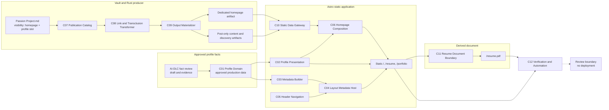

# Application Design — 이력서·포트폴리오 재구축

## 문서 상태

- **단계**: INCEPTION - Application Design
- **상태**: 승인됨
- **상세 수준**: Standard
- **작성일**: 2026-07-23
- **승인된 설계 답변**: A/B/A/B/A/A
- **상세 문서**:
  - [Components](components.md)
  - [Component Methods](component-methods.md)
  - [Services](services.md)
  - [Component Dependencies](component-dependency.md)

## 1. Design Outcome

이 설계는 임시 외부 Notion 링크를 저장소가 소유하는 한국어 `/resume`와 `/portfolio`로 교체한다. 두 페이지, homepage 소개, metadata와 PDF는 승인된 typed profile data 한 벌을 사용한다. 외부 Vault의 `Passion Project.md`는 명시적인 homepage source와 profile slot만 소유하며 프로필 사실은 소유하지 않는다.

Rust preprocessor는 모든 Vault note를 같은 공개 게시물로 취급하지 않는다. `visibility: homepage`를 typed publication scope로 정규화하고, 정확히 하나인 homepage source와 일반 게시물 projection을 producer에서 구조적으로 분리한다. Astro는 dedicated homepage artifact와 post-only contract를 서로 다른 interface로 읽는다.

최종 사용자 결과는 static HTML/CSS와 version-controlled PDF다. 새 client JavaScript, Preact island, runtime API, database, Terraform/AWS 변경 또는 배포는 없다.

## 2. Binding Design Decisions

| Area | Decision |
|---|---|
| Canonical profile | `site/src/lib/profile/`의 TypeScript domain package, approved production data와 dependency-free fail-fast validation |
| Draft and approval | Draft, public evidence와 approval record는 production data 밖의 AI-DLC review artifact에 둠 |
| Homepage profile | `Passion Project.md`의 exactly-one profile slot에 canonical-data Astro component를 build-time 삽입 |
| Navigation | Résumé와 Portfolio를 hydration-independent server-rendered desktop/mobile Header와 profile-local navigation에 추가; knowledge search/graph/tags/nav tree에는 추가하지 않음 |
| Publication syntax | `visibility: homepage`, 기존 note의 기본값은 `post` |
| Homepage references | 모든 normal wikilink variant를 `/`와 지원 fragment로 정규화하고 alias 보존; 모든 homepage-target transclusion은 build error |
| Print and PDF | web의 승인된 전체 상세를 print/PDF에 포함; Git-tracked `site/public/resume.pdf`, public `/resume.pdf` |
| Metadata | `/resume`는 `ProfilePage` + 최소 승인 `Person`; `/portfolio`는 `CollectionPage` + ordered `ItemList`/보수적 `CreativeWork` |
| Runtime | static build only; 새 client script/island/runtime dependency 없음 |
| Infrastructure | 각 unit에서 Infrastructure Design 실행, 예상 결과는 no-change compatibility decision |
| Delivery | 검증에서 종료; deploy, Terraform과 AWS mutation은 별도 승인 없이는 금지 |

## 3. High-Level Architecture

### Text Alternative

1. Draft facts and evidence remain in the AI-DLC review boundary; only explicitly approved facts enter C01.
2. The external Vault flows through C07 and C08. C09 emits one dedicated homepage artifact and a separate post-only discovery contract.
3. C10 reads generated data; C06 combines the homepage artifact with the C02 canonical profile component.
4. C01 feeds C02 presentation and C03 metadata. C03 and C05 feed the shared C04 layout.
5. Astro generates `/`, `/resume` and `/portfolio` as static pages.
6. C11 derives `/resume.pdf` from the rendered résumé.
7. C12 verifies all results and stops before deployment.

## 4. Component Model

| ID | Component | Responsibility | Primary Unit |
|---|---|---|---|
| C01 | Profile Domain | canonical approved facts, typed validation, ordered consumer projections | U1 |
| C02 | Profile Presentation | static résumé/portfolio, shared profile UI, contact and evidence links | U1 |
| C03 | Profile Metadata Builder | canonical/social metadata and conservative JSON-LD | U1 |
| C04 | Base Layout Metadata Host | backward-compatible shared head/body shell and structured-data host | U1 |
| C05 | Header Navigation | hydration-independent server-rendered desktop/mobile profile links, shared route model and current-page semantics | U1 |
| C06 | Homepage Composition | exactly-one profile slot and canonical homepage CTA composition | U2 |
| C07 | Publication Catalog | typed homepage/post classification and immutable projections | U2 |
| C08 | Link and Transclusion Transformer | homepage route normalization, fragment/alias preservation, transclusion rejection | U2 |
| C09 | Output Materializer | dedicated homepage and post-only/discovery generated contracts | U2 |
| C10 | Static Data Gateway | strict homepage getter and discoverable-post-only site access | U2 |
| C11 | Resume Document Boundary | print representation, stable PDF derivation and document contract | U1 |
| C12 | Verification and Automation Adapters | local/CI build, example/PBT, browser, metadata, print/PDF and parity evidence | U3 |

Production dependency direction is one-way:

- `C01 → C02/C03/C06/C11`
- `C03 → C04`
- `C05 → C04`
- `C07 → C08/C09`
- `C08 → C09`
- `C09 → generated artifact contract → C10`
- `C10 + C02 → C06`
- `C02 static route → C11`
- `C12 → observed public contracts`; no production component imports C12

## 5. High-Level Interface Contract

### 5.1 Profile Domain and Presentation

| Interface | Purpose |
|---|---|
| `getCanonicalProfile(): ProfileData` | approved production data 한 벌을 읽음 |
| `validateProfile(input): ValidationResult<ValidatedProfile>` | field-addressable validation result 생성 |
| `requireValidProfile(input): ValidatedProfile` | invalid production data를 build failure로 승격 |
| `selectResumeProfile(profile): ResumeProfile` | résumé/print/PDF의 ordered read model |
| `selectPortfolioProfile(profile): PortfolioProfile` | 3~6개 case-study read model |
| `selectHomepageProfile(profile): HomepageProfile` | homepage intro/CTA read model |
| profile Astro component props | validated projection만 받아 semantic static HTML 생성 |
| metadata builder interfaces | visible facts와 동일한 projection에서 head/JSON-LD 생성 |

### 5.2 Publication and Homepage

| Interface | Purpose |
|---|---|
| `parse_publication_scope(raw) -> Result<PublicationScope>` | `post` default와 `homepage` enum 정규화 |
| `build_publication_catalog(index) -> Result<PublicationCatalog>` | exactly-one homepage와 discoverable post projection 생성 |
| `resolve_publication_link(reference, catalog)` | homepage target을 `/`와 fragment/alias contract로 변환 |
| `validate_transclusion(reference, catalog)` | homepage-target full/heading/block transclusion 거부 |
| `write_homepage_artifact(...)` | homepage를 normal post output 밖에 materialize |
| `write_post_artifacts(...)` | discoverable post만 content/meta로 materialize |
| `write_discovery_artifacts(...)` | 같은 post-only projection으로 모든 discovery output 생성 |
| `getHomepageArtifact()` | homepage route 전용 required generated contract |
| `getDiscoverablePostMeta()` | route/list/tag/RSS 등 normal-post-only metadata |
| `composeHomepage(...)` | exactly-one profile slot에 canonical Astro fragment 삽입 |

### 5.3 Document and Verification

| Interface | Purpose |
|---|---|
| `getResumeDocumentLink()` | stable `/resume.pdf` descriptor |
| `generateResumeDocument(request)` | rendered `/resume`와 print media에서 tracked PDF 생성 |
| `inspectResumeDocument(result)` | text/page/file inspection evidence 제공 |
| `runProfileDomainChecks(...)` | U1 example/PBT contract 실행 |
| `runPublicationChecks(...)` | U2 example/PBT contract 실행 |
| `runStaticBuild(...)` | Astro route/content output 검증 |
| `runLinkAndMetadataChecks(...)` | internal links, canonical, JSON-LD와 PDF link 검증 |
| `runBrowserSmoke(...)` | responsive, keyboard, focus, reduced-motion와 print smoke |
| `runResumeDocumentChecks(...)` | web/print/PDF fact parity와 document quality 검증 |
| `runCiVerification(...)` | stable unit commands와 PBT seed를 Jenkins에 최소 연결 |

정확한 field predicate, error message, parser truth table, artifact schema, PBT framework, browser matrix, PDF engine와 CSS 수치는 후속 Functional/NFR Design에서 정의한다.

## 6. Build-Time Services

| ID | Service | Orchestration |
|---|---|---|
| S01 | Profile Assembly | C01을 먼저 검증하고 C02/C03/C04/C05를 같은 immutable profile value로 조립 |
| S02 | Publication Projection | C07 분류 → C08 reference policy → C09 dedicated/post-only output |
| S03 | Homepage and Static Site Composition | C10 homepage/post getters + C02 canonical profile fragment → C06 slot composition → Astro static site |
| S04 | Resume Document | first-pass `/resume` + print media → tracked `/resume.pdf` → parity input |
| S05 | Verification Orchestration | U1/U2-owned tests, Astro/build/link/browser/PDF checks와 U3 minimal CI aggregation |

### Required Order

1. 사용자 사실 승인 gate를 통과한 값만 production profile source에 넣는다.
2. S01이 profile data와 metadata projection을 검증한다.
3. S02가 readable Vault에서 homepage와 post-only generated contracts를 만든다.
4. S03이 `/`, `/resume`, `/portfolio`의 first-pass static output을 만든다.
5. S04가 현재 résumé에서 `site/public/resume.pdf`를 갱신한다.
6. S05가 final build와 example/PBT/browser/metadata/link/print/PDF/parity gate를 실행한다.
7. 검증된 diff와 artifact를 review한다. 배포하지 않는다.

## 7. Strict Homepage Publication Boundary

`visibility: homepage` source는 homepage body를 생성하기 위해서만 존재한다. producer가 post-only projection을 모든 normal discovery builder에 전달하므로 consumer마다 slug filter를 반복하지 않는다.

| Surface or behavior | Homepage source contract |
|---|---|
| `/` | dedicated homepage artifact로 정확히 한 번 사용 |
| `/posts/passion-project` | route/content/meta 미생성 |
| post list, tag, today list, 404 recent | 제외 |
| hub routes, children, parents and orphans | 제외; invalid structural use는 authoring error |
| search documents/hits | 제외; filtered document index는 연속 범위를 유지 |
| RSS | 제외 |
| sitemap | `/`는 포함, `/posts/passion-project`는 제외 |
| nav tree | roots/children/orphans에서 제외 |
| previews/link preview | 제외 |
| graph/full/local graph | node와 edge에서 제외 |
| related/backlink/forward-link discovery | source와 homepage-origin edge의 score/reference 영향 제외 |
| normal post → homepage wikilink | `/`로 렌더링, alias와 지원 fragment 보존, discovery edge 없음 |
| homepage → normal post wikilink | 화면 link는 유지, target의 backlink/graph/related score에는 미반영 |
| homepage-target transclusion | full/heading/block variant 모두 build error |
| unrelated posts | route, ordering, content와 discoverability 보존 |

Missing/duplicate homepage source, unknown visibility, missing/duplicate profile slot 또는 prohibited transclusion은 silent fallback이 아니라 non-zero build failure다.

## 8. Profile, Metadata and PDF Integrity

### Approved Fact Boundary

- Public GitHub/repository evidence로 만든 초안은 AI-DLC fact-review artifact에 기록한다.
- 이름, title, introduction, contact, career, dates, roles, projects, decisions, outcomes, metrics와 URLs는 사용자 승인 전 production data에 들어가지 않는다.
- `ProfileData`는 승인 완료 사실만 포함하고 page별 copy를 두지 않는다.
- optional data가 없으면 projection이 해당 section/link를 생략한다. Placeholder는 만들지 않는다.

### Metadata

- canonical URL은 configured site identity와 `/resume`, `/portfolio` path에서 만든다.
- Open Graph/Twitter와 JSON-LD는 visible projection을 벗어나지 않는다.
- résumé structured data는 `ProfilePage`와 최소 승인 `Person`이다.
- portfolio는 `CollectionPage`, ordered `ItemList`, 보수적 `CreativeWork`를 사용한다.
- 실제 공개 source-code URL과 의미가 승인된 경우에만 더 구체적인 project type을 고려한다.

### Print and PDF

- Screen résumé는 요약과 native `
` 상세를 제공한다.
- Print와 PDF는 승인된 전체 상세를 같은 document order로 제공한다.
- `site/public/resume.pdf`는 reviewed, version-controlled derived release asset이며 canonical fact source가 아니다.
- PDF missing, stale, unreadable, broken link 또는 web/PDF fact mismatch는 completion을 차단한다.
- 기존 PDF가 있다는 이유만으로 현재 source의 regeneration evidence를 생략할 수 없다.

## 9. Failure and Recovery Boundaries

| Failure | Required behavior | Forbidden fallback |
|---|---|---|
| Invalid or unapproved profile | fail before public-ready output | infer fact, placeholder, page-local duplicate |
| Metadata overclaim | fail consistency gate | keep unsupported JSON-LD claim |
| Homepage source count != 1 | fail preprocess | infer `passion-project` by filename |
| Unknown visibility | path-aware parse failure | silently coerce to `post` |
| Homepage transclusion | authoring build error | duplicate homepage inside post |
| Missing/malformed generated homepage | fail Astro build | read stale normal-post artifact |
| Profile slot count != 1 | fail composition | insert panel at arbitrary location |
| Vault unavailable | explicit blocker | edit repository substitute/generated output |
| PDF failure or parity mismatch | fail completion | manually edit PDF facts or accept stale binary |
| Infrastructure incompatibility | stop and request authority | edit Terraform, call AWS or deploy |

Generated output may be regenerated through documented commands under safe working-tree conditions. Authored source and unrelated dirty changes must not be reset, overwritten or absorbed as recovery.

## 10. Requirements Traceability

### 10.1 Functional Requirements

| Requirement | Owning design |
|---|---|
| FR-001 | C01 typed canonical data/validation and route projections |
| FR-002 | fact-review gate, C01 approved-only source, C03/C11 derived outputs |
| FR-003 | C02 native Korean routes, C04/C05 navigation shell |
| FR-004 | C01 résumé projection, C02 summary/details, C11 print/PDF |
| FR-005 | C01 project order/data and C02 case-study presentation |
| FR-006 | C01 approved contact and C02 accessible actions |
| FR-007 | C02 route-specific presentation with existing theme contract |
| FR-008 | C06 slot composition, C10 homepage gateway, scoped Vault contract |
| FR-009 | C07–C10 producer-side publication separation and strict surface matrix |
| FR-010 | C02 print source, C11 tracked stable PDF, C12 document checks |
| FR-011 | C03 metadata/JSON-LD and C04 safe host |
| FR-012 | C05 global navigation and C02 profile-local navigation |
| FR-013 | C02/C05/C06 static anchors and native HTML; no new client code |
| FR-014 | C12 static, content/link, browser and print adapters |
| FR-015 | C01/C07/C08 property ownership; C12 later-stage execution evidence |
| FR-016 | C12 minimal Jenkins path/test/seed adapter |
| FR-017 | C01/C06–C10 authored/generated boundary |
| FR-018 | no-deploy stop boundary and per-unit Infrastructure Design guard |

### 10.2 Non-Functional Requirements

| Requirement | Owning design |
|---|---|
| NFR-001 | C02 semantic/accessibility contract, C11 reading order, C12 verification |
| NFR-002 | C02 responsive content contract and C12 viewport verification |
| NFR-003 | C02–C06 static build; no new client/runtime dependency |
| NFR-004 | C01 separated domain and C07–C10 explicit publication contract |
| NFR-005 | deterministic C01/C07–C09 outputs and C12 seed/evidence boundary |
| NFR-006 | C03 metadata and C07–C10 leak prevention |
| NFR-007 | approved fact gate, C01/C02 links, C03/C11 conservative derivatives |
| NFR-008 | native HTML/no-JS experience and later browser matrix |
| NFR-009 | C02 print source, C11 document derivation and C12 parity evidence |
| NFR-010 | C12 proportional gates and no-deploy verification |

## 11. Story Ownership

| Story | Component/service ownership |
|---|---|
| ST-U01 | C02, C05, C06, C10; S01/S03 |
| ST-U02 | C01–C04; S01 |
| ST-U03 | C02, C11, C12; S04/S05 |
| ST-U04 | C01–C04; S01 |
| ST-U05 | fact-review gate, C01/C02 |
| ST-U06 | C06–C10; S02/S03 |
| ST-E01 | C01 validator and projections |
| ST-E02 | fact-review gate, C01/C03/C11 |
| ST-E03 | U1 C01 properties, U2 C07/C08 properties, C12 execution result |
| ST-E04 | C12/U3 minimal CI integration |

## 12. Unit and Later-Stage Handoff

### U1 — Profile Domain and Native Experience

- Owns C01–C05, C11, S01 and S04.
- Functional Design identifies profile validation, ordering, projection and metadata/PDF parity rules.
- NFR Requirements selects applicable TypeScript PBT and browser/PDF tooling requirements.
- Infrastructure Design verifies `/resume`, `/portfolio`, `/resume.pdf` compatibility and records no change or stops.
- Code Generation cannot finalize public data/PDF until the user approves the complete fact inventory.

### U2 — Homepage Publication Boundary

- Owns C06–C10, S02 and S03 plus the authorized single Vault-file change.
- Functional Design specifies publication cardinality, reference truth table, surface preservation, artifact and slot rules.
- PBT properties cover partition, unrelated-post preservation, link closure, search-index bounds, determinism and idempotence.
- Infrastructure Design verifies that generated route removal/addition needs no delivery change.
- Vault edit occurs only after consuming behavior exists and requires exact diff review; no external commit/push is implied.

### U3 — Quality Gate and CI Integration

- Owns C12 and S05.
- Does not move or duplicate U1/U2 PBT logic.
- Adds browser/PDF/cross-unit evidence and minimal Jenkins path/test/seed wiring.
- Infrastructure Design confirms CI validation does not mutate deployment infrastructure.

### Construction Sequence

Each unit completes Functional Design → NFR Requirements → NFR Design → Infrastructure Design → Code Generation before the next unit begins. The sequence is U1 → U2 → U3 → integrated Build and Test.

## 13. PBT and Infrastructure Status

Application Design is not a PBT enforcement stage, so current PBT compliance is **N/A** and there is no blocking PBT finding. The approved PBT obligations are assigned to U1/U2 Functional Design, each unit's NFR Requirements and Code Generation, U3 CI aggregation and integrated Build and Test.

Infrastructure Design is included for every unit because the user explicitly added the previously skipped stage. Its current expected result is a documented compatibility/no-change decision. This inclusion does not authorize infrastructure implementation.

## 14. Deferred Decisions and Explicit Non-Components

### Deferred

- exact profile fields, validation predicates, error taxonomy and fact copy;
- exact slot literal, parse boundary and generated homepage artifact schema;
- full wikilink/transclusion truth table and fragment encoding;
- PBT framework, custom generators, shrinking and seed syntax;
- browser/version/viewport matrix and accessibility tooling;
- CSS measurements, breakpoint, print pagination and visual thresholds;
- PDF browser engine, deterministic settings and parity extraction;
- exact commands, Jenkins syntax and report schema.

### Not Components

- runtime résumé/portfolio API or server;
- database, CMS, contact form or analytics pipeline;
- new profile Preact island or client-side state;
- external embed, image CDN or runtime service;
- production draft/approval workflow;
- Terraform/AWS resource or deployment service.

## 15. Design Completeness

- Twelve components and five build-time services have explicit responsibilities and public interfaces.
- Production dependencies are acyclic and identify forbidden reverse dependencies.
- One component owns profile facts, one owns publication classification, one owns output materialization and one owns site reads.
- All FR-001~FR-018, NFR-001~NFR-010 and ST-U01~ST-U06/ST-E01~ST-E04 are traced.
- Homepage-only behavior covers every observed public and derived discovery surface.
- Fact approval, metadata, print/PDF and source/generated boundaries are explicit.
- no-new-client-JS, no-runtime-service, no-deploy and Infrastructure Design no-change boundaries are preserved.
- Detailed algorithms and NFR tool choices remain in their correct later stages.
- The detailed dependency document supplies three validated Mermaid diagrams with text alternatives; this consolidated document supplies an additional overview diagram and text alternative.
