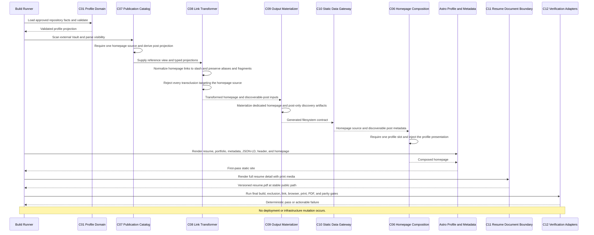

# Component Dependencies and Communication — 이력서·포트폴리오 재구축

## 문서 상태

- **단계**: INCEPTION - Application Design
- **상태**: 승인됨
- **입력 결정**: A/B/A/B/A/A
- **의존성 방향**: authored source → typed projection → generated contract → static presentation → derived document → verification
- **runtime component 추가**: 없음
- **infrastructure implementation 변경**: 없음

## 1. Component Index

| ID | Component | Layer | Primary ownership |
|---|---|---|---|
| C01 | Profile Domain | Site domain | U1 |
| C02 | Profile Presentation | Astro presentation | U1 |
| C03 | Profile Metadata Builder | Site projection | U1 |
| C04 | Base Layout Metadata Host | Astro shell | U1 |
| C05 | Header Navigation | Astro shell/navigation | U1 |
| C06 | Homepage Composition | Astro build-time composition | U2 |
| C07 | Publication Catalog | Rust domain/projection | U2 |
| C08 | Link and Transclusion Transformer | Rust transformation | U2 |
| C09 | Output Materializer | Rust generated-contract producer | U2 |
| C10 | Static Data Gateway | Astro generated-contract consumer | U2 |
| C11 | Resume Document Boundary | Build-time document output | U1 |
| C12 | Verification and Automation Adapters | Test/build/CI | U3 |

## 2. Dependency Rules

1. C01은 profile fact의 유일한 production source다. C02, C03, C06, C11 또는 PDF에 공유 사실을 다시 선언하지 않는다.
2. C07은 publication scope의 유일한 classification owner다. C09와 C10 이후의 consumer는 homepage 여부를 다시 추론하지 않는다.
3. C08은 C07의 typed projection과 reference view를 받는다. shared wikilink regex를 복제하지 않고 `syntax.rs`의 기존 shared syntax contract를 사용한다.
4. C09만 Rust output shape를 물질화하고 C10만 Astro에서 그 contract를 읽는다.
5. C06은 dedicated homepage getter를 사용한다. normal-post API로 `passion-project`를 조회하지 않는다.
6. C11은 C02가 생성한 résumé route를 document로 투영한다. PDF에서 profile fact를 역으로 읽어 C01을 갱신하지 않는다.
7. C12는 C01~C11을 검증할 수 있지만 production component는 C12를 import하지 않는다.
8. source component는 generated output에 의존하지 않는다. generated output은 언제든 authored source와 documented command로 재생성할 수 있어야 한다.
9. 어느 component도 Terraform, AWS API 또는 deployment command를 호출하지 않는다.

## 3. Allowed Dependency Matrix

아래 표에서 `Consumer → Provider`는 consumer가 provider의 public interface 또는 artifact contract에 의존한다는 뜻이다. 표에 없는 production dependency는 기본적으로 허용되지 않으며 Functional Design에서 추가 필요성이 발견되면 cycle과 source ownership을 다시 검토한다.

| Consumer | Provider | Mode | Contract | Reverse dependency prohibited |
|---|---|---|---|---|
| C02 Profile Presentation | C01 Profile Domain | Direct code | validated profile value, ordered selectors | C01은 Astro component/markup을 알지 않음 |
| C02 Profile Presentation | C03 Profile Metadata Builder | Direct code/value | route-specific metadata projection | C03은 page body를 render하지 않음 |
| C02 Profile Presentation | C04 Base Layout Metadata Host | Direct presentation | page body와 typed head props | C04는 route-specific content를 소유하지 않음 |
| C02 Profile Presentation | C11 Resume Document Boundary | Contract only | stable résumé route/document spec; PDF URL은 `/resume.pdf` | C02는 PDF binary를 읽지 않음 |
| C03 Profile Metadata Builder | C01 Profile Domain | Direct code | approved-fact projection | C01은 schema.org나 head markup을 알지 않음 |
| C04 Base Layout Metadata Host | C03 Profile Metadata Builder | Props/value | title, description, canonical, social metadata, JSON-LD | C03은 layout을 render하지 않음 |
| C04 Base Layout Metadata Host | C05 Header Navigation | Direct presentation | shared Header with pathname | C05는 layout metadata를 소유하지 않음 |
| C06 Homepage Composition | C01 Profile Domain | Direct code | validated homepage profile projection | C01은 Vault slot을 알지 않음 |
| C06 Homepage Composition | C10 Static Data Gateway | Direct build-time call | required homepage body, discoverable post metadata/previews | C10은 homepage UI를 알지 않음 |
| C06 Homepage Composition | C02 Profile Presentation | Direct presentation | canonical-data-backed summary와 internal CTA component | C02는 Vault slot을 알지 않음 |
| C06 Homepage Composition | C04 Base Layout Metadata Host | Direct presentation | static page shell | C04는 slot composition을 알지 않음 |
| C08 Link and Transclusion Transformer | C07 Publication Catalog | Direct Rust type/call | full reference view, homepage projection, post-only projection | C07은 transformed markup을 알지 않음 |
| C09 Output Materializer | C07 Publication Catalog | Direct Rust type/call | validated scope and projection membership | C07은 filesystem output을 쓰지 않음 |
| C09 Output Materializer | C08 Link and Transclusion Transformer | Direct Rust call/value | transformed homepage/post content and allowed link projection | C08은 artifact path를 소유하지 않음 |
| C10 Static Data Gateway | C09 Output Materializer | Artifact contract | dedicated homepage artifact + post-only generated files | C09는 TypeScript/site component를 import하지 않음 |
| C11 Resume Document Boundary | C01 Profile Domain | Direct value | approved résumé projection for source validation | C01은 browser/PDF generation을 알지 않음 |
| C11 Resume Document Boundary | C02 Profile Presentation | Build artifact | rendered `/resume` with print media | C02는 PDF에서 fact를 역수집하지 않음 |
| C12 Verification and Automation Adapters | C01–C11 public contracts | Test/artifact/process | fixtures, generated/static output, stable commands와 exit status | production component는 C12를 import하지 않음 |

### 3.1 Dependency DAG Notes

- C02 → C01/C03/C04, C03 → C01, C04 → C03/C05는 acyclic site dependency다.
- C06 → C01/C02/C04/C10은 U1의 stable domain/presentation contract와 U2 generated contract를 조합한다.
- C10 → C09는 code import가 아니라 Rust producer와 Astro consumer 사이의 filesystem contract다.
- C11 → C02 역시 source import가 아니라 first-pass static route artifact dependency다. C02가 C11의 stable path contract를 사용해도 PDF binary를 읽지 않으므로 fact cycle은 생기지 않는다.
- C12의 관찰 의존성은 production graph에 포함하지 않는다.

## 4. Communication Patterns

| Boundary | Pattern | Data ownership | Error propagation |
|---|---|---|---|
| C01 → C02/C03/C06/C11 | in-process typed TypeScript import and pure selectors | C01 owns facts; consumers own projections/doc validation | validation exception/build failure |
| C03 → C04 | typed Astro props and JSON-serializable value | C03 owns semantics; C04 owns safe head emission | Astro build failure |
| C05 → visitor | hydration-independent server-rendered anchor markup in desktop/mobile navigation | C05 owns global profile route links; conditional island is not their sole carrier | link/build/no-JS browser assertion |
| External Vault → C07 | filesystem read and YAML/Markdown parse | external Vault owns homepage prose/declaration | explicit path-aware preprocess failure |
| C07 → C08/C09 | borrowed/owned Rust structs and projection views | C07 owns scope classification | `Result` propagated to CLI non-zero exit |
| C08 → C09 | transformed content and link projection | C08 owns route/reference semantics | authoring/transform error before successful materialization |
| C09 → C10 | generated filesystem contract | C09 owns shape; C10 owns strict read API | missing/invalid artifact fails Astro build |
| C10/C02 → C06 | synchronous build-time values and Astro props | C10 owns data access; C02 owns profile markup; C06 owns slot | exact-one slot/build failure |
| C02 static output → C11 | local static route rendered with print media | web route remains fact source | browser/PDF command non-zero failure |
| C01–C11 → C12 | read-only test and process adapters | owning unit retains test logic | actionable assertion, seed and exit status |
| static output → visitor | existing S3/CloudFront static delivery | no application runtime service | outside current non-deploy workflow |

No new event bus, HTTP API, database, browser fetch 또는 runtime message channel을 도입하지 않는다.

## 5. Strict Homepage Publication Projection

### 5.1 Projection Contract

C07은 하나의 scanned reference catalog에서 두 개의 서로 다른 projection을 만든다.

- **Homepage projection**: `visibility: homepage`인 정확히 한 source. homepage body transformation에만 사용한다.
- **Post projection**: 기본 `visibility: post`인 일반 문서. route와 모든 knowledge discovery artifact의 유일한 입력이다.

reference resolution은 두 projection의 title, heading와 block을 볼 수 있지만 discovery calculation은 post projection만 볼 수 있다. 이 분리는 homepage가 다른 post를 link하더라도 graph, backlink와 related ranking에 영향을 주지 않게 한다.

### 5.2 Surface Matrix

| Surface/behavior | Homepage source | Normal posts | Native profile routes |
|---|---:|---:|---:|
| `/` body source | Exactly one | 필요 시 rendered links/card로 참조 | profile slot에서 summary/CTA |
| `/posts/[slug]` generation | Excluded | Included | N/A |
| 일반 metadata/list/tag/today/404 recent | Excluded | Included | Excluded |
| knowledge search | Excluded | Included | Excluded |
| RSS | Excluded | Included if existing RSS policy allows | Excluded |
| sitemap | `/`만 포함; `/posts/passion-project` 없음 | Included by route policy | `/resume`, `/portfolio` included |
| nav tree/hub discovery | Excluded | Included | Excluded |
| previews | Excluded | Included | Excluded |
| graph nodes/edges | Excluded | Included | Excluded |
| related/backlink/forward-link discovery metadata | Excluded | Included against post-only peers | Excluded |
| normal post wikilink to homepage | Rendered target `/`; alias와 supported fragment 보존; discovery edge 없음 | N/A | N/A |
| homepage outbound link to post | 화면 link로 렌더링; target의 discovery score/backlink에는 미반영 | Target remains usable | Native links remain normal anchors |
| transclusion targeting homepage | All variants fail build | Other existing transclusion behavior preserved | N/A |
| global Header | Homepage link remains site title | Existing knowledge links preserved | Résumé/Portfolio added to desktop/mobile |

### 5.3 Preservation Invariant

homepage source를 제거한 post projection은 일반 post끼리 계산한 route, sort order, search document, RSS item, graph/related/nav membership을 유지해야 한다. homepage exclusion 때문에 관계없는 post를 누락하거나 재정렬해서는 안 된다. 구체적인 equality/idempotence property는 U2 Functional Design에서 정의한다.

## 6. Build-time Data Flow

```mermaid
flowchart LR
    subgraph Authored["Authored sources"]
        Vault["External Vault<br/>Passion Project.md"]
        Profile["C01 Profile Domain<br/>approved facts only"]
    end

    subgraph Preprocess["Rust build-time pipeline"]
        Catalog["C07 Publication Catalog"]
        HomeProjection["Exactly one homepage projection"]
        PostProjection["Post-only discovery projection"]
        Transformer["C08 Link and Transclusion Transformer"]
        Materializer["C09 Output Materializer"]
    end

    subgraph Generated["Generated contract"]
        HomeArtifact["Dedicated homepage artifact"]
        PostArtifacts["Post routes, metadata, search, RSS inputs,<br/>sitemap inputs, nav, previews, graph, related links"]
    end

    subgraph AstroBuild["Astro static build"]
        Gateway["C10 Static Data Gateway"]
        Home["C06 Homepage Composition<br/>exactly one profile slot"]
        Presentation["C02 Profile Presentation"]
        Metadata["C03 Profile Metadata Builder"]
        Layout["C04 Base Layout Metadata Host"]
        Header["C05 Header Navigation"]
        StaticSite["Static HTML and CSS"]
    end

    subgraph Documents["Document output"]
        ResumeBoundary["C11 Resume Document Boundary"]
        Pdf["site/public/resume.pdf<br/>versioned derived asset"]
    end

    Verify["C12 Verification and Automation Adapters"]
    Stop["Boundary: no deploy or infrastructure mutation"]

    Vault --> Catalog
    Catalog --> HomeProjection
    Catalog --> PostProjection
    HomeProjection --> Transformer
    PostProjection --> Transformer
    Transformer --> Materializer
    Materializer --> HomeArtifact
    Materializer --> PostArtifacts
    HomeArtifact --> Gateway
    PostArtifacts --> Gateway
    Gateway --> Home
    Profile --> Presentation
    Presentation --> Home
    Profile --> Metadata
    Metadata --> Layout
    Header --> Layout
    Presentation --> StaticSite
    Home --> StaticSite
    Layout --> StaticSite
    StaticSite --> ResumeBoundary
    ResumeBoundary --> Pdf
    StaticSite --> Verify
    Pdf --> Verify
    Verify -.-> Stop
```

### Text Alternative

1. External `Passion Project.md` flows to C07; approved repository profile facts flow to C01.
2. C07 validates exactly one homepage source and splits it from the post-only discovery projection.
3. Both projections pass through C08 for rendering semantics, but only the post projection can contribute discovery relationships.
4. C09 writes one dedicated homepage artifact and a separate set of normal post/discovery artifacts.
5. C10 reads those generated contracts. C06 combines the homepage artifact with the C02 profile summary at exactly one slot.
6. C01 separately feeds C02 presentation and C03 metadata; C03 and C05 feed the C04 layout host.
7. Astro emits static HTML/CSS. C11 renders the static résumé into the versioned derived PDF.
8. C12 verifies static output and PDF, then stops. No deployment or infrastructure mutation follows.

## 7. Build and Document Sequence

### Text Alternative

1. The build validates approved profile facts before it renders any profile result.
2. C07 scans the Vault, validates exactly one homepage scope and derives the normal post projection.
3. C08 resolves normal links to the homepage as `/` while preserving supported aliases/fragments and rejects all homepage-target transclusions.
4. C09 writes the dedicated homepage artifact and post-only discovery contract; C10 supplies them to Astro.
5. C06 validates exactly one profile slot and inserts the canonical profile presentation.
6. Astro renders the homepage, native profile routes, metadata, JSON-LD and Header into a first-pass static site.
7. C11 uses the rendered résumé with print media to refresh `/resume.pdf`.
8. C12 performs the final static build and all exclusion, link, browser, print, PDF and parity checks.
9. A pass ends in reviewed artifacts. It does not invoke Terraform, AWS or deployment.

## 8. Failure Propagation and Recovery Boundaries

| Failure | Owning component | Propagation | Permitted recovery | Forbidden fallback |
|---|---|---|---|---|
| Unapproved or invalid profile fact | C01 | fail profile/static build | obtain explicit fact approval or correct canonical source | placeholder, inferred fact, page-specific duplicate |
| Metadata stronger than approved/displayed facts | C03 | fail metadata verification/build | reduce projection to supported semantics | silent schema overclaim |
| Homepage count is not exactly one | C07 | fail preprocess before successful output | correct authored `visibility` | infer by filename or choose first match |
| Unknown publication scope | C07 | path-aware parse error | correct frontmatter | coerce to `post` silently |
| Homepage-target transclusion | C08 | authoring error with source/variant | replace with supported link or remove embed | duplicate homepage content in a post |
| Generated homepage missing/invalid | C09/C10 | fail preprocess or Astro build | regenerate from authored Vault | read stale `content/posts/passion-project.md` |
| Profile slot count is not one | C06 | fail Astro build | correct the single approved Vault file | append CTA at arbitrary location |
| PDF missing/stale/unreadable | C11/C12 | fail completion/CI gate | regenerate from current static résumé | accept an older binary merely because it exists |
| Web/PDF facts diverge | C12 | fail parity gate | regenerate or correct canonical source | edit PDF facts manually |
| Vault inaccessible | C07/S02 gate | explicit blocker | restore authorized Vault access | modify another repository file/generated output |
| Infrastructure assumption fails | Infrastructure Design | stop current scope | request separate design/implementation authorization | edit Terraform or invoke AWS |

Generated outputs may be deleted and regenerated when the documented command and safe working-tree conditions allow it. Authored source, unrelated dirty changes and the external Vault repository must not be reset, overwritten or absorbed as recovery.

## 9. Unit and Branch Dependency

```mermaid
flowchart LR
    Base["Validated reconciled develop"] --> U1["U1 Profile Domain and Native Experience<br/>C01-C05, C11"]
    U1 --> Merge1["Merge to develop with --no-ff"]
    Merge1 --> U2["U2 Homepage Publication Boundary<br/>C06-C10"]
    U2 --> Merge2["Merge to develop with --no-ff"]
    Merge2 --> U3["U3 Quality Gate and CI Integration<br/>C12"]
    U3 --> Merge3["Merge to develop with --no-ff"]
    Merge3 --> Integrated["Integrated Build and Test"]
    Integrated --> Review["Reviewable completion; no deployment"]
```

### Text Alternative

1. Construction starts only after the divergent `main`/`develop` base is reconciled and validated in an isolated clean worktree.
2. U1 implements the profile domain/native experience on its own feature branch and merges to `develop` with `--no-ff`.
3. U2 starts from that updated `develop`, consumes U1's public profile presentation contract, implements the homepage publication boundary, and merges separately.
4. U3 starts from the next updated `develop`, integrates stable U1/U2 gates without moving their test ownership, and merges separately.
5. Integrated Build and Test runs after all units. Completion stops before deployment.

The diagram describes an approved future Git Flow. Application Design itself does not create a branch, merge, push or alter the dirty primary worktree.

## 10. Source, Generated, External and Delivery Boundaries

| Boundary | Examples | Canonical status | Allowed mutation in this workflow |
|---|---|---|---|
| Repository-authored application source | `site/src/`, `preprocessor/`, tests, `Justfile`, minimal `Jenkinsfile` scope | Canonical behavior | only in the owning unit after its design/code approval |
| Repository-authored profile facts | `site/src/lib/profile/` | Canonical public fact source after explicit user approval | U1 only; no unapproved values |
| External authored source | `Areas/Notes/Passion Project.md` | Canonical homepage prose/scope/slot source | U2 may edit this one file only after consumer support; no commit/push without authorization |
| Generated content contract | `content/`, generated public JSON/assets | Derived, gitignored or regenerated | never manual behavior source; regenerate through documented commands |
| Static site output | `site/dist/` | Derived | build/test only; no upload |
| Versioned PDF | `site/public/resume.pdf` | tracked derived release asset, not fact source | regenerate from approved `/resume`, review parity, commit with owning source |
| Fact draft/evidence/approval | AI-DLC review artifacts | process evidence, not production data | update through explicit review gate |
| Infrastructure | `infra/`, AWS resources | existing delivery contract | design verification only; no implementation mutation without separate authorization |

## 11. No-Deploy and Infrastructure Compatibility Gate

- Existing extensionless route rewriting is expected to serve `/resume` and `/portfolio`.
- The extension-bearing `/resume.pdf` is expected to resolve as a static object without rewrite.
- Profile routes are static Astro output; no origin application or runtime compute is introduced.
- Infrastructure Design runs for each unit because the user added the previously skipped stage, but the expected result is a documented **no-change compatibility decision**.
- If source analysis or built output contradicts that expectation, work stops for separate authorization.
- C12 must not treat `just deploy`, AWS credential checks, S3 sync, CloudFront invalidation or Terraform apply as test steps.

## 12. Design Validation

- Dependency directions are acyclic at the production-code level.
- Exactly one component owns canonical profile facts: C01.
- Exactly one component owns publication classification: C07.
- Exactly one producer owns generated materialization: C09.
- Exactly one Astro gateway owns generated reads: C10.
- Homepage exclusion is structural at the producer, not a repeated consumer convention.
- PDF is a one-way derived output and cannot become a second fact source.
- C12 observes components but does not become a production dependency.
- All three Mermaid diagrams have equivalent text alternatives.
- Detailed business rules and PBT framework choices remain assigned to later Functional/NFR Design.
