# Execution Plan — 이력서·포트폴리오 재구축

## 문서 상태

- **단계**: INCEPTION - Workflow Planning
- **상태**: 승인됨 (2026-07-23T09:21:22Z, 사용자 입력: "다음 단계를 진행시켜.")
- **상세 수준**: Standard
- **작성일**: 2026-07-23
- **Project Type**: Brownfield
- **Overall Risk**: Medium
- **현재 실행 단계**: U1 Code Generation — Part 2 Generation, Step 18

## 1. Detailed Analysis Summary

### 1.1 Transformation Scope

- **Transformation Type**: 여러 application component에 걸친 호환 가능한 기능 확장
- **Architectural Transformation**: No
- **Infrastructure Transformation**: No
- **Deployment Model Change**: No
- **Primary Changes**:
  - 저장소 소유의 typed profile data와 validation
  - 한국어 `/resume`, `/portfolio` 정적 route와 사용자 경험
  - metadata, JSON-LD, print CSS, version-controlled PDF
  - 홈페이지 전용 콘텐츠의 선언적 publication boundary
  - homepage CTA를 위한 허용된 외부 Vault 단일 파일 수정
  - 예제 기반 테스트, PBT, Playwright, 최소 Jenkins 실행 경로
- **Explicitly Unchanged**:
  - Terraform, S3, CloudFront, ACM, Cloudflare DNS
  - runtime application server 또는 database
  - 배포 방식과 AWS resources
  - 기존 Preact islands 및 외부 runtime integration

이 변경은 정적 배포 아키텍처를 바꾸지 않는다. 기존 CloudFront clean-route 처리가 `/resume/index.html`과 `/portfolio/index.html`을 제공할 수 있으므로 새 infrastructure가 필요하지 않다.

### 1.2 Change Impact Assessment

| Impact Area | Impact | Analysis |
|---|---|---|
| User-facing | Yes | 홈페이지 소개·CTA, 이력서, 포트폴리오, 인쇄·PDF, 연락·공개 근거 경험 추가 |
| Structural | Yes — compatible | 새 profile domain, page/component, visibility contract와 test surface가 추가되지만 기존 static architecture는 유지 |
| Data model | Yes | 저장소에 typed canonical profile data와 validation rule 추가 |
| Public API | No | network API 또는 external consumer contract 추가 없음 |
| Internal build contract | Yes | homepage-only visibility가 posts/search/RSS/sitemap 및 관련 파생 출력에 일관되게 반영돼야 함 |
| Runtime dependency | No | 새 client JavaScript, 외부 API, embed 또는 runtime dependency 금지 |
| Build dependency | Likely | 정확한 PBT·Playwright·PDF verification 도구는 NFR Requirements와 Application Design에서 선택 |
| NFR | Yes | WCAG 2.2 AA 목표, responsive, static performance, metadata, print/PDF, determinism, test reproducibility |
| Infrastructure | Design-only | Infrastructure Design에서 기존 S3/CloudFront clean-route, 정적 PDF·asset delivery, cache/invalidation 및 rollback 가정을 검증하되 Terraform/AWS는 변경하지 않음 |
| Operations | Limited | Jenkins의 현재 repository path 수정과 test/PBT seed 실행만 포함; deploy stage 변경은 제외 |

### 1.3 Component Relationships

- **Primary Component**: `site/` Astro static application
- **Producer Component**: `preprocessor/` Rust content compiler
- **Shared Domain**: 저장소 소유 typed profile data와 validation
- **External Authored Source**: Obsidian Vault의 `Areas/Notes/Passion Project.md`
- **Generated Contract**: `content/`과 `site/public`의 post/index/navigation/preview/graph artifacts
- **Supporting Components**: `fixtures/vault/`, site test package, `Justfile`, `Jenkinsfile`
- **Infrastructure Components**: `infra/` — compatibility reference only; unchanged by default

| Component | Relationship | Change Type | Reason | Change Importance |
|---|---|---|---|---|
| `site/src/` | Primary consumer and UI | Minor compatible feature | profile routes, shared rendering, metadata, styles, print/PDF links | Critical |
| Profile domain source | Shared site input | New | canonical typed data and validation | Critical |
| `preprocessor/` | Generated-contract producer | Minor compatible feature | homepage-only visibility and derived-output filtering | Critical |
| `fixtures/vault/` and Rust tests | Producer verification | Minor | visibility/filter regression and PBT properties | Important |
| External `Passion Project.md` | Homepage authored input | Content-only | internal CTA and homepage-only declaration | Important |
| Site test surface | Consumer verification | New | route/content/link, responsive, accessibility, print/PDF smoke | Important |
| `Jenkinsfile` | Build automation | Configuration-only | correct Rust path, example/PBT execution, seed output | Important |
| `Justfile` | Local command contract | Patch if required | stable local verification entry points only | Important |
| `infra/` | Static delivery reference | None by default | verify existing clean routes, PDF/assets, caching and rollback assumptions without mutation | Important |

### 1.4 Risk Assessment

- **Risk Level**: Medium
- **Rollback Complexity**: Moderate
- **Testing Complexity**: Complex
- **Production Runtime Risk**: Low; output remains static
- **Primary Risk Drivers**:
  1. `main` and `develop` are genuinely diverged and require semantic reconciliation.
  2. Current dirty paths overlap files that differ between the branches.
  3. Homepage-only behavior affects multiple generated and site-consumed discovery surfaces.
  4. Actual profile facts require human approval and must match the PDF.
  5. PBT full mode requires per-language framework selection, shrinking, seed replay and CI.
  6. Print/PDF and responsive/accessibility behavior need visual and browser-level verification.
- **Rollback Strategy**:
  - revert only the affected unit merge from local `develop`;
  - restore the authorized Vault file from its reviewed pre-change content;
  - regenerate outputs from authored source;
  - do not roll back Terraform or AWS because neither is changed.

## 2. Binding Scope and Extension Decisions

| Decision | Workflow Effect |
|---|---|
| Obsidian Press extension enabled | `AGENTS.md`, source/generated boundaries, quality gates, Git Flow and one active run remain binding |
| Resiliency disabled | no reliability baseline artifacts or blocking findings |
| Security disabled | no project-wide SECURITY remediation; normal content/link hygiene remains in requirements |
| PBT full enabled | Functional Design, NFR Requirements, Code Generation and Build and Test obligations are mandatory |
| Static HTML/CSS first | no new client JavaScript, Preact island or external runtime dependency |
| Terraform/AWS implementation excluded | Infrastructure Design executes as a no-change compatibility design; no deploy, Terraform edit or AWS mutation |
| External Vault scope limited | only `Areas/Notes/Passion Project.md` may be edited |
| Facts require user approval | content approval blocks final public page and PDF completion |
| Git Flow confirmed | focused branches from a reconciled `develop`, merged back with `--no-ff` |

Workflow Planning itself is not an applicable PBT enforcement stage. PBT compliance is therefore **N/A**, no blocking PBT finding exists here, and all later enforcement stages are explicitly scheduled.

## 3. Workflow Visualization

```mermaid
flowchart TD
    Start(["Resume and portfolio rebuild"])

    subgraph INCEPTION["INCEPTION PHASE"]
        WD["Workspace Detection<br/><b>COMPLETED</b>"]
        RE["Reverse Engineering<br/><b>COMPLETED</b>"]
        RA["Requirements Analysis<br/><b>COMPLETED</b>"]
        US["User Stories<br/><b>COMPLETED</b>"]
        WP["Workflow Planning<br/><b>COMPLETED</b>"]
        AD["Application Design<br/><b>COMPLETED</b>"]
        UG["Units Generation<br/><b>COMPLETED</b>"]
    end

    subgraph CONSTRUCTION["CONSTRUCTION PHASE"]
        FD["Current unit<br/>Functional Design<br/><b>EXECUTE</b>"]
        NFRA["Current unit<br/>NFR Requirements<br/><b>EXECUTE</b>"]
        NFRD["Current unit<br/>NFR Design<br/><b>EXECUTE</b>"]
        ID["Current unit<br/>Infrastructure Design<br/><b>EXECUTE</b>"]
        CG["Current unit<br/>Code Generation<br/><b>EXECUTE</b>"]
        MoreUnits{"More approved units?"}
        BT["Build and Test<br/><b>EXECUTE</b>"]
    end

    subgraph OPERATIONS["OPERATIONS PHASE"]
        OPS["Operations<br/><b>PLACEHOLDER</b>"]
    end

    Start --> WD
    WD --> RE
    RE --> RA
    RA --> US
    US --> WP
    WP --> AD
    AD --> UG
    UG --> FD
    FD --> NFRA
    NFRA --> NFRD
    NFRD --> ID
    ID --> CG
    CG --> MoreUnits
    MoreUnits -- "Yes: next unit" --> FD
    MoreUnits -- "No: all units complete" --> BT
    BT --> End(["Feature complete"])
    BT -.-> OPS

    style WD fill:#4CAF50,stroke:#1B5E20,stroke-width:3px,color:#fff
    style RE fill:#4CAF50,stroke:#1B5E20,stroke-width:3px,color:#fff
    style RA fill:#4CAF50,stroke:#1B5E20,stroke-width:3px,color:#fff
    style US fill:#4CAF50,stroke:#1B5E20,stroke-width:3px,color:#fff
    style WP fill:#4CAF50,stroke:#1B5E20,stroke-width:3px,color:#fff
    style AD fill:#4CAF50,stroke:#1B5E20,stroke-width:3px,color:#fff
    style UG fill:#4CAF50,stroke:#1B5E20,stroke-width:3px,color:#fff
    style FD fill:#FFA726,stroke:#E65100,stroke-width:3px,stroke-dasharray: 5 5,color:#000
    style NFRA fill:#FFA726,stroke:#E65100,stroke-width:3px,stroke-dasharray: 5 5,color:#000
    style NFRD fill:#FFA726,stroke:#E65100,stroke-width:3px,stroke-dasharray: 5 5,color:#000
    style ID fill:#FFA726,stroke:#E65100,stroke-width:3px,stroke-dasharray: 5 5,color:#000
    style CG fill:#4CAF50,stroke:#1B5E20,stroke-width:3px,color:#fff
    style MoreUnits fill:#CE93D8,stroke:#6A1B9A,stroke-width:3px,color:#000
    style BT fill:#4CAF50,stroke:#1B5E20,stroke-width:3px,color:#fff
    style OPS fill:#BDBDBD,stroke:#424242,stroke-width:2px,stroke-dasharray: 5 5,color:#000
    style INCEPTION fill:#BBDEFB,stroke:#1565C0,stroke-width:3px,color:#000
    style CONSTRUCTION fill:#C8E6C9,stroke:#2E7D32,stroke-width:3px,color:#000
    style OPERATIONS fill:#FFF59D,stroke:#F57F17,stroke-width:3px,color:#000
    style Start fill:#CE93D8,stroke:#6A1B9A,stroke-width:3px,color:#000
    style End fill:#CE93D8,stroke:#6A1B9A,stroke-width:3px,color:#000

    linkStyle default stroke:#333,stroke-width:2px
```

### Text Alternative

1. Workspace Detection, Reverse Engineering, Requirements Analysis, User Stories, Workflow Planning, Application Design and Units Generation are complete.
2. The approved per-unit Construction loop executes Functional Design → NFR Requirements → NFR Design → Infrastructure Design → Code Generation.
3. U1 has completed Functional Design, NFR Requirements, NFR Design, Infrastructure Design and Code Generation Part 1; approved Part 2 generation is active.
4. For each approved unit, complete Functional Design → NFR Requirements → NFR Design → Infrastructure Design → Code Generation before starting the next unit.
5. Infrastructure Design executes inside every unit as a compatibility and no-change design gate for clean routes, PDF/assets, caching, invalidation and rollback.
6. After all units complete Code Generation, integrated Build and Test executes once.
7. Operations remains a placeholder; this workflow does not deploy.

**Mermaid Validation**: Revalidated with Mermaid CLI 11.12.0 and the repository Puppeteer configuration on 2026-07-24 after status synchronization.

## 4. Phase Determination

Every `EXECUTE` stage produces all artifacts defined by its AI-DLC rule. Artifact detail stays at Standard depth unless a unit's actual risk requires deeper treatment.

### 4.1 INCEPTION

| Stage | Decision | Rationale |
|---|---|---|
| Workspace Detection | COMPLETED | brownfield workspace, dirty tree and branch blocker identified |
| Reverse Engineering | COMPLETED | Rust, Astro, generated contracts, Vault and automation analyzed |
| Requirements Analysis | COMPLETED | 18 FR, 10 NFR and extension choices approved |
| User Stories | COMPLETED | 4 personas, 10 stories and 40 acceptance criteria approved |
| Workflow Planning | COMPLETED | approved on 2026-07-23T09:21:22Z after Infrastructure Design was added |
| Application Design | COMPLETED | approved profile domain, route/component, visibility, PDF and metadata boundaries |
| Units Generation | COMPLETED | approved three-unit U1 → U2 → U3 decomposition and dependency gates |

### 4.2 CONSTRUCTION

| Stage | Decision | Rationale |
|---|---|---|
| Functional Design | EXECUTE | validation, ordering, visibility filtering and transformations require exact business rules; PBT-01 is binding |
| NFR Requirements | EXECUTE | accessibility, responsive/print, static performance, metadata, determinism and PBT-09 framework selection are unresolved |
| NFR Design | EXECUTE | no-JS behavior, print/PDF, responsive/accessibility, metadata and reproducible test patterns cross components |
| Infrastructure Design | EXECUTE | user requested inclusion; validate the existing static delivery contract and produce a no-change design, while keeping Terraform edits, AWS mutation and deployment outside authorization |
| Code Generation | EXECUTE | always required; planning and generation occur per approved unit |
| Build and Test | EXECUTE | always required; all unit and integrated gates plus PBT seed evidence are mandatory |

### 4.3 OPERATIONS

| Stage | Decision | Rationale |
|---|---|---|
| Operations | PLACEHOLDER | deployment and production mutation are explicitly outside this workflow |

## 5. Provisional Units

Units Generation will confirm names, boundaries and story maps. The following split is the planning baseline.

### U1 — Profile Domain and Native Experience

- **Scope**:
  - repository-owned typed canonical profile data and validation;
  - `/resume` and `/portfolio`;
  - homepage/profile navigation and contact CTA;
  - page metadata and approved JSON-LD;
  - responsive and accessible static rendering;
  - print CSS and version-controlled PDF flow;
  - profile validation properties, TypeScript-domain generators and complementary example/PBT coverage owned by this unit.
- **Primary Components**: `site/src/`, profile source data, site tests, static PDF location
- **Stories**: ST-U01 through ST-U05, ST-E01, ST-E02
- **Dependencies**: approved Application Design; user fact approval before final content/PDF
- **Provisional Branch**: `codex/feature/resume-profile-experience`

### U2 — Homepage Publication Boundary

- **Scope**:
  - declarative homepage-only authored marker or equivalent approved contract;
  - Rust scan/output/filter behavior;
  - exclusion from normal route, lists, search, RSS, sitemap and design-confirmed derived discovery surfaces;
  - fixture, regression and Rust property-based coverage for filtering invariants and idempotence;
  - scoped edit of external `Passion Project.md` after marker support and U1 routes exist.
- **Primary Components**: `preprocessor/`, `fixtures/vault/`, relevant Astro route/feed consumers, external Vault single file
- **Stories**: ST-U06; ST-E01 structural rules where shared
- **Dependencies**: visibility contract from Application Design; U1 route targets before final Vault CTA edit
- **Provisional Branch**: `codex/feature/resume-home-boundary`

### U3 — Quality Gate and CI Integration

- **Scope**:
  - route/content/link example assertions;
  - Playwright responsive/accessibility/print smoke;
  - PDF link, render and fact-parity verification;
  - aggregation of U1/U2-owned example and PBT commands;
  - minimal Jenkins Rust path, test and PBT seed execution.
- **Primary Components**: Rust/site test packages, test configuration, `Jenkinsfile`, optional narrow `Justfile` recipes
- **Stories**: ST-E04 plus cross-unit evidence obligations; ST-E03 properties remain owned and implemented by U1/U2
- **Dependencies**: stable local commands and behaviors from U1 and U2
- **Provisional Branch**: `codex/feature/resume-quality-gates`

## 6. Module Update Strategy

- **Update Approach**: Sequential across units, with limited parallel work inside only the active unit
- **Critical Path**: Git base gate → Application Design contract → Units Generation → complete U1 loop → complete U2 loop → complete U3 loop → integrated Build and Test
- **Parallelization Opportunities**:
  - no formal stage or implementation work starts for a later unit before the active unit completes Code Generation;
  - within U1, resume and portfolio visual work can proceed independently against the same approved canonical data;
  - within the active unit, test-scenario and PBT-generator preparation can proceed alongside implementation refinement after the applicable design gates are approved.
- **Coordination Points**:
  - canonical profile data contract;
  - homepage-only visibility contract;
  - metadata and PDF fact source;
  - stable local test commands used by Jenkins;
  - approved public-content inventory.

### 6.1 Recommended Update Sequence

1. **Application Design**
   - define profile domain responsibilities without selecting unapproved facts;
   - decide homepage-only contract and every affected discovery consumer;
   - decide page, metadata, print/PDF and test boundaries.
2. **Units Generation**
   - confirm U1–U3 boundaries, dependencies, story map and affected files;
   - keep each unit on a focused Git Flow branch.
3. **Branch Base Gate**
   - reconcile and validate `develop` non-destructively in an isolated worktree;
   - create no feature branch until this gate passes.
4. **U1 Profile Domain and Native Experience — complete per-unit loop**
   - execute Functional Design → NFR Requirements → NFR Design → Infrastructure Design → Code Generation in order;
   - use Infrastructure Design as a read-only compatibility gate for clean routes, PDF/assets, caching, invalidation and rollback;
   - if implementation-level infrastructure change appears necessary, stop and request separate scope and authorization rather than editing Terraform or AWS;
   - establish canonical data/validation first;
   - identify PBT properties in U1 Functional Design and generate its example/PBT tests with the owning code;
   - generate both profile routes, metadata, responsive/static behavior and print/PDF flow;
   - stop for explicit user fact approval before final content is treated as public.
5. **U2 Homepage Publication Boundary — complete per-unit loop**
   - begin only after U1 completes Code Generation, then execute all five per-unit stages in order;
   - record a no-change Infrastructure Design result or stop for separate authorization;
   - implement producer visibility behavior and fixtures;
   - identify filtering properties in U2 Functional Design and generate its example/PBT tests with the owning Rust code;
   - verify every normal discovery output;
   - modify only the approved Vault file after support exists.
6. **U3 Quality Gate and CI Integration — complete per-unit loop**
   - begin only after U2 completes Code Generation, then execute all five per-unit stages in order;
   - verify during Infrastructure Design that CI changes do not alter deployment infrastructure;
   - add browser/PDF and cross-unit execution gates;
   - execute, but do not relocate, U1/U2-owned PBT in CI;
   - fix only the Jenkins path/test/seed scope;
   - do not change deployment behavior.
7. **Integrated Build and Test**
   - regenerate from authored source when safe;
   - verify source/generated attribution and all user stories;
   - do not deploy.

### 6.2 Testing Checkpoints

| Checkpoint | Minimum Gate |
|---|---|
| Branch reconciliation | targeted image-embed regressions, `just test`, `cd site && npx astro build` |
| Per-unit Infrastructure Design | existing clean-route and static PDF/asset delivery assumptions verified for the current unit; `infra/` remains unchanged unless separately authorized |
| U1 iteration | profile data validation examples/PBT, site route/content/metadata build assertions |
| U1 visual | Playwright narrow/wide, keyboard/focus/reduced-motion, print and PDF render review |
| U2 iteration | targeted Rust fixture examples/PBT for visibility and unrelated-post preservation |
| U2 integration | `just test` plus safe cross-pipeline build or documented `just site-build` alternative |
| U3 local | full example/PBT/Playwright/PDF commands with seed output |
| U3 CI | Jenkins syntax/path review and reproducible test/PBT seed evidence |
| Final | `just test` and `just build` when the external Vault and dirty tree are safe; otherwise the documented project-approved alternative with reason |

## 7. Git Flow and Branch Base Gate

### 7.1 Verified State

After `git fetch --prune origin` on 2026-07-23:

- local `main` = `origin/main` at `24ae762`;
- local `develop` = `origin/develop` at `b191bbf`;
- `main...develop` = 113 main-only / 8 develop-only commits;
- merge base = `3310316b8541eb635c291be0ff47e73110d3fec7`;
- neither branch is an ancestor of the other;
- the primary `main` worktree is dirty;
- every current tracked dirty path also differs between `main` and `develop`;
- a read-only merge preview shows semantic conflicts in `CLAUDE.md`, Rust output/scanner/transform/types modules, a Rust transform test and the binary image fixture;
- no feature branch was created.

Current `develop` is therefore not a safe feature base, and switching the dirty primary worktree is prohibited.

### 7.2 Non-Destructive Reconciliation Plan

This gate runs after Units Generation approval and before the first Construction branch.

1. Refresh remote refs and re-check commit IDs, divergence, merge base, worktrees, operation locks and branch-name collisions.
2. Snapshot and classify dirty paths; do not stash, stage, discard or absorb unrelated user changes.
3. Leave the primary dirty `main` worktree untouched.
4. Create an isolated clean linked worktree from `origin/develop` on a reconciliation branch such as `codex/chore/reconcile-develop-main`.
5. Merge `origin/main` into that branch with a merge commit.
6. Resolve conflicts semantically, preserving current `main` behavior and any genuinely missing `develop` image-embed behavior. Do not use whole-tree `ours`/`theirs`, reset, rebase or history rewrite.
7. Run targeted image-embed tests, `just test`, and `cd site && npx astro build`.
8. Review the reconciliation diff and history. If conflicts or gates cannot be resolved safely, stop and request direction.
9. Advance local `develop` to the validated reconciliation commit by fast-forward only.
10. For each unit in approved order, create only the current `codex/feature/*` branch from the latest validated local `develop`, complete and merge it back with `--no-ff`, then create the next unit branch from that newly advanced `develop`.
11. Transfer only reviewed feature and AI-DLC artifacts into the clean worktree; keep unrelated primary-worktree changes untouched.
12. Do not push local `develop`, feature branches or merge results without separate user authorization.

Plan approval accepts this strategy, but no Git mutation occurs during Workflow Planning.

### 7.3 PBT Ownership Gate

- U1 owns profile-domain property identification in Functional Design and its generators/tests in Code Generation.
- U2 owns homepage-visibility property identification in Functional Design and its generators/tests in Code Generation.
- Each unit selects the applicable language framework during its NFR Requirements stage and must satisfy PBT-01 through PBT-10 where applicable.
- U3 does not postpone or duplicate unit PBT. It wires the stable U1/U2 commands into Jenkins, verifies seed output and adds cross-unit browser/PDF evidence.
- Build and Test aggregates all unit-owned PBT and records shrinking, seed and replay evidence.

## 8. Content and External-Source Gates

### 8.1 Public Fact Approval

Before U1 can finalize pages or PDF, the user must explicitly approve:

- public email and GitHub identity;
- name, title and introduction;
- career, dates, roles, education and certifications if used;
- final 3–6 projects and their order;
- problem, role, decisions, architecture, outcomes and lessons for each project;
- every quantitative metric and external link.

Public GitHub and repository history can support a draft but cannot prove private roles or outcomes.

### 8.2 External Vault Write

- Edit only `Areas/Notes/Passion Project.md`.
- Preserve the external repository's unrelated dirty state.
- Apply the approved homepage-only declaration and internal CTA only after the consuming behavior exists.
- Present the exact diff and do not commit or push the Vault repository unless separately authorized.

## 9. Estimated Timeline

- **Stage types to execute**: 8
- **Stage types to skip**: 0
- **Expected stage executions**: 18 with the 3 provisional units — 2 Inception stages + (5 per-unit stages × 3 units) + 1 integrated Build and Test stage
- **Execution-count rule**: Units Generation may revise the unit count; recalculate the per-unit stage executions before Construction if it does. Approval gates inside stages and content/branch gates are additional.
- **Provisional units**: 3
- **Estimated effort**: 5–8 focused engineering sessions, excluding user approval wait
- **Schedule risks**:
  - semantic `main`/`develop` conflict resolution;
  - user fact review and case-study evidence;
  - PDF rendering iteration;
  - existing CloudFront/S3 delivery assumptions requiring design verification;
  - PBT/Playwright framework integration in the existing test-light site package.

This estimate is a planning range, not a delivery guarantee.

## 10. Success Criteria

### Primary Goal

Replace temporary external résumé and portfolio links with a trustworthy, maintainable and verified native professional profile.

### Key Deliverables

- approved typed canonical profile data;
- Korean `/resume` and `/portfolio`;
- homepage introduction and internal CTA;
- homepage-only publication boundary;
- responsive/accessibility/static UX;
- page metadata and approved structured data;
- browser print and version-controlled PDF;
- example tests, PBT, Playwright and minimum Jenkins integration;
- infrastructure compatibility and no-change design evidence;
- complete active AI-DLC artifacts followed by final archive.

### Quality Gates

- all 40 User Story acceptance criteria have evidence;
- applicable PBT rules are compliant at each enforcement stage;
- `just test` passes for Rust changes;
- `cd site && npx astro build` passes for site changes;
- safe integrated build and generated-output attribution are recorded;
- Playwright responsive/accessibility/print smoke passes;
- PDF link, render and fact parity pass;
- Jenkins uses correct paths and records PBT seed;
- Infrastructure Design verifies the existing static-delivery contract and records that no implementation change is required, or stops for separate authorization;
- no unrelated local change is overwritten;
- no deployment or AWS mutation occurs.
- existing static delivery remains operationally unchanged; no new monitoring or runtime-service requirement is introduced.

## 11. Approval Boundaries

Approval of this execution plan authorizes the next AI-DLC stage, Application Design, and accepts the recommended stage selection and non-destructive branch strategy. It does not by itself:

- approve actual profile facts;
- finalize Application Design or unit boundaries;
- authorize destructive Git operations;
- authorize any push;
- authorize an external Vault commit or push;
- authorize infrastructure implementation merely because Infrastructure Design is now included;
- authorize deployment, Terraform or AWS mutation.
