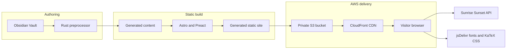
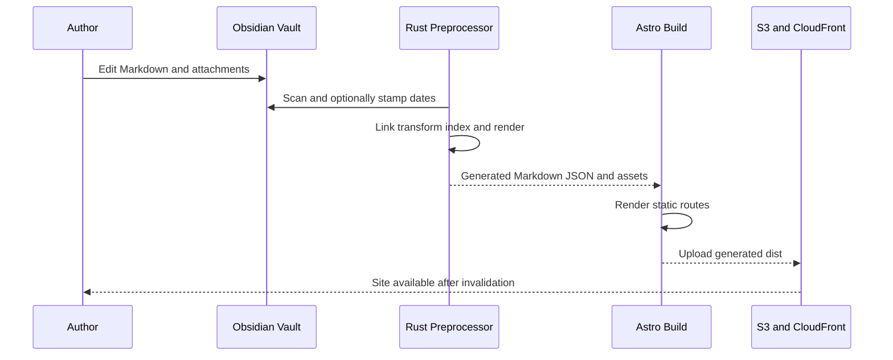

# System Architecture

## System Overview

Obsidian Press is a build-time publishing system with three authored layers:

1. An external Obsidian Vault supplies canonical Markdown and attachments.
2. A Rust CLI transforms Vault content into a generated content contract.
3. An Astro 6 static site consumes that contract and emits static HTML, CSS, JavaScript, JSON, XML, and assets.

The deployed application has no runtime application server or database. S3 stores the static build and CloudFront delivers it. Preact islands perform search, graph, navigation, and theme interactions in the browser.

## Architecture Diagram

### Text Alternative

- Vault content flows into the Rust preprocessor.
- Generated Markdown, metadata, indexes, and assets flow into the Astro build.
- Generated `site/dist/` is uploaded to private S3 and served by CloudFront.
- The visitor browser optionally contacts the sunrise/sunset API and jsDelivr.

## Component Descriptions

### External Obsidian Vault

- **Purpose**: Canonical knowledge and homepage content.
- **Responsibilities**: Store published notes and attachments; currently store the temporary Notion profile links in `Areas/Notes/Passion Project.md`.
- **Dependencies**: iCloud filesystem and the author's separate Vault Git repository.
- **Type**: External authored content source.

### `preprocessor/`

- **Purpose**: Obsidian-to-static-content compiler.
- **Responsibilities**: Five-pass scan, link, transform, search, and output pipeline; diagram rendering; metadata and navigation derivation.
- **Dependencies**: Rust crates, D2 CLI, Mermaid CLI and Chrome, optional Typst CLI, Git metadata, and the Vault filesystem.
- **Type**: Application and shared library.

### `site/`

- **Purpose**: Static web application.
- **Responsibilities**: Route generation, unified Markdown rendering, responsive layouts, professional-profile entry points, RSS/sitemap, and interactive islands.
- **Dependencies**: Generated `content/`, generated public indexes/assets, Astro, Preact, Unified, Shiki, KaTeX, D3, and Lucide.
- **Type**: Application.

### `infra/`

- **Purpose**: AWS delivery infrastructure.
- **Responsibilities**: S3 buckets, OAC, CloudFront distribution/function, logging, custom-domain TLS inputs, error mapping, and security headers.
- **Dependencies**: Terraform, AWS provider, externally managed Cloudflare DNS, and an ACM certificate.
- **Type**: Infrastructure.

### Root Automation

- **Purpose**: Local and CI workflow orchestration.
- **Responsibilities**: Just recipes and Jenkins scheduled build/deploy pipeline.
- **Dependencies**: Cargo, npm/npx, filesystem tools, AWS CLI, Jenkins, and configured credentials.
- **Type**: Build and deployment automation.

### `fixtures/vault/`

- **Purpose**: Real fixture data for Rust integration tests.
- **Responsibilities**: Exercise links, blocks, callouts, diagrams, footnotes, formatting, images, math, and transclusion.
- **Dependencies**: Rust test harness and renderer CLIs.
- **Type**: Test package.

## Data Flow

### Text Alternative

- Authoring changes begin in the Vault.
- The preprocessor may mutate publication dates only when `--stamp-published` is requested.
- The preprocessor emits the generated content contract.
- Astro emits `site/dist/`.
- Explicit deployment uploads that directory and invalidates CloudFront.

## Route Architecture

- `/` renders generated `passion-project` content and replaces one exact Korean heading section with posts published on the current UTC date.
- `/posts/[slug]` statically generates every note, including hubs and `passion-project`.
- `/hubs/[slug]` statically generates hub-specific navigation pages.
- `/tags` and `/tags/[tag]` provide tag navigation.
- `/graph` hydrates the full graph island.
- `/rss.xml` is a build-time GET endpoint.
- `/404` is the CloudFront error response page.
- `/search-index.json`, `/graph.json`, `/previews.json`, `/nav-tree.json`, and `/assets/*` are static generated contracts.

## Current Résumé and Portfolio Boundary

- The current links are not Astro routes or components.
- They originate in the external Vault's `Passion Project.md`.
- They render as ordinary same-tab external anchors on both `/` and `/posts/passion-project`.
- There are no local `/resume` or `/portfolio` pages, structured content models, print styles, downloadable documents, analytics events, or automated link checks.
- Existing CloudFront clean-route rewriting can already serve `/resume/index.html` and `/portfolio/index.html`, so native static pages would not require infrastructure changes.
- External images, APIs, or embedded pages would require explicit CSP review because current `img-src`, `connect-src`, and default frame policy are restrictive.

## Integration Points

### External APIs

- **Sunrise-Sunset API**: Optional solar theme timing from the browser.

### Static Data Contracts

- **Generated post Markdown and metadata**: Read synchronously by Astro at build time.
- **Search index**: Fetched lazily by `Search.tsx`.
- **Navigation tree**: Fetched by desktop and mobile navigation islands.
- **Preview index**: Read at build time and fetched by runtime link previews.
- **Graph JSON**: Read at build time for graph routes and local graph islands.

### Third-Party Services

- **jsDelivr**: Pretendard and KaTeX styles.
- **Notion**: Current temporary résumé and portfolio destinations.
- **GitHub**: Current external profile destination.
- **Cloudflare**: DNS outside this Terraform module.
- **AWS**: S3, CloudFront, ACM input, and remote Terraform state.

## Infrastructure Components

- **Terraform Resources**: Site S3 bucket, public-access block, OAC bucket policy, log bucket and lifecycle, CloudFront OAC, clean-route function, security-header policy, and CloudFront distribution.
- **Deployment Model**: Static upload using `aws s3 sync --delete`, followed by full CloudFront invalidation.
- **Networking**: No VPC or application server. Public HTTPS terminates at CloudFront; S3 is accessible only through OAC.
- **Security Headers**: HSTS, content-type protection, frame denial, strict-origin referrer policy, and CSP.

## Architectural Risks Relevant to the Requested Change

1. The current professional profile has no versioned site-owned product surface.
2. Homepage behavior depends on the exact `passion-project` slug and exact Korean heading markup.
3. The profile link section is duplicated in a normal searchable, syndicated post.
4. `set:html` and `rehype-raw` trust author-controlled Vault HTML.
5. The external Vault is outside the repository and requires separate write authority and Git handling.
6. `main` and `develop` are significantly diverged, blocking the normal feature-branch flow until the base is confirmed or repaired.
7. Jenkins' Rust build paths do not match the repository structure.

## Obsidian Press Extension Compliance

- **OBSIDIAN-01**: Compliant. Architecture and build constraints come from the current code and root instructions.
- **OBSIDIAN-02**: Compliant. Authored layers and generated contracts are explicitly separated.
- **OBSIDIAN-03**: Compliant. Rust tests and Astro build evidence are recorded; no deployment was used as validation.
- **OBSIDIAN-04**: Compliant. Divergence is documented and no branch operation occurred.
- **OBSIDIAN-05**: Compliant. The active run remains at `aidlc-docs/`.
