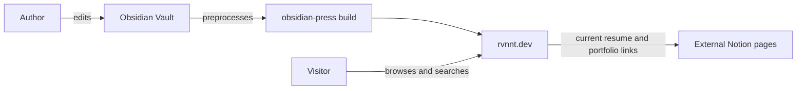

# Business Overview

## Business Context Diagram

### Text Alternative

- The author edits Markdown and attachments in an Obsidian Vault.
- `obsidian-press` converts that content into a static Astro site.
- Visitors browse and search the deployed site at `rvnnt.dev`.
- The current résumé and portfolio journey leaves the site for two temporary Notion pages.

## Business Description

- **Business Description**: Obsidian Press turns a personal Obsidian knowledge vault into a fast, searchable, interconnected public website while preserving Obsidian-native authoring features.
- **Primary Audience**: Readers exploring the author's knowledge base, work history, projects, and professional profile.
- **Authoring Model**: The author maintains canonical knowledge content in an external iCloud Obsidian Vault. Repository code owns transformation, presentation, and delivery.
- **Current Professional Profile Model**: The homepage publishes GitHub, Résumé, and Portfolio as a plain list. GitHub is direct; Résumé and Portfolio are opaque external Notion URLs with no local route, controlled schema, print mode, download, or automated verification.

## Business Transactions

1. **Publish or update knowledge content**
   - The author edits Vault Markdown and attachments.
   - The Rust CLI scans, links, transforms, indexes, and writes generated content.
   - Astro renders static routes and client islands.
   - Deployment copies the static build to S3 and invalidates CloudFront when explicitly run.

2. **Discover the author's professional profile**
   - A visitor opens the homepage.
   - The homepage renders the `passion-project` note.
   - The visitor currently follows external Notion links for the résumé or portfolio.

3. **Read a post or hub**
   - A visitor opens a statically generated post or hub route.
   - The site presents rendered content, tags, related posts, backlinks, navigation, a table of contents, and local graph context.

4. **Search the knowledge base**
   - A visitor opens search through the header or keyboard shortcut.
   - The Preact island lazily loads the generated search index and ranks matching posts.

5. **Explore relationships**
   - A visitor browses the full graph, local graph, hub hierarchy, tag index, or link previews.

6. **Subscribe or recover**
   - A visitor reads the generated RSS feed or uses the 404 page to return to current content.

7. **Change visual theme**
   - A visitor chooses a theme or permits solar-time detection.
   - The browser caches theme, geolocation, and sunrise/sunset state locally.

## Business Dictionary

- **Vault**: The external Obsidian directory containing canonical author-written Markdown and attachments.
- **Post**: A published note rendered at `/posts/{slug}`.
- **Hub**: A note that organizes child posts and also receives a `/hubs/{slug}` route.
- **Passion Project**: The canonical Vault note currently used as both homepage content and a normal post.
- **Generated Content**: `content/`, public JSON indexes, rendered assets, and `site/dist/`; never the sole source of a behavior change.
- **Preprocessor**: The Rust CLI that converts Obsidian syntax into site-ready Markdown, HTML, metadata, indexes, and assets.
- **Island**: A Preact component hydrated only where client interaction is needed.
- **Professional Profile**: The résumé and portfolio experiences that the requested change intends to rebuild.
- **Deployment**: Explicit upload of `site/dist/` to S3 plus CloudFront invalidation; it is not implied by AI-DLC completion.

## Component-Level Business Descriptions

### External Obsidian Vault

- **Purpose**: Canonical authoring environment.
- **Responsibilities**: Store notes, frontmatter, wikilinks, attachments, and the current homepage profile links.

### Rust Preprocessor

- **Purpose**: Translate private authoring conventions into a deterministic public content contract.
- **Responsibilities**: Scan, normalize slugs, resolve links, transform syntax, render diagrams, calculate metadata, and build search/navigation/graph artifacts.

### Astro Site

- **Purpose**: Present generated content as a static, responsive website.
- **Responsibilities**: Render routes, layouts, professional-profile entry points, SEO metadata, RSS, and interactive Preact islands.

### Build and Delivery Automation

- **Purpose**: Reproduce and deliver the public site.
- **Responsibilities**: Run preprocessing and Astro builds; optionally deploy to S3 and CloudFront under explicit authority.

### AWS Infrastructure

- **Purpose**: Serve the static website globally over HTTPS.
- **Responsibilities**: Private object storage, CDN delivery, clean-route rewriting, access logging, error routing, and security headers.

## Obsidian Press Extension Compliance

- **OBSIDIAN-01**: Compliant. Root `AGENTS.md` was read and project constraints are reflected here.
- **OBSIDIAN-02**: Compliant. Canonical Vault and repository source are distinguished from generated content.
- **OBSIDIAN-03**: N/A for this documentation artifact; quality-gate evidence is recorded in the assessment.
- **OBSIDIAN-04**: Compliant. No branch was created while `main` and `develop` remain diverged.
- **OBSIDIAN-05**: Compliant. This document belongs to the only active AI-DLC run.
