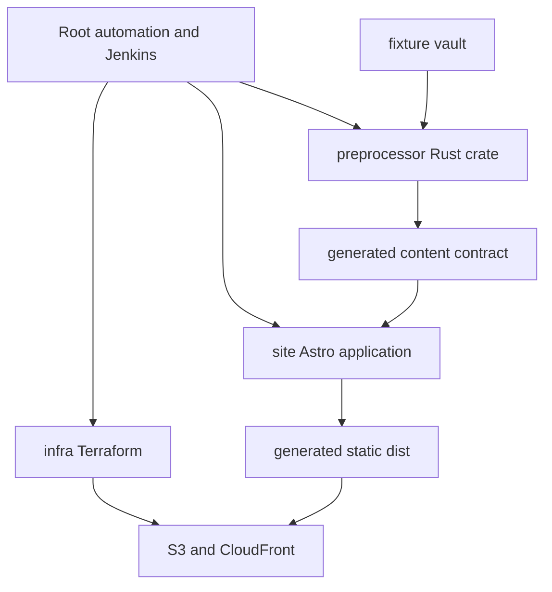

# Dependencies

## Internal Dependencies

### Text Alternative

- Root automation invokes the Rust preprocessor, Astro site, and infrastructure/deployment tools.
- Test fixtures feed the preprocessor.
- The preprocessor generates the content contract consumed by Astro.
- Astro generates the static distribution uploaded to AWS resources described by Terraform.

### Root Automation Depends on Preprocessor

- **Type**: Build and runtime CLI.
- **Reason**: Generate Markdown, metadata, indexes, and assets before Astro builds.
- **Current Risk**: Jenkins uses a nonexistent root Cargo workspace and incorrect binary path.

### Root Automation Depends on Site

- **Type**: Build.
- **Reason**: Generate the deployable static distribution.

### Preprocessor Depends on External Vault

- **Type**: Build-time content.
- **Reason**: Canonical notes and attachments, including the current professional-profile links.
- **Current Risk**: `--stamp-published` mutates the Vault; source date lookup invokes Git in the wrong working directory.

### Site Depends on Generated Content

- **Type**: Build-time and runtime static contract.
- **Reason**: Posts, metadata, graph, search, previews, navigation, and assets.
- **Current Risk**: TypeScript/Rust schema drift and tracked dirty generated JSON.

### Delivery Depends on Infrastructure

- **Type**: Deployment.
- **Reason**: Upload the static distribution to S3 and deliver through CloudFront.
- **Authorization**: Deployment is never an implicit validation step.

## Rust External Dependencies

| Dependency | Locked Version | Purpose | License |
|---|---:|---|---|
| anyhow | 1.0.102 | Error propagation | MIT OR Apache-2.0 |
| serde | 1.0.228 | Serialization models | MIT OR Apache-2.0 |
| serde_json | 1.0.149 | JSON contracts | MIT OR Apache-2.0 |
| serde_yml | 0.0.12 | YAML frontmatter | MIT OR Apache-2.0 |
| walkdir | 2.5.0 | Vault traversal | Unlicense/MIT |
| clap | 4.6.0 | CLI arguments | MIT OR Apache-2.0 |
| regex | 1.12.3 | Syntax matching | MIT OR Apache-2.0 |
| chrono | 0.4.44 | Dates | MIT OR Apache-2.0 |
| tempfile | 3.27.0 | Temporary renderer/test files | MIT OR Apache-2.0 |
| lindera | 2.3.2 | Korean tokenization | MIT |

The Rust lockfile contains 306 package entries. The project crate itself does not declare a license or minimum supported Rust version.

## Site Runtime Dependencies

| Dependency | Locked Version | Purpose | License |
|---|---:|---|---|
| @astrojs/preact | 5.1.1 | Preact integration | MIT |
| @astrojs/rss | 4.0.18 | RSS generation | MIT |
| @astrojs/sitemap | 3.7.2 | Sitemap generation | MIT |
| @shikijs/rehype | 4.0.2 | Syntax highlighting | MIT |
| @shikijs/transformers | 4.0.2 | Code transformers | MIT |
| astro | 6.1.5 | Static application framework | MIT |
| d3-force | 3.0.0 | Graph simulation | ISC |
| d3-selection | 3.0.0 | Graph DOM/canvas selection utilities | ISC |
| d3-zoom | 3.0.0 | Graph zoom | ISC |
| lucide-preact | 1.8.0 | Island icons | ISC |
| lucide-static | 1.8.0 | Build-time icons | ISC |
| preact | 10.29.1 | Interactive islands | MIT |
| rehype-katex | 7.0.1 | Math rendering | MIT |
| rehype-raw | 7.0.0 | Trusted raw HTML parsing | MIT |
| rehype-slug | 6.0.0 | Heading IDs | MIT |
| rehype-stringify | 10.0.1 | HTML serialization | MIT |
| remark-gfm | 4.0.1 | GFM syntax | MIT |
| remark-math | 6.0.0 | Math syntax | MIT |
| remark-parse | 11.0.0 | Markdown parsing | MIT |
| remark-rehype | 11.1.2 | Markdown-to-HAST bridge | MIT |
| unified | 11.0.5 | Rendering pipeline | MIT |
| unist-util-visit | 5.1.0 | AST traversal | MIT |

## Site Development Dependencies

| Dependency | Locked Version | Purpose | License |
|---|---:|---|---|
| @astrojs/check | 0.9.8 | Astro/TypeScript checking | MIT |
| @types/d3-force | 3.0.10 | D3 types | MIT |
| @types/d3-selection | 3.0.11 | D3 types | MIT |
| @types/d3-zoom | 3.0.8 | D3 types | MIT |
| @types/hast | 3.0.4 | HAST types | MIT |
| typescript | 5.9.3 | Static typing | Apache-2.0 |

The npm lock contains 503 package entries. Optional Sharp/libvips platform packages include LGPL-3.0-or-later components.

## Infrastructure Dependencies

- **Terraform AWS Provider 5.100.0** - AWS resource provisioning; MPL-2.0.
- **Terraform CLI** - Configuration declares `>=1.0`, but `use_lockfile` requires a newer Terraform than the observed local 1.5.7.
- **AWS CLI and credentials** - Deployment and identity checks.
- **Cloudflare DNS and ACM certificate** - Managed or supplied outside this module.

## External Runtime Dependencies

- **CloudFront and S3** - Site availability.
- **jsDelivr** - Web fonts and KaTeX CSS.
- **Sunrise-Sunset API** - Optional solar theme.
- **Notion** - Current temporary professional-profile pages.
- **GitHub** - Current profile link.

## Dependency Risks Relevant to the Requested Change

1. New dependencies are unnecessary for a straightforward native static implementation.
2. Removing Notion as a product dependency would improve control and consistency.
3. External media or embeds would expand CSP and availability dependencies.
4. A shared professional-data model should avoid duplicating résumé and portfolio facts.
5. The existing modified npm lockfile must be preserved unless an approved dependency change intentionally regenerates it.

## Obsidian Press Extension Compliance

- **OBSIDIAN-01**: Compliant. Dependency contracts reflect the actual custom rendering and package-manager rules.
- **OBSIDIAN-02**: Compliant. Generated content is shown as an internal contract, not authored source.
- **OBSIDIAN-03**: Compliant. Dependency and toolchain risks are tied to verification gates.
- **OBSIDIAN-04**: N/A for dependency documentation.
- **OBSIDIAN-05**: Compliant. Artifact is contained in the active run.
