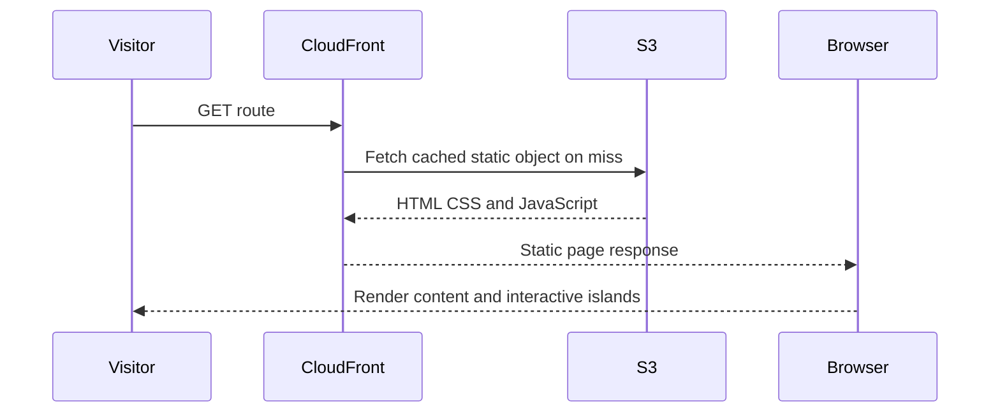
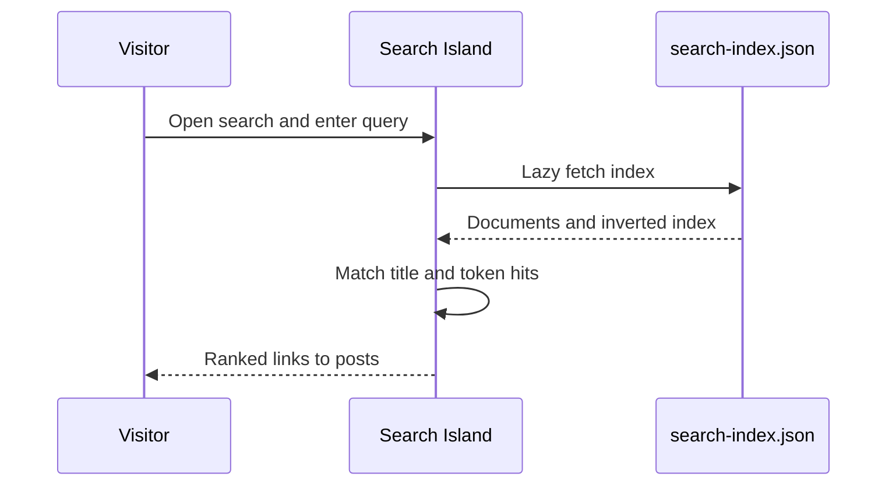
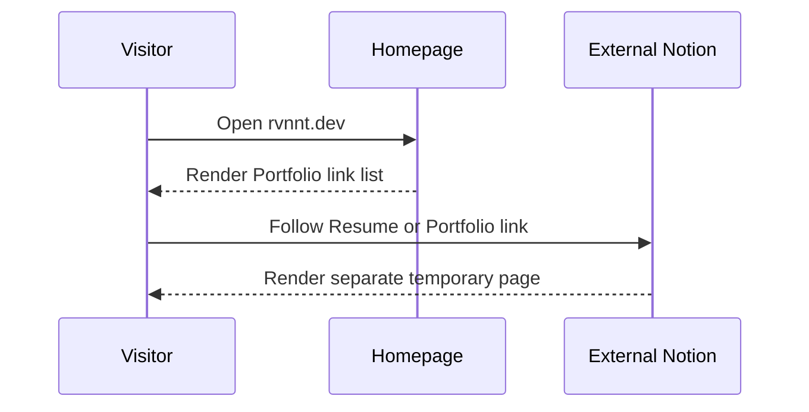

# Interaction Diagrams

## Visitor Browses a Static Route

### Text Alternative

- A visitor requests a route from CloudFront.
- CloudFront reads the private S3 object on a cache miss.
- The browser receives and renders static resources.
- Preact hydrates only the interactive islands on that page.

## Visitor Searches

### Text Alternative

- Search opens in a Preact island.
- The island lazily loads a generated static JSON index.
- Matching and ranking happen entirely in the browser.
- Results navigate to static post routes.

## Current Résumé and Portfolio Journey

### Text Alternative

- The homepage renders profile links from generated `passion-project` Markdown.
- Selecting Résumé or Portfolio navigates away from `rvnnt.dev` in the same tab.
- The destination experience, data contract, availability, and styling are controlled outside this repository.

## Author Publishes

The full author-to-delivery sequence is documented in `architecture.md`. Its critical boundary is that Vault and repository source are authored, while `content/`, public indexes/assets, and `site/dist/` are generated.

## Interaction Findings for Requirements Analysis

- Decide whether the new professional profile remains Vault-authored, becomes repository-authored, or uses a deliberate hybrid.
- Decide whether `/resume` and `/portfolio` are standalone native routes or a single combined profile.
- Decide whether the résumé needs browser print/PDF behavior.
- Decide how homepage and `/posts/passion-project` duplication is removed or made intentional.
- Decide whether professional data needs one shared schema to prevent résumé/portfolio divergence.

## Obsidian Press Extension Compliance

- **OBSIDIAN-01**: Compliant. Interactions use the actual static-site and build architecture.
- **OBSIDIAN-02**: Compliant. Authored and generated boundaries are explicit.
- **OBSIDIAN-03**: N/A for interaction documentation.
- **OBSIDIAN-04**: N/A for interaction documentation.
- **OBSIDIAN-05**: Compliant. Artifact is part of the sole active run.
