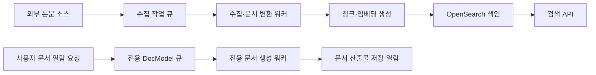

# 조준희 | 카카오페이 데이터 엔지니어 — 데이터 플랫폼

데이터의 수집·정규화·색인부터 서비스가 결과를 사용하는 순간까지, 처리 흐름과 운영 문제를 함께 다루는 엔지니어입니다.

DocSuri의 4인 팀에서 데이터 엔지니어로 멀티소스 수집, DocModel 구조화, 임베딩·색인 파이프라인을 맡고 인프라를 운영했습니다. 서로 다른 소스의 중복·버전·철회를 처리하고, 재처리의 출발점과 복구 절차를 마련했습니다. 대량 백필 중 검색이 503을 반환했을 때에는 수집량을 제한해 검색을 복구하고 사용자 문서 생성 작업을 별도 큐·워커로 분리했습니다. 개인 프로젝트에서는 산출물 누락이 CI 성공으로 처리되는 문제를 수정했습니다.

[GitHub](https://github.com/revenantonthemission) · [기술 블로그](https://rvnnt.dev) · corpseonthemission@icloud.com

> 2026-09-20 확장한 지원용 원고입니다. 제출 분량을 줄이기 전, 활용할 수 있는 사례를 넓게 보존한 판본입니다. 운영 수치는 당시 문서·커밋의 관측값이며 이번에 새로 측정한 값이 아닙니다. [작성 근거](research.md)와 [문서 조사 범위·기여 구분](evidence/context-and-scope.md)에 세부 출처와 한계를 정리했습니다.

## 1. DocSuri — 멀티소스 데이터 파이프라인과 운영 안정화

**프로젝트**: AWS AI School 2기 팀 프로젝트. AI/ML 논문을 탐색하고 원문에 근거한 한국어 요약을 제공하는 서비스입니다.  
**담당**: 4인 팀의 Data Engineer. U1 코퍼스 수집·구조화·임베딩·색인, 인프라 운영과 후속 개선. 검색·요약·에이전트의 초기 전체 구현은 다른 담당자의 영역이었습니다.  
**사례 시점**: 2026년 6~7월 AWS 구축·운영, 8월 이후 로컬 운영 전환·개선.  
**관련 기술**: Python, PostgreSQL, OpenSearch, Amazon SQS, ECS/Fargate, S3, Amazon Bedrock, AWS CDK, CloudWatch, Redis. 로컬 전환에서는 Docker, MinIO, ElasticMQ, Ollama를 사용했습니다.

### 서비스에서 데이터가 쓰이는 과정

외부 논문 데이터를 수집해 문서 구조와 청크로 변환하고, 임베딩과 검색용 필드를 생성해 OpenSearch에 색인했습니다. 검색 결과는 논문 탐색뿐 아니라 문서 열람과 근거 기반 요약으로 연결됩니다. 따라서 백필의 처리 속도와 검색·열람의 응답성을 함께 관리해야 했습니다.

이 그림은 장애 대응 후의 작업 분리를 단순화한 것입니다. 백필은 수집 큐에서, 사용자 열람에 필요한 문서 생성은 별도 큐·워커에서 처리합니다. 실행 경로를 나누어도 외부 소스의 요청 한도와 공유 자원의 부하는 계속 관리해야 합니다.

### 1.1. 검색 503 복구 — 수집량 제어와 사용자 작업 격리

#### 문제: 백필이 사용자 검색과 문서 열람에 영향을 줌

대량 arXiv 백필 중 검색 API가 503을 반환했습니다. 운영 기록에는 OpenSearch k-NN 검색의 2초 타임아웃과 수집 큐 적체가 남아 있습니다. 사용자 요청 문서 생성 작업도 약 3.3만 건의 백필 대기열 뒤에서 기다리는 문제가 있었습니다.

당시 진단은 워커 3개에서 발생하는 외부 요청량과 공유 자원 부하를 함께 지목했습니다. arXiv 요청 제한은 프로세스별로 적용되어, 각 워커가 제한을 지켜도 워커 수가 늘어나면 전체 요청량은 증가했습니다. 큐 적체에 맞춰 워커를 늘리는 방식이 외부 소스의 한도 및 검색 서비스의 처리 여유와 충돌한 사례였습니다.

#### 대응

- **수집량을 제어해 검색을 복구했습니다.** 7월 1일에는 수집 워커를 3개에서 1개로 줄인 뒤 장애 재현 쿼리의 정상 응답을 확인했습니다. 다음 날의 추가 안정화에서는 수집을 중지하고 자동 확장을 일시 정지했습니다. 이 중지 조치에서는 큐 메시지를 보존했고, 검색이 비저하 결과 20건을 반환하는 것을 확인했습니다.
- **작은 범위에서 재처리를 검증했습니다.** 한 번에 가져오는 메시지 수를 제한하고, 외부 소스의 요청 간격 제어를 적용했습니다. 이후 별도로 승인된 큐 정리와 파일럿 재등록을 거쳐 단일 워커로 재색인을 검증했습니다.
- **큐 분리에서 실행 자원 분리로 개선했습니다.** 7월 1일 사용자 요청 DocModel 작업을 전용 우선순위 큐로 분리했고, 7월 2일에는 별도 워커 서비스로 실행 자원까지 분리했습니다. 전용 DocModel 워커는 해당 큐만 소비하도록 했습니다. 대량 수집 적체가 문서 열람 작업의 실행 기회를 빼앗지 않도록 한 조치입니다.
- **확장과 복구 조건을 운영 규칙으로 남겼습니다.** 프로세스별 요청 제한의 특성을 고려해 당시 관련 워커 서비스의 확장 상한을 1로 제한하고, 버스트 확장을 제거했습니다. bulk 큐는 30분, DocModel 큐는 5분의 대기 시간 알람을 설정했습니다. DLQ 재처리 절차에는 검색 지연을 함께 확인하도록 명시했습니다.

#### 결과와 검증 범위

| 확인 항목 | 당시 기록 | 의미 |
|---|---|---|
| 검색 복구 | 워커 3→1 축소 후 재현 쿼리 정상화. 후속 수집 중지 시 비저하 결과 20건 반환 | 각 안정화 단계에서 검색 경로 확인 |
| 제한된 재처리 | 단일 논문에서 118개 청크 색인, 13개 자산 저장 | 작은 범위에서 문서 생성→색인 경로 검증 |
| 파일럿 중 상태 | 처리 대상 큐가 0으로 감소, 수집 DLQ는 111건으로 유지, 검색 비저하 상태 유지 | 해당 파일럿에서 DLQ 추가 유입 없이 처리 |
| 조치 후 혼합 부하 시험 | 20 VU, 검색 p95 664.9ms, 전체 HTTP 오류율 0.01% | 프런트·readyz·반복 단일 검색어를 섞은 당시 k6 기록 |
| 후속 문서 생성 큐 복구 | 7월 8일 문서 생성 DLQ 24건→0건 기록 | 별도 DocModel 큐의 후속 복구 결과 |

수집 DLQ 111건과 문서 생성 DLQ 24건은 서로 다른 큐의 관측값입니다. 이 결과는 단일 파일럿과 특정 시점의 복구 기록이며, 전체 백필 완료나 장기 SLA 달성을 의미하지 않습니다.

부하 시험은 프런트·준비 상태 요청과 검색 요청이 섞인 20 VU 시나리오입니다. 검색은 반복된 단일 질의를 사용하므로 캐시 영향이 있을 수 있고, 0.01%는 검색만의 오류율이 아닙니다. 이전 smoke 시험의 검색 p95 9,061ms는 검색 12회·동시성 3으로 조건이 달라 지연 개선율을 계산하지 않았습니다. [측정 조건과 원문](evidence/operations.md)

#### 설계에서 중요하게 본 점

데이터 처리량과 사용자 응답성의 목표를 분리했습니다. 큐를 분리하는 것과 외부 소스·저장소의 부하를 제한하는 것은 각각 필요했습니다. 당시에는 백필 속도를 제한하는 비용을 받아들이고 검색과 문서 열람의 가용성을 우선했습니다.

팀에서 제기한 재임베딩·재색인 문제도 데이터 흐름을 기준으로 구분했습니다. 지연 문서 생성은 문서 산출물을 갱신하지만, 검색 인덱스를 자동으로 갱신하지는 않았습니다. 검색 결과를 새 문서 구조에 맞추려면 문서 생성 이후 청킹·임베딩·색인까지 거쳐야 한다는 점을 확인하고 대응 범위를 정했습니다.

**직무와의 연결**: 프로덕션 파이프라인의 지연 진단, 재처리와 온라인 조회의 영향 분리, 백로그·DLQ 관측, 운영 제약을 반영한 확장 판단을 보여주는 사례입니다.

**근거**: [팀 저장소](https://github.com/80-hours-a-week/DocSuri), [수집량 제어 커밋](https://github.com/80-hours-a-week/DocSuri/commit/7edbcc51), [파이프라인·인프라 개선 PR #323](https://github.com/80-hours-a-week/DocSuri/pull/323), [요청량 제한 개선 PR #420](https://github.com/80-hours-a-week/DocSuri/pull/420), [문서 생성 큐 복구 런북](https://github.com/80-hours-a-week/DocSuri/blob/develop/reports/runbook-docmodel-drain-344.md).

### 1.2. 멀티소스 결합 — 같은 논문의 대표 레코드와 출처 관리

arXiv, Semantic Scholar, OpenAlex를 공통 수집 경로에 연결하면서 같은 논문이 소스마다 다른 식별자와 메타데이터로 들어오는 문제를 다뤘습니다. DOI, arXiv ID, 정규화한 제목·첫 저자·연도의 순서로 canonical 식별 키를 만들고, 소스 우선순위에 따라 대표 레코드를 선택했습니다.

낮은 우선순위의 중복은 원문 추출·임베딩 전에 걸러 불필요한 후속 처리를 줄이도록 했습니다. 더 높은 우선순위의 소스가 나중에 들어오면 대표를 갱신하고, 대표 레코드의 별칭과 관측 소스를 확인할 수 있게 했습니다. 데이터베이스에서는 우선순위·버전 조건에 맞을 때만 대표 정보를 갱신하도록 했습니다.

원본의 철회도 데이터 변경으로 처리했습니다. 검색 청크를 tombstone 처리하고 문서 캐시·자산을 정리하며, 철회된 대표가 정상적인 외부 복본의 수집을 계속 막지 않도록 canonical 상태를 제거하는 회귀 테스트를 추가했습니다. 이는 소스 변경을 파생 데이터의 수명주기까지 연결한 경험입니다. 전체 코퍼스의 중복률 감소 수치는 별도로 측정하지 않았습니다. [구현·기여·테스트 근거](evidence/data-pipelines.md)

### 1.3. DocModel — 여러 소비자가 재사용하는 구조화 데이터

원문을 평문으로만 전달하면 검색 결과를 원문의 위치에 연결하거나 표·수식을 다시 활용하기 어렵습니다. DocModel을 섹션·블록 단위의 공통 표현으로 두고, 같은 구조에서 읽기 순서의 본문과 검색 청크를 만들었습니다. 문단·표·수식·그림 캡션 등의 구조와 함께 논문·버전·섹션·블록 식별자를 남겼습니다.

검색용 토큰과 출처 참조인 `blockRefs`를 분리하고, 공용 DTO 변경을 요약·프런트 소비자에 함께 반영했습니다. provenance의 parser/schema 버전으로 저장물의 호환성을 판단하며, 소비자 측 파생 캐시도 DocModel 세대를 구분합니다. 데이터 생산자의 변경을 저장 형식뿐 아니라 조회·요약·화면의 변경 범위로 다룬 사례입니다.

이 과정에서 모든 파서를 단독 구현한 것은 아닙니다. 특히 후속 GROBID TEI 구조 파서는 팀원의 기여이며, 현재 읽기 경로도 모든 구버전을 일괄 거부하지는 않습니다. 입력 형식별 구조 품질과 일부 레거시 인용 앵커의 차이는 남아 있습니다. [파이프라인 근거](evidence/data-pipelines.md) · [소비자 계약 근거](evidence/contracts-quality.md)

### 1.4. 재시도·중복·부분 실패 — 완료 상태의 의미를 검증

같은 논문 버전의 작업이 다시 전달되더라도 불필요한 색인 호출을 반복하지 않도록 중복 처리 경로를 뒀습니다. OpenSearch bulk의 일부 항목이 실패하면 처리 완료 상태를 기록하지 않는 테스트로, 요청 전체가 반환됐다는 사실과 모든 항목의 성공을 구분했습니다. 재시도·DLQ에는 원래 작업의 소스와 실패 단계 정보를 전달하도록 구성했습니다.

증분 진행 위치는 소스별 watermark로 관리했습니다. watermark가 뒤로 가지 않는지, 한 소스의 갱신이 다른 소스의 진행 상태를 바꾸지 않는지 속성 기반 테스트로 확인했습니다. 전체 재구축 중에는 스케줄·이벤트 등록과 워커 실행 경로를 제한해 기존 작업이 재구축 상태를 덮어쓰는 충돌을 줄이도록 했습니다.

이 검증은 재처리와 잘못된 완료 판정의 구체적인 실패 경로에 한정됩니다. 여러 저장소의 전역 트랜잭션이나 모든 순서·동시성에서의 exactly-once, 유실 0을 보장하는 것으로 표현하지 않습니다. [근거](evidence/data-pipelines.md)

### 1.5. 목적별 재처리 — 복사·재임베딩·재파싱의 출발점 분리

“인덱스를 다시 만든다”는 작업을 바뀌는 데이터에 따라 구분했습니다.

| 변경 목적 | 재처리 출발점 | 처리 내용 |
|---|---|---|
| 샤드 등 저장 구조 변경 | 기존 색인 레코드 | 레코드 복사 |
| 임베딩 모델 변경 | 저장된 청크 텍스트 | 벡터 재생성, 나머지 필드 보존 |
| 파서·문서 구조 변경 | 원본 바이트 캐시 | 다시 파싱한 후 청킹·임베딩·색인 |

문서 열람용 DocModel만 다시 생성하는 것과 검색용 청크·벡터까지 갱신하는 것도 구분했습니다. 목적에 맞는 경로를 마련해 외부 원문을 불필요하게 다시 내려받지 않도록 설계했습니다. 재파싱은 개별 실패 후에도 종료 코드가 0일 수 있어 로그·처리 결과를 함께 확인해야 하는 한계가 남아 있습니다. 전체 재처리 완료 시간이나 시간 단축률은 확보하지 않은 수치로 채우지 않았습니다. [구현·런북 근거](evidence/data-pipelines.md)

### 1.6. 외부 호출 한도 — 병렬성보다 계정 전체의 처리 한도 고려

재임베딩에서는 워커를 늘려도 계정 전체의 모델 호출 한도를 넘을 수 없다는 제약을 반영했습니다. 배치의 예상 토큰 수로 호출 속도를 제한하고, 속도 제한 모드에서는 대상 인덱스에 이미 기록된 문서를 조회해 재시작 시 임베딩을 생략하도록 했습니다. 한 번의 토큰 버킷 용량보다 큰 배치도 여러 보충 구간을 거쳐 처리하는 회귀 테스트를 추가했습니다.

이는 처리량을 높이는 것과 중단 후 이미 수행한 작업을 재사용하는 것을 함께 고려한 경험입니다. 대상 인덱스와 설정을 유지한 재시작이 전제이며, 문서 존재 확인만으로 다른 모델·설정의 결과까지 안전하게 재사용할 수 있는 것은 아닙니다. [근거](evidence/data-pipelines.md)

### 1.7. 인덱스 전환 — 적재·검증·읽기 전환·롤백을 분리

후보 인덱스에 데이터를 적재하는 작업과 사용자의 읽기 경로를 바꾸는 작업을 분리했습니다. 최소 문서 수 점검, 원본·대상 문서 수 비교, replica·refresh 복원, alias 전환, 수집 재개의 절차를 런북으로 남겼습니다. alias의 이전 대상 제거와 새 대상 추가는 하나의 요청으로 수행하도록 했습니다.

임베딩 차원이 바뀌면 검색의 질의 벡터와 수집의 문서 벡터도 함께 바뀌어야 합니다. 인덱스뿐 아니라 reader/writer의 공유 스펙과 실행 이미지를 함께 맞추고, 복구 시 이전 이미지와 alias를 되돌리는 범위를 명시했습니다.

현재 점검 도구의 보장은 문서 수 부족 감지 수준이며 ID 집합·내용·출처의 완전성 검증은 아닙니다. cutover 명령 자체가 별도 검증 명령의 실행을 강제하지도 않으므로, 자동 무중단 전환이나 실패 시 전환 불가능을 달성했다고 주장하지 않습니다. [근거](evidence/data-pipelines.md)

### 1.8. 외부 데이터 입력 — 주소·크기·파싱 비용 제한

외부 논문 수집은 가공 전에 입력 자체의 경계를 확인해야 했습니다. URL의 공인 IP 여부와 리다이렉트를 검사하고, 응답을 스트리밍하면서 크기 상한을 넘으면 중단하도록 보완했습니다. XML 엔티티 확장과 과도한 압축 해제에도 제한을 뒀습니다.

6월 29일 하드닝 기록에는 외부 응답 64MB, XML 32MB, 압축 파일 개별 항목 20MB·합계 200MB 제한과 관련 회귀 테스트가 남아 있습니다. 이는 외부 입력이 수집기의 자원을 과도하게 사용하지 않도록 한 구현 사례이며, 서비스 전체의 보안 검증이나 금융 개인정보 처리 경험을 뜻하지는 않습니다. [변경 이력·소스 근거](evidence/data-pipelines.md)

### 1.9. 파생 자산 — 검색 처리와 그림·도표의 실패 영향 구분

팀의 자산 파이프라인은 주 검색 색인 처리 뒤에 그림·도표 추출을 best-effort로 수행합니다. 자산은 객체 저장소에 먼저 쓰고 데이터베이스의 manifest를 갱신하며, 문서 블록의 assetId와 연결합니다. 버전 변경·철회 시에는 관련 파생 산출물도 정리합니다.

검색이 가능한 상태와 화면의 모든 자산이 준비된 상태를 동일한 성공으로 보지 않는 설계입니다. 객체 저장소와 데이터베이스 사이의 원자성은 없으므로 고아 객체나 표시 누락이 없다는 보장으로 확대하지 않습니다. 자산 추출 세부 구현은 팀의 공통 결과로 구분합니다. [근거](evidence/data-pipelines.md)

### 1.10. 사용자 PDF — 공개 코퍼스와 구별되는 비동기 입력 계약

사용자 PDF 처리에서는 공개 논문용 ID를 임의로 만들지 않고 별도 `userdoc` 식별자와 작업 종류를 정의했습니다. 큐 입력의 job·owner·record reference가 서로 맞는지 확인하고, 저장된 파일을 읽어 같은 DocModel 형식으로 변환하도록 연결했습니다. 잘못된 입력과 파싱할 수 없는 문서는 영구 실패로 분류해 DLQ로 보냈습니다.

공용 계약을 먼저 정한 뒤 수집·백엔드·프런트가 순서대로 맞추는 작업 경계도 문서화했습니다. 이 사례는 메시지 입력의 식별·검증에 관한 것이며, 이후 감사에서 발견된 읽기 API의 소유자 검사 결함까지 해결한 사용자 간 접근 격리 사례로 쓰지는 않습니다. [구현 근거](evidence/data-pipelines.md) · [계약 순서](evidence/context-and-scope.md)

### 1.11. 운영 상태 진단 — 코드·배포 템플릿·실제 설정을 대조

큐 적체를 애플리케이션 처리 성능만으로 해석하지 않았습니다. 별도의 backlog 조사에서는 약 15.3만 건의 메시지가 대기하는 상황에서 코드와 배포 템플릿의 워커 확장 상한은 1이지만, 실제 자동 확장 설정은 0으로 남아 있는 차이를 확인했습니다. 이 기록은 워커가 실행되지 않는 운영 상태를 원인으로 좁힌 진단이며, 그 자체를 이후 적체 해소 결과로 표현하지 않습니다.

관측·운영 모듈의 중복 이벤트 처리 상태에 메모리 상한을 두고 민감한 로그 필드를 가리도록 보완했습니다. 오래된 식별자가 제거된 뒤 다시 들어올 수 있으므로 영구적인 중복 제거와는 구분했습니다. 큐 대기 시간·DLQ·검색 지연을 함께 보는 런북을 남겨, 재처리를 시작하거나 확장을 바꿀 때 온라인 조회 영향도 확인하도록 했습니다. [운영 기록·기여 근거](evidence/operations.md)

### 1.12. 비용 제어 — 실행 중 제한과 사용자 쿼터를 연결

공통 비용 제어 기반 위에서 에이전트의 warning/critical 상태 처리 경계를 보완하고, 실행 비용을 관측 지표에 기록하도록 개선했습니다. Redis 기반 사용자별 쿼터도 연결해 공통 서비스 예산과 개별 사용량을 서로 다른 제한으로 다뤘습니다.

데이터·AI 기능의 비용 신호를 일괄 장애와 동일하게 취급하지 않고, 기능별로 어떤 호출을 계속하고 어느 단계에서 중단할지 구분하는 경험이었습니다. 최초 공통 운영 유닛 전체를 제가 구현한 것은 아니며, 월 비용 절감률이나 모든 장애에서 정확한 과금·차단을 보장했다는 수치는 주장하지 않습니다. [담당 커밋·제한](evidence/operations.md)

### 1.13. 복구·백업·환경 이전 — 실행 환경까지 확인

AWS 운영 기록에는 CloudWatch 경보의 실제 이메일 수신과 RDS snapshot을 새 인스턴스로 복원해 available 상태를 확인한 검증이 있습니다. 백업 설정의 존재와 복원 확인을 구분해 운영 근거로 남긴 팀의 사례입니다.

8월에는 AWS 환경을 종료하고 컨테이너·로컬 서버로 옮기면서 MinIO·ElasticMQ 및 로컬 모델 어댑터로 연결을 변경했습니다. 이후 백업 dump와 복사는 성공하지만 launchd 실행 맥락의 macOS 권한 때문에 오래된 백업 정리가 실패하는 문제를 다뤘습니다. 로컬 manifest와 날짜 기준 retention, 실패 시 재시도 방식으로 보완하고 실제 launchd 실행 결과와 양쪽 dump 생성을 확인했습니다.

서비스 안의 헬스 체크만으로 호스트 전체 장애를 알기 어려워 외부 heartbeat도 연결했습니다. 다만 현재 구성은 단일 호스트이며 고가용성 구성이 아닙니다. dump 목록 확인은 실제 복원 시험이 아니고, AWS 시기의 RDS 복원 확인이 현재 객체 저장소·검색 인덱스까지 포함하는 통합 복원 보장도 아닙니다. [운영 이전·백업 검증 근거](evidence/operations.md)

#### 배포에서 드러난 권한·기존 리소스·식별자 경계

운영 중 자산 조회가 막혔을 때 API 역할의 S3 읽기 권한을 필요한 prefix 범위로 보완했습니다. 관측 경로에서도 metric namespace 설정과 실제 IAM 권한·전달 여부를 별도로 확인해야 했습니다. 기존 큐가 있는 배포에서는 재생성 충돌을 확인하고 import했으며, 의도하지 않은 기능 플래그 변경은 보존한 뒤 배포했습니다. 실행 이미지는 commit tag로 추적하고 서비스 안정화와 health 응답을 확인한 기록을 남겼습니다.

별도 개발 환경의 serverless 검증에는 호출 권한과 실제 전송 payload의 hash를 대조해 403을 좁힌 사례도 있습니다. 이는 production 전환 완료와 구분합니다. AWS 종료 뒤에는 더 이상 사용할 수 없는 이전 도메인의 기본값을 정리하되, 재현용 fixture와 안정적 ID 생성에 쓰는 namespace는 보존했습니다. 단순 문자열 치환이 기존 데이터의 식별 의미까지 바꾸지 않도록 한 작업입니다. [배포·도메인 변경 근거](evidence/operations.md)

### 1.14. 협업 — 데이터 계약과 문서 추적성을 변경의 기준으로 사용

공용 JSON Schema와 Python 모델을 데이터 형상의 기준으로 사용하고, 호출 동작은 별도 Protocol 포트로 나눴습니다. 제가 담당한 수집 데이터의 필드와 의미가 바뀔 때에는 공용 DTO와 소비자 변경을 함께 다뤘습니다. 계약의 생산자·소비자·검토 책임을 명시하는 방식으로 병렬 작업의 경계를 맞췄습니다.

벡터의 호환성도 단순히 배열 길이만 확인하는 문제가 아니었습니다. 팀의 공용 계약은 모델, specVersion, 차원, 거리 함수, 정규화를 동일 공간의 조건으로 다루고 문서용·질의용 input type을 구분합니다. 비교 함수와 필드별 불일치 테스트는 있지만, 이를 모든 런타임에 강제되는 배포 게이트로 설명하지는 않습니다.

개발 문서가 늘어나면서 기존 추적성 도구를 프로젝트에 맞게 수정했습니다. 한국어 요구사항 ID와 모노레포 경로, 유닛별 계획을 해석하도록 파서를 보완해 요구사항→스토리→유닛→코드 관계를 점검할 수 있게 했습니다. 자동 보고서에서 연결이 발견됐다는 사실을 기능 구현 완료와 동일시하지 않고, 빠진 연결과 리뷰 대상을 찾는 데 사용했습니다. [계약 근거](evidence/contracts-quality.md) · [개인 도구 개선 이력](evidence/context-and-scope.md)

### 1.15. 데이터 소비자와 품질 — 팀의 구현에서 함께 고려한 경계

다음은 수집·인프라와 연결되는 팀의 검색·요약·사용자 데이터 설계입니다. 전체 기능의 개인 구현 성과가 아니라, 생산한 데이터가 어떻게 쓰이고 어떤 계약이 필요한지 보여주는 보조 사례입니다.

- **이벤트의 의미**: 검색 이력은 질의 문자열뿐 아니라 requestId를 사용합니다. 같은 이벤트의 재전달은 중복으로, 같은 질의를 새로 실행한 요청은 별도 행동으로 구분하는 테스트가 있습니다.
- **기능 저하의 의미**: 임베딩 장애 시 lexical 검색으로 낮추는 것과 색인 자체를 조회할 수 없는 상태를 구분합니다. 요약은 비용 제한·생성 의존성 장애·원문 부재를 별도 상태로 다룹니다. 최신 감사에는 일부 빈 결과에서 저하 상태가 사라지는 결함이 남아 있어 완전한 상태 전달을 주장하지 않습니다.
- **파생 캐시의 재사용 조건**: 논문·버전뿐 아니라 언어·persona·용어집·모델·프롬프트·DocModel 세대를 구분합니다. parser 변경 시 이전 생성물을 재사용하지 않는 시험과 별개로, 공유 캐시가 원문 identity에 결속되지 않은 오염 경로는 후속 교정 대상입니다.
- **집계 결과의 제한**: 개인화 boost에는 개별 값과 절댓값 합의 상한을 두고, 세 범주의 가중치가 같을 때의 반례를 속성 테스트에 고정합니다. 적용·폴백·실패 이유를 관측하되 과거 shadow-only 설계를 현재 동작으로 소개하지 않습니다.
- **평가 데이터의 한계**: 요약 근거 평가에는 실제 논문 8건의 수치 발췌로 구성한 18개 사례와 false-pass/false-abstain 구분이 있습니다. 문서의 confident 14개 성공 기록은 통제된 평가 문장에 한정되며 실제 운영의 환각률 0%를 의미하지 않습니다.
- **불확실한 외부 참조**: 인용 그래프는 canonical ID가 해소되지 않은 참조, 순환·중복, 탐색량 제한, 부분 결과를 표현하도록 설계했습니다. 외부 provider의 실제 전체 여정 검증과는 구분합니다.

온보딩 이벤트로 집계 규칙을 재사용하는 설계, 알림의 성공 시점에만 watermark를 전진시키는 설계, 등급별 한도를 기존 비용 제어로 전달하는 확장도 검토 자료에 남겼습니다. 이 항목들은 직접 운영한 성과로 섞지 않습니다. [소비자별 근거](evidence/contracts-quality.md) · [추가 설계 소재](evidence/context-and-scope.md)

### 1.16. 남은 한계와 후속 검증 기준

이 프로젝트에서 얻은 중요한 기준은 **작업 성공, 저장물 존재, 데이터 품질, 사용자의 실제 활용 성공은 서로 다른 검증 대상**이라는 점입니다. 최신 감사에는 코퍼스의 fixture 혼입, 공유 캐시의 원문 결속, 사용자 문서 읽기 권한, 일부 타입 생성의 실패 전파 등 미해결 항목이 남아 있습니다. 이번 원고는 과거의 성공 기록을 현재 서비스 전체의 품질 보장으로 확장하지 않습니다.

추가로 검증할 항목은 원본·색인의 ID와 내용 비교, 실패 건수와 종료 상태의 일치, 캐시의 검증된 source identity 결속, 소유권 경계, 호스트 장애 후 데이터 복원입니다. 승인된 후속 설계와 아직 수행하지 않은 복원·성능 시험은 완료 성과와 구분했습니다.

**직무와의 연결**: 여러 소스의 정규화·결합, 중복·수정·철회의 처리, 재시작 가능한 배치, reader/writer 데이터 계약, 부하·비용·복구를 함께 고려하는 운영 경험을 데이터 플랫폼 업무로 확장하고 싶습니다. Kafka·Flink·Spark 등 대규모 분산 처리 엔진이나 금융 원장 정합성을 이미 운영했다고 표현하지 않습니다.

**운영 시점 구분**: AWS 경험은 당시 운영 사례입니다. 현재는 로컬 환경이며 예전 주소를 현재 운영 주소로 안내하지 않습니다. 전체 문서 목록과 채택·제외 판단은 [문서 조사 기록](evidence/context-and-scope.md)에 보존했습니다.

## 2. obsidian-custom-publish — 산출물 누락을 CI 실패로 전파

**프로젝트**: 직접 사용하는 Obsidian 문서를 정적 블로그로 게시하는 개인 프로젝트.  
**담당**: Rust 전처리기, 렌더링 경로, 검증·배포 구성.  
**관련 기술**: Rust, Astro, TypeScript, Jenkins, Mermaid/D2.

### 데이터 흐름

Markdown 원문과 메타데이터, 문서 간 참조를 읽어 게시물과 검색 인덱스·링크 그래프·미리보기·탐색 데이터를 생성합니다. 원문 처리와 화면 렌더링의 책임을 나누고, 생성물을 빌드 과정에서 다시 만들도록 구성했습니다.

### 문제와 원인

2026년 7월, CI는 성공했지만 다이어그램이 빠진 문서가 배포되는 문제가 있었습니다. 당시 수정 커밋에는 28개 글에서 Mermaid 렌더링 65건이 실패한 기록이 남아 있습니다.

로컬 브라우저 설정 파일이 Git 관리 대상에서 제외되어 CI에는 전달되지 않았고, Puppeteer가 사용할 브라우저를 찾지 못했습니다. 렌더러 오류가 경고로 처리되어 전처리 명령은 성공했고, 배포가 계속된 것이 문제였습니다.

### 개선과 검증

CI에 브라우저 실행 경로를 명시하고, Mermaid/D2 SVG 렌더링 실패를 집계해 전처리 명령의 실패로 전파하도록 변경했습니다. 생성된 파일은 문제를 조사할 수 있도록 남겼습니다.

당시 커밋의 재현 기록은 브라우저 경로가 없을 때 종료 코드 1과 렌더링 실패 65건, 경로가 있을 때 종료 코드 0과 밝은·어두운 테마용 SVG 130개 생성입니다. 검증 대상은 해당 렌더링 실패 경로이며, 모든 파일 쓰기 실패까지 보장하는 것은 아닙니다.

별도로 공개 범위와 홈페이지 참조 규칙을 출력 이전에 검증하고, manifest와 실제 생성 파일 목록을 비교하는 테스트를 두었습니다. 외부 다이어그램 렌더러를 제외한 fixture에서는 같은 입력을 재실행했을 때 출력 바이트가 일치하는지도 검사합니다.

**직무와의 연결**: 파이프라인의 종료 상태가 결과물의 실패를 반영하도록 만들고, 입력 계약과 출력 검증으로 데이터 품질을 확인하는 경험입니다.

**근거**: [저장소](https://github.com/revenantonthemission/obsidian-custom-publish), [렌더링 실패 전파 수정 커밋](https://github.com/revenantonthemission/obsidian-custom-publish/commit/f82c9eb370f34470d0c930b9e89630f7fceb278e).

## 3. mcp-local-reference — 원본 자료를 검색·활용 가능한 인터페이스로 제공

**담당**: 로컬 데이터 접근, 인덱싱, MCP 도구와 인용 출력 흐름 설계·구현.  
**관련 기술**: Python, SQLite, PDF 텍스트·도판 추출, semantic index, MCP.

로컬 Zotero 라이브러리의 메타데이터와 PDF를 읽어 검색, 컬렉션 탐색, 본문·도판 추출, Harvard 형식 인용을 제공하는 서버를 만들었습니다. 원본 데이터와 검색 인덱스를 분리하고, 조회·도판 추출·인용 생성을 별도 도구로 제공했습니다.

이 프로젝트는 저장된 데이터를 사용자가 찾고 참조할 수 있는 형태로 가공하는 경험을 보여줍니다. 데이터의 원래 구조와 출처를 유지하면서, 활용 목적에 맞는 검색·조회 인터페이스를 제공하는 데 집중했습니다.

**근거**: [저장소](https://github.com/revenantonthemission/mcp-local-reference).

## 카카오페이에서 이어가고 싶은 일

카카오페이의 데이터 플랫폼 직무는 수집한 데이터를 서비스와 분석에 필요한 형태로 만들고, 지연·유실·중복 문제를 찾아 개선하는 역할로 이해했습니다. DocSuri에서 백필과 사용자 요청의 요구가 충돌했던 경험을 바탕으로, 데이터의 생산 과정과 사용하는 쪽의 요구를 함께 살피는 엔지니어로 기여하고 싶습니다. [채용 공고](https://kakaopay.career.greetinghr.com/ko/o/214480)

특히 카카오페이의 Pinot 운영 사례에서 장애 복구와 실시간 업데이트의 자원 관리까지 다룬 점이 인상적이었습니다. 저는 프로젝트에서 쌓은 장애 분석·작업 격리·산출물 검증 경험을 더 큰 규모의 실시간·배치 처리 환경으로 확장하고 싶습니다. 새로운 기술을 적용할 때에도 처리량뿐 아니라 실패 시 영향 범위, 복구 방법, 데이터를 사용하는 동료의 요구를 함께 설명하겠습니다. [Pinot 운영 사례](https://tech.kakaopay.com/post/realtime-olap-with-apache-pinot/)
